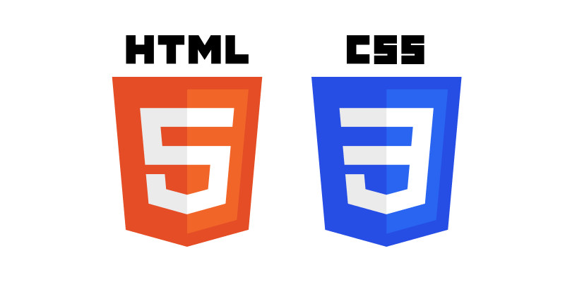
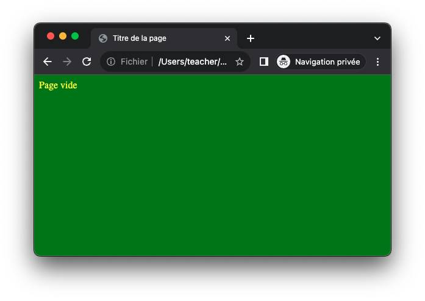

# Création d'une page web



## Introduction

Ces travaux pratiques consistent découvrir (ou redécouvrir) les langages HTML et CSS.
Pour celà, vous devrez créer une page web en utilisant un certain nombre de balises HTML et la mettre en forme en
utilisant le langage CSS.

!!! success "Objectifs"

    - vérifier le bon fonctionnement de votre ordinateur portable   
    - mesurer votre maîtrise des outils numériques (ordinateur et logiciels)
    - mesurer votre capacité à suivre des consignes
    - mesurer vos compétences en programmmation

## Préparation

### Espace de travail

Pour que vos productions numériques ne soient pas mélangées entre les différentes matières et travaux pratiques,
vous allez créer des dossiers afin de les organiser.

!!! note "Organisation de l'espace travail"

    === "Ordinateur portable"

        1. Lancez l'**explorateur de fichiers**
        2. Accédez au dossier **Documents**
        3. Créez un dossier nommé **NSI**
        4. Dans le dossier **NSI**, créez un dossier nommé **chapitre_01**

    === "Ordinateur fixe"

        1. Depuis le bureau, double-cliquez sur l'icône intitulée **Zone personnelle**
        2. Dans votre zone personnelle, créez un dossier nommé **NSI** s'il n'existe pas
        3. Dans le dossier **NSI**, créez un dossier nommé **chapitre_01**

### Logiciels

Tout code informatique (aussi appelé *code source*) doit être écrit dans un **fichier texte** en utilisant un **éditeur
de texte**. Celui-ci ne doit pas être confondu avec les logiciels de traitement de texte tels que Word ou LibreOffice
Writer permettant de créer des **documents texte**.

Un fichier texte (aussi appelé *texte brut*) ne comporte aucune mise en forme du texte (choix et taille de police, gras,
italique, paragraphes, ...).

Un éditeur de texte est disponible dans tout système d'exploitation. Sous Windows, il s'agit du **Bloc-notes** qui
permet l'écriture de n'importe quel code informatique. Il lui manque cependant beaucoup de fonctionnalités utiles au
développement telles que : la coloration syntaxique ou la détection des erreurs à la saisie.

Nous vous recommandons d'utiliser les logiciels [Notepad++](https://notepad-plus-plus.org/)
ou [Visual Studio Code](https://code.visualstudio.com/) selon vos préférences.

!!! info "Installation de Notepad++"

    === "Ordinateur portable"

        1. Télécharger [Notepad++ v8.5.7 version portable (zip)](https://github.com/notepad-plus-plus/notepad-plus-plus/releases/download/v8.5.7/npp.8.5.7.portable.x64.zip)
        2. Se rendre dans le répertoire où le fichier téléchargé a été enregistré
        3. Faire un **clic-droit** sur celui-ci et choisir l'option **Extraire tout...**
        4. Lancer l'application depuis le dossier décompressé
        5. Passer l'application en français en allant dans **Settings** puis **Preferences...** et choisir **Français** au niveau du champ **Localization**

    === "Ordinateur fixe"

        Notepad++ est déjà installé sur les ordinateurs fixes du lycée.

## Le langage HTML

### Structure d'une page

Pour commencer, vous allez créer une page web vide à partir du code HTML suivant :

```html
<!doctype html>
<html lang="fr">
<head>
    <meta charset="utf-8">
    <title>Titre de la page</title>
</head>
<body>
Corps de la page
</body>
</html>
```

!!! note "Création et visualisation d'une page web"

    1. Créez un fichier nommé `index.html` dans le dossier `chapitre_01` créé précédement 
    2. Copiez-y le code HTML ci-dessus en utilisant un éditeur de texte
    3. Ouvrez le fichier `index.html` dans un navigateur web

### Modification du contenu

Vous allez maintenant modifier le contenu de la page web en agissant sur son code source et en observant le résultat
dans le navigateur web.

!!! note "Modification de la page web"

    1. Modifiez le titre de la page web et observez le résultat dans le navigateur 
    2. Modifiez le contenu de la page web et observez le résultat dans le navigateur
    3. Modifiez le contenu de la page web en sautant des lignes et en ajoutant de nombreux caractères d'espacement entre les mots. Observez le résultat dans le navigateur

### Expérimentation de balises

Voici quelques balises à tester avec les contenus de votre choix :

| Balise                         | Description                      | Documentation                                                                                     |
|:-------------------------------|:---------------------------------|:--------------------------------------------------------------------------------------------------|
| `#!html <h1>...</h1>`          | Titre niveau 1                   | [voir](https://developer.mozilla.org/fr/docs/Web/HTML/Element/Heading_Elements){:target="_blank"} |
| `#!html <h2>...</h2>`          | Titre niveau 2 (sous-titre)      | [voir](https://developer.mozilla.org/fr/docs/Web/HTML/Element/Heading_Elements){:target="_blank"} |
| `#!html <h3>...</h3>`          | Titre niveau 3 (sous-sous-titre) | [voir](https://developer.mozilla.org/fr/docs/Web/HTML/Element/Heading_Elements){:target="_blank"} |
| `#!html <p>...</p>`            | Paragraphe                       | [voir](https://developer.mozilla.org/fr/docs/Web/HTML/Element/p){:target="_blank"}                |
| `#!html <br />`                | Saut de ligne                    | [voir](https://developer.mozilla.org/fr/docs/Web/HTML/Element/br){:target="_blank"}               |
| `#!html <strong>...</strong>`  | Important                        | [voir](https://developer.mozilla.org/fr/docs/Web/HTML/Element/strong){:target="_blank"}           |
| `#!html <em>...</em>`          | Emphase                          | [voir](https://developer.mozilla.org/fr/docs/Web/HTML/Element/em){:target="_blank"}               |
| `#!html ` | Image                            | [voir](https://developer.mozilla.org/fr/docs/Web/HTML/Element/img){:target="_blank"}              |
| `#!html <a href="url">...</a>` | Lien hypertexte                  | [voir](https://developer.mozilla.org/fr/docs/Web/HTML/Element/a){:target="_blank"}                |
| `#!html <table>...</table>`    | Tableau                          | [voir](https://developer.mozilla.org/fr/docs/Web/HTML/Element/table){:target="_blank"}            |
| `#!html <ul><li>...</li></ul>` | Liste non ordonnée               | [voir](https://developer.mozilla.org/fr/docs/Web/HTML/Element/ul){:target="_blank"}               |
| `#!html <ol><li>...</li></ol>` | Liste ordonnée                   | [voir](https://developer.mozilla.org/fr/docs/Web/HTML/Element/ol){:target="_blank"}               |

## Le langage CSS

### Création d'une feuille de style

Vous allez maintenant créer une feuille de style à lier à votre page web à partir du code CSS suivant :

```css
body {
    background: green;
    color: yellow;
}
```

!!! note "Création de la feuille de style"

    1. Créez un fichier nommé `style.css` dans le même dossier que `index.html` 
    2. Copiez-y le code CSS ci-dessus
    3. Liez la feuille de style à la page web en ajoutant la ligne ci-dessous entre les balises  `#!html <head></head>` du fichier `index.html`:<br />
      `#!html <link rel="stylesheet" href="style.css">`
    4. Ouvrez ou rafraichissez la page `index.html` dans un navigateur web

??? success "Résultat attendu"

    

### Modification du style

Vous allez maintenant modifier la mise en forme de votre page HTML en utilisant de nouveaux sélecteurs et de nouvelles
propriétés CSS.

#### Sélecteurs CSS

| Sélecteur                  | Description         | Documentation                                                                           |
|:---------------------------|:--------------------|:----------------------------------------------------------------------------------------|
| `#!css p { ... }`          | Sélecteur de balise | [voir](https://developer.mozilla.org/fr/docs/Web/CSS/Type_selectors){:target="_blank"}  |
| `#!css .ma-classe { ... }` | Sélecteur de classe | [voir](https://developer.mozilla.org/fr/docs/Web/CSS/Class_selectors){:target="_blank"} |

#### Propriétés CSS

| Propriété                | Description             | Documentation                                                                           |
|:-------------------------|:------------------------|:----------------------------------------------------------------------------------------|
| `#!css color:`           | Couleur du texte        | [voir](https://developer.mozilla.org/fr/docs/Web/CSS/color){:target="_blank"}           |
| `#!css backround:`       | Style de l'arrière plan | [voir](https://developer.mozilla.org/fr/docs/Web/CSS/background){:target="_blank"}      |
| `#!css text-align:`      | Alignement du texte     | [voir](https://developer.mozilla.org/fr/docs/Web/CSS/text-align){:target="_blank"}      |
| `#!css text-decoration:` | Décoration du texte     | [voir](https://developer.mozilla.org/fr/docs/Web/CSS/text-decoration){:target="_blank"} |
| `#!css font-size:`       | Taille du texte         | [voir](https://developer.mozilla.org/fr/docs/Web/CSS/font-size){:target="_blank"}       |
| `#!css width:`           | Largeur d'un élément    | [voir](https://developer.mozilla.org/fr/docs/Web/CSS/width){:target="_blank"}           |

## Ressources

Voici quelques ressources qui vous permettront d'approfondir vos connaissances et de mettre en œuvre des pages plus
audacieuses :

- [Mozilla - Introduction au HTML](https://developer.mozilla.org/fr/docs/Learn/HTML/Introduction_to_HTML/Getting_started){:target="_blank"}
- [Mozilla - Bases du HTML](https://developer.mozilla.org/fr/docs/Learn/Getting_started_with_the_web/HTML_basics){:target="_blank"}
- [Mozilla - Bases du CSS](https://developer.mozilla.org/fr/docs/Learn/Getting_started_with_the_web/CSS_basics){:target="_blank"}
- [W3Schools - Cours HTML](https://www.w3schools.com/html/){:target="_blank"}
- [W3Schools - Cours CSS](https://www.w3schools.com/css/){:target="_blank"}
- [W3C - Liste de toutes les balises HTML](https://www.w3.org/TR/2012/WD-html-markup-20121025/elements.html){:target="_blank"}