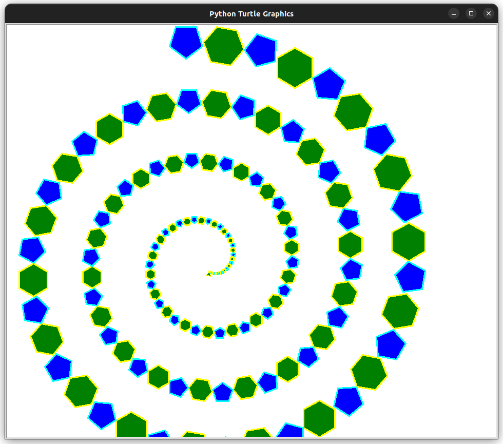

# TP3 - Module Turtle

## Introduction

La tortue graphique (ou *Turtle*) est un module d'initiation à la programmation.
Son fonctionnement consiste à réaliser des dessins par le déplacement d'une tortue virtuelle dotée d'un stylo sur un
plan orthonormé.

!!! info "Fonctions Turtle"

    |   Fonction    | Description                                                                                      |
    |:-------------:|:-------------------------------------------------------------------------------------------------|
    | `forward(n)`  | Avancer la tortue de *n* pixel                                                                   |
    | `backward(n)` | Reculer la tortue de *n* pixel                                                                   |
    |   `left(n)`   | Effectuer une rotation de la tortue d'un angle de *n* degrés vers la gauche *(sans antihoraire)* |
    |  `right(n)`   | Effectuer une rotation de la tortue d'un angle de *n* degrés vers la droite *(sans horaire)*     |
    | `goto(x, y)`  | Déplacer la tortue aux coordonnées *(x, y)*                                                      |
    |   `penup()`   | Lever le crayon                                                                                  |
    |  `pendown()`  | Baisser le crayon                                                                                |

!!! tip "Documentation officielle"

    Vous pouvez consulter la documentation de ces fonctions et en découvrir bien d'autres sur le site officiel de Python à l'adresse suivante :
    [https://docs.python.org/fr/3.10/library/turtle.html](https://docs.python.org/fr/3.10/library/turtle.html){:target="_blank"}

## Préparation

### Espace de travail

Vous allez créer des dossiers afin de ne pas mélanger vos productions numériques entre vos différentes matières et
travaux pratiques.

!!! note "Organisation de l'espace travail"

    === ":material-laptop: Ordinateur portable"

        1. Lancez l'**explorateur de fichiers**
        2. Accédez au dossier **Documents**
        3. Créez un dossier nommé **NSI** *(s'il n'existe pas déjà)*
        4. Dans le dossier **NSI**, créez un dossier nommé **chapitre_03** *(s'il n'existe pas déjà)*

    === ":material-desktop-tower: Ordinateur fixe"

        1. Depuis le bureau, double-cliquez sur l'icône intitulée **Zone personnelle**
        2. Dans votre zone personnelle, créez un dossier nommé **NSI** *(s'il n'existe pas déjà)*
        3. Dans le dossier **NSI**, créez un dossier nommé **chapitre_03** *(s'il n'existe pas déjà)*

### Environnement de développement

Pour ces travaux pratiques, l'utilisation de **Thonny** est **obligatoire**.
Cet IDE a été conçu pour l'apprentissage du langage Python.

*[IDE]: Intergrated Development Environment

??? note "Téléchargement de Thonny"

    Thonny devrait normalement être déjà installé sur votre ordinateur portable.
    Si ce n'est pas le cas ou si vous utilisez un ordinateur fixe du lycée, voici les instructions pour l'installer :
    
    1. Rendez vous sur le [site officiel](https://thonny.org/){:targer="_blank"}
    2. Approchez la souris de *« Windows »* dans la zone de téléchargement
    3. Téléchargez la version *« Portable variant with 64-bit Python 3.10 »*
    4. Décompressez l'archive ZIP téléchargée
    5. Déplacez le dossier décompressé dans votre dossier **Documents**
    6. Lancez Thonny en double-cliquant sur l'exécutable **thonny.exe**

!!! danger "Ne perdez pas de temps !"

    Thonny peut être long à télécharger et décompresser.
    Ne perdez pas de temps et commencez immédiatement les travaux pratiques en utilisant l'interpréteur Python en ligne [Basthon](https://console.basthon.fr/){:target="_blank"}.
    Une fois Thonny prêt, lancez-le.

## Premiers déplacements

### Test du module Turtle

Vous allez vérifier le bon fonctionnement du module Turtle. Pour cela, suivez les instructions suivantes :

!!! abstract "Instructions"

    1. Lancez l'application **Thonny**
    2. Créez un nouveau fichier et copiez/collez-y le code ci-dessous :
        ```python
        import turtle
        
        # Tracé de démonstration
        turtle.goto(40, 40)
        turtle.right(90)
        turtle.forward(40)
        turtle.left(90)
        turtle.penup()
        turtle.backward(20)
        turtle.pendown()
        turtle.backward(20)
        
        # Boucle des événements
        turtle.mainloop()
        ```
    3. Enregistrez le programme dans le dossier **NSI/chapitre_03** en le nommant **tp3_test.py**
    4. Exécutez le programme

!!! question "Questions"

    - Pouvez-vous décrire le rôle de chaque fonction de tracé ?
    - Pouvez-vous situer l'origine *(point de coordonnées (0,0))* du plan orthonormé au sein de la fenêtre Turtle ?

!!! tip "Astuce"

    En l'absence de l'appel de fonction `#!python turtle.mainloop()`, la console Python reste accessible sous Thonny.
    À l'exécution de votre programme, vous pouvez alors y saisir d'autres instructions Turtle et voir le résultat directement à l'écran.
    Testez par exemple `#!python turtle.goto(-100, 100)`

### Aide au tracé

Afin d'éventuellement mieux visualiser la position de la tortue dans le plan,
nous avons écrit une fonction capable d'afficher une grille à l'écran.
Suivez les instructions suivantes pour la rendre visible.

!!! abstract "Instructions"

    1. Téléchargez le fichier [aide.py](assets/aide.py){:download="aide.py"}
    2. Déplacez le fichier dans le dossier **NSI/chapitre_03**<br>*(il doit se trouver dans le même dossier que le fichier tp3_test.py créé précédemment)*
    3. Ajoutez les lignes surlignées ci-dessous à votre fichier **tp3_test.py**
        ```python hl_lines="2 4 5"
        import turtle
        import aide
        
        # Tracé de la grille
        aide.grille()
        
        # Tracé de démonstration
        turtle.goto(40, 40)
        turtle.right(90)
        turtle.forward(40)
        ...
        ```
    4. Exécutez le programme

!!! question "Question"

    - Savez-vous expliquer ce que fait précisément l'instruction `#!python import aide` ?

Notez qu'afficher la grille n'a rien d'indispensable.
Elle peut cependant vous aider à vous repérer en phase de débogage.

## Formes géométriques

### Le carré

Nous souhaitons tracer un carré. Suivre les instructions suivantes :

!!! abstract "Instructions"

    1. Réfléchissez à un algorithme permettant de tracer un carré en ne faisant qu'avancer (`forward`) ou tourner (`right` ou `left`) la tortue
    2. Lancez l'application **Thonny**
    3. Créez un nouveau fichier
    4. Écrivez un programme permettant de tracer un carré de **100 pixels** de côté
    5. Enregistrez le programme dans le dossier **NSI/chapitre_03** en le nommant **tp3_carre.py**
    6. Exécutez le programme

??? success "Solution"

    ```python
    import turtle
    
    # Affichage de la grille
    import aide
    aide.grille()
    
    # Tracé d'un carré
    turtle.forward(100)
    turtle.right(90)
    turtle.forward(100)
    turtle.right(90)
    turtle.forward(100)
    turtle.right(90)
    turtle.forward(100)
    turtle.right(90)
    
    # Boucle des événements
    # turtle.mainloop()
    ```

### Le triangle équilatéral

Nous souhaitons maintenant tracer un triangle équilatéral. Suivre les instructions suivantes :

!!! abstract "Instructions"

    1. Créez un nouveau fichier
    2. Écrivez un programme permettant de tracer un triangle équilatéral de **100 pixels** de côté
    3. Enregistrez le programme dans le dossier **NSI/chapitre_03** en le nommant **tp3_triangle.py**
    4. Exécutez le programme

??? success "Solution"

    ```python
    import turtle
    
    # Affichage de la grille
    import aide
    aide.grille()
    
    # Tracé d'un triangle équilatéral
    turtle.forward(100)
    turtle.right(360/3)
    turtle.forward(100)
    turtle.right(360/3)
    turtle.forward(100)
    turtle.right(360/3)
    
    # Boucle des événements
    # turtle.mainloop()
    ```

### Utilisation des boucles

Si vous n'avez pas pensé utiliser une boucle, vous devriez constater une répétition de certaines commandes. Exemple pour
le tracé d'un carré :

```python
# Tracé d'un carré
turtle.forward(100)
turtle.right(90)
turtle.forward(100)
turtle.right(90)
turtle.forward(100)
turtle.right(90)
turtle.forward(100)
turtle.right(90)
```

Pour éviter ces répétitions, vous pouvez utiliser une boucle qui se chargera de répéter les commandes dédiées au tracé
d'un seul côté du carré.

```python
# Tracé d'un carré
i = 0
while i < 4:
    turtle.forward(100)
    turtle.right(90)
    i = i + 1
```

!!! abstract "Instructions"

    1. Modifiez le programme de tracé d'un carré **tp3_carre.py** de façon à faire usage d'une boucle non bornée `while`
    2. Modifiez le programme de tracé d'un triange équilatéral **tp3_triangle.py** de façon à faire usage d'une boucle non bornée `while`

## Fonctions et modules

### Tracé de plusieurs carrés

Nous souhaiterions effectuer le tracé de plusieurs carrés à l'écran.

!!! abstract "Instructions"

    - Ouvrez le fichier **tp3_carre.py**
    - Modifiez le code de façon à tracer trois carrés distincts de taille 100 à l'écran *(dupliquer le code est autorisé)*

!!! tip "Astuce"

    Si vous souhaitez démarrer un tracé à un autre endroit que l'origine du plan, pensez à déplacer au préalable la tortue en levant son crayon avec la fontion `penup()`.
    Vous pouvez aussi réinitialiser la position et l'angle de la tortue en utilisant la fonction `#!python turtle.home()`.

### Factorisation du code

Vous avez certainement copié/collé le code du carré initial.
Dupliquer du code n'est pas une bonne pratique de programmation.
Nous pouvons éviter cela grâce à une fonction,
c'est-à-dire un bloc de code nommé et réutilisable qui ne s'exécute que si on l'appelle.
L'action consistant à mutualiser du code dupliqué au sein d'une fonction s'appelle **factoriser**.

!!! abstract "Instructions"

    1. Ouvrez le fichier **tp3_carre.py** dans Thonny
    2. Copiez/collez le code surligné ci-dessous **en début** de fichier *(une fonction doit être définie avant son utilisation)*
    ```python hl_lines="3-9"
    import turtle

    def carre():
      """Dessine un carré de 100 pixels de côté"""
      i = 0
      while i < 4:
        turtle.forward(100)
        turtle.right(90)
        i = i + 1

    # Tracé de vos 3 carrés
    ...
    ```
    3. Modifiez votre code de tracé de trois carrés en faisant cette fois appel à la fonction `carre()`

!!! question "Questions"

    - Saurez-vous expliquer ce en quoi consiste la *factorisation de code* ?
    - Comprenez-vous le rôle de la ligne `#!python """ Dessine un carré de 100 pixels de côté """` ? <br>
      *(Si ce n'est pas le cas, lire les explications de cette [page](https://kxs.fr/cours/python/docstring) ou la [PEP 257](https://peps.python.org/pep-0257/))*

### Création d'un module

Afin d'organiser votre code et le rendre réutilisable dans plusieurs programmes, vous avez la possibilité de le diviser
en plusieurs fichiers :

!!! abstract "Instructions"

    1. Créez un nouveau fichier et l'enregistrer immédiatement dans un fichier nommé **formes.py**
    2. Importez y le module `turtle`
    3. Déplacez le code de la fonction `carre()` du fichier **tp3_carre.py** vers le fichier **formes.py**
    4. Modifiez le fichier `tp3_carre.py` de façon à importer le module `formes` et appeler la fonction de tracé des carrés depuis ce module : `formes.carre()`

!!! success "Solution"

    === ":material-file-document-outline: formes.py"

        ```python
        import turtle

        def carre():
          """Dessine un carré de 100 pixels de côté"""
          i = 0
          while i < 4:
            turtle.forward(100)
            turtle.right(90)
            i = i + 1
        ```

    === ":material-file-document-outline: tp3_carre.py"

        ```python
        import turtle
        import formes
        
        turtle.penup()
        turtle.goto(-150, 150)
        turtle.pendown()
        formes.carre()
        
        turtle.penup()
        turtle.goto(150, 150)
        turtle.pendown()
        formes.carre()
        
        turtle.penup()
        turtle.goto(150, -150)
        turtle.pendown()
        formes.carre()
        ```

!!! question "Question"

    - Êtes-vous capable de repérer une autre portion de code potentiellement factorisable dans l'exemple de fichier **tp3_carre.py** ?

### Factorisation du tracé du triangle équilatéral

!!! abstract "Instructions"

    1. Ouvrez le fichier **formes.py**
    2. De la même manière que pour le carré, créez la fonction `triangle()`
    3. Testez cette fonction dans le fichier **tp3_triangle.py** en dessinant 3 triangles

## Paramètres de fonction

### Carrés et triangles de taille variable

Nous souhaitons maintenant pouvoir dessiner des formes géométriques de différentes tailles.
Pour ce faire, nous allons rendre l'algorithme de tracé d'un carré paramétrable en ajoutant un paramètre à la
fonction `carre()`.

```python hl_lines="1 2 5"
def carre(longueur):
    '''Dessine un carré de "longueur" pixels de côté'''
    i = 0
    while i < 4:
        turtle.forward(longueur)
        turtle.right(90)
        i = i + 1
```

!!! abstract "Instructions"

    1. Modifiez la fonction `carre()` définie dans le fichier **formes.py**
    2. Modifiez le fichier **tp3_carre.py** de façon à tracer trois carrés : un de 20 pixels, un autre de 100 pixels et un dernier de 200 pixels
    3. Faites de même avec la fonction `triangle()` et tracez trois triangles de taille différente dans le fichier **tp3_triangle.py**

### Polygones réguliers

Le carré et le triangle équilatéral sont des polygones réguliers. Un polygone régulier est un polygone dont les côtés
et les angles intérieurs ont la même mesure.

!!! abstract "Instructions"

    1. Ouvrez le fichier **formes.py**
    2. Écrivez la fonction `polygone()` permettant de tracer un polygone régulier à partir de son nombre de côtés et leur longueur. Vous trouverez ci-dessous le code à trou permettant de réaliser cette fonction.
    ```python
    def polygone(n, longueur):
        '''Dessine un polygone régulier de "n" côtés de "longueur" pixels'''
        i = 0
        while i < ...:
            turtle.forward(...)
            turtle.right(...)
            i = i + 1
    ```
    3. Testez cette fonction dans le fichier **tp3_carre.py**
    4. Modifiez les fonctions `carre()` et `triangle()` de manière à ce qu'elle fasse appel à la fonction `polygone()` pour le tracé

## Envoi du travail

### Dépôt du travail

Suivez les instructions ci-dessous afin d'envoyer votre travail via Pronote.

!!! note "Dépôt d'une copie sur Pronote"

    1. Compressez votre dossier NSI/chapitre_03 au format **ZIP**
    2. Connectez-vous à l'**ENT** : [https://ent.iledefrance.fr](https://ent.iledefrance.fr){:target="_blank"}
    3. Accédez à l'application **Pronote**
    4. Depuis l'accueil, recherchez le devoir **NSI1RE03 - TP3 Turtle**
    5. Cliquez sur le bouton **Déposer ma copie**{:style="display:inline-block;color:#4a1b7f;background-color:#ebdbff;padding:5px 20px;border-radius:10px;"}
    6. Cliquez sur le bouton **Un seul fichier (*.pdf, *.doc, ...)**
    7. Déposez votre fichier ZIP

### Questionnaire

Afin de vérifier votre compréhension de ces travaux pratiques, veuillez répondre au questionnaire Pronote suivant :

!!! note "Questionnaire de vérification"

    1. Connectez-vous à l'**ENT** : [https://ent.iledefrance.fr](https://ent.iledefrance.fr){:target="_blank"}
    2. Accédez à l'application **Pronote**
    3. Depuis l'accueil, recherchez le QCM intitulé **NSI1RE03 - TP3 Turtle**
    4. Cliquez sur le bouton 
       **Exécuter le QCM**{:style="display:inline-block;color:#4a1b7f;background-color:#ebdbff;padding:5px 20px;border-radius:10px;"}

## Bonus

### Générer une image

Nous souhaitons maintenant effectuer des tracés plus ambitieux :

!!! abstract "Instructions"

    1. Ajoutez le code des fonctions `dessin_1()` et `dessin_2()` ci-dessous au fichier **formes.py**
        ```python
        def dessin_1(n, longueur):
            '''Dessine une combinaison de "n" carrés de taille "longueur"'''
            while n > 0:
                carre(longueur)
                turtle.right(10)
                n = n - 1
        
        
        def dessin_2(n, longueur):
            '''Dessine une série de "n" carrés de taille "longueur"'''
            while n > 0:
                carre(longueur)
                turtle.penup()
                turtle.forward(2 * longueur)
                turtle.pendown()
                turtle.right(10)
                n = n - 1
        ```
    2. Testez ces fonctions dans un fichier nommé **tp3_dessin.py**

!!! tip "Astuce"

    Vous pouvez modifier la vitesse de déplacement de la tortue grâce à la fonction `turtle.speed()`

### Reproduire une image

Essayer de produire un dessin se rapprochant de la capture d'écran suivante :

<figure markdown>
  
</figure>