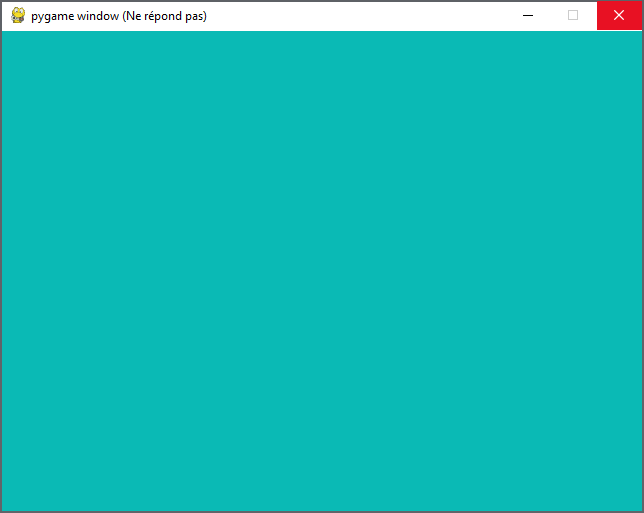
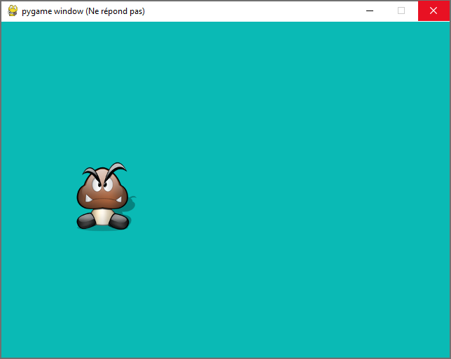

!!! warning "Attention"

    L'usage de **ChatGPT** va vous rendre **idiot**.
    
    - Ce TP est adapté à votre niveau.
    - Sa progression est réfléchie.
    - Si au lieu de réfléchir, vous allez pomper une solution de ChatGPT ou équivalent, vous n'apprendrez rien, vous vous ennuierez dans les prochains TPs et vous risquez d'avoir du mal lors de l'interrogation, et vous aurez donc une mauvaise image de vous, ce qui est fort dommage.
    - Il est donc fortement recommandé de [réfléchir]("La reflexion vous aidera à avoir le contrôle de votre vie.")  par vous-même.
    - Si vous êtes coincé, demandez de l'aide à votre professeur, il est la pour ça.
    - Ne regardez pas les solutions sans réfléchir.
    
    

<br />
<br />

# Initiation à Pygame


## 0. Préambule

- [Pygame](https://www.pygame.org/news){. target="_blank"} est un package de Python facilitant la création de jeux basés une interface graphique.
- Au lycée, vous pouvez l'installer sur votre distribution Python, par ```pip3 install pygame```.
- Sur votre pc perso, vous pouvez utiliser le gestionnaire de packages de Thonny (```Outils / Gérer les Paquets``` )


- La progression de ce TP est fortement inspiré par celui de Gilles Lassus


## 1. Préparation de la scène

```python
import pygame
from pygame.locals import * # pour la définition plus facile des constantes

pygame.init() # Initialisation du module pygame

fenetre = pygame.display.set_mode((640, 480)) # Création de la fenêtre de taille (640, 480)
fenetre.fill((10, 186, 181)) # On remplit tout avec la couleur (10, 186, 181)

running = True
while running: 
    fenetre.fill((10, 186, 181))
    pygame.display.flip() # Permet de rafraîchir la totalité de la fenêtre.

pygame.quit()
``` 


Ce code devrait vous donner ceci :

{width=300}


**Remarques**

- La ligne ```from pygame.locals import *``` permettra d'utiliser des variables locales déjà définies par ```pygame```, comme ```MOUSEBUTTONDOWN```, par exemple.
- Durant tout le code, notre scène de travail sera l'objet ```fenetre```, dans lequel nous viendrons coller de nouveaux éléments. 
- Pour l'instant, notre code nous enferme dans une boucle infinie : la fenêtre ne se ferme pas, il faut arrêter Python depuis Thonny. Nous y remedierons bientôt.

!!! abstract "Les éléments structurants d'un code ```pygame```"

    - ```pygame.init()```  effectue une initialisation globale de tous les modules ```pygame``` importés. À mettre au début du code.
    - ```while running:``` comme très souvent dans les jeux, la structure essentielle est une boucle infinie dont on ne sortira que par la bascule d'un booléen. Ici on restera bloqué dans la boucle jusqu'au moment où la variable ```running``` passera à ```False```.
    - ```pygame.display.flip()``` effectue un rafraîchissement total de tous les éléments graphiques de la fenêtre. À mettre à l'intérieur de la boucle infinie, généralement à la fin de celle-ci.


## 2. Apparition d'un personnage

### 2.1. Téléchargement de l'image
Nous allons travailler avec le sprite ci-dessous, nommé ```perso.png```. Il est issu de [openclassrooms](https://openclassrooms.com/fr/courses/1399541-interface-graphique-pygame-pour-python)


{ align=center }


[Téléchargez-le](img/perso.png) pour le mettre dans le même dossier que votre code ```pygame```.

Vous pouvez trouver sur internet un grand nombre de sprites libres de droits, au format ```png``` (donc gérant la transparence), dans de multiples positions (ce qui permet de simuler des mouvements fluides). Ici nous travaillerons avec un sprite unique.

### 2.2. Importation de l'image dans la fenêtre

```python
perso = pygame.image.load('perso.png').convert_alpha()
```
La fonction ```convert_alpha()``` est appelée pour que soit correctement traité le canal de transparence (canal _alpha_) de notre image.

### 2.3. Affichage de l'image

À ce stade, ```perso``` est un objet ```pygame``` de type ```Surface``` .

Afin de facilement pouvoir le déplacer, nous allons stocker la position de cet objet dans une variable ```position_perso```,  grâce à l'instruction ```perso.get_rect()```.

Notre image est devenue «un rectangle» que nous allons positionner où nous voulons.


Par exemple, pour positionner le coin supérieur gauche du personnage aux coordonnées ```(100, 200)```, nous écrirons :

```python
position_perso = perso.get_rect()
position_perso.topleft = (100, 200)
```

> Il y a d'autres instructions que ```topleft``` : vous pouvez les retrouver [ici](https://pygame.readthedocs.io/en/latest/rect/rect.html#points-of-interest){. target="_blank"}.

Pour afficher cette image, nous allons venir le superposer aux éléments graphiques déjà dessinés (en l'occurence : rien) avec l'instruction ```blit()``` :

```python
fenetre.blit(perso, position_perso)
```

**▸ récapitulatif du code**

```python linenums='1'
import pygame
from pygame.locals import *

pygame.init()

fenetre = pygame.display.set_mode((640, 480))

perso = pygame.image.load('perso.png').convert_alpha()
position_perso = perso.get_rect()

running = True
while running: 
    fenetre.fill((10, 186, 181))
    position_perso.topleft = (100, 200)
    fenetre.blit(perso, position_perso)
    pygame.display.flip()

pygame.quit()
```

**Aperçu**

{width=300}

## 3. Gestion des évènements
Lorsqu'un programme ```pygame``` est lancé, la variable interne ```pygame.event.get()``` reçoit en continu les évènements des périphériques gérés par le système d'exploitation.  
Nous allons nous intéresser aux évènements de type ```KEYDOWN``` (touche de clavier appuyée) ou de type ```MOUSEBUTTONDOWN``` (boutons de souris appuyé).


Pour commencer, la gestion des évènements nous permettra de pouvoir enfin fermer proprement la fenêtre Pygame, grâce au code suivant :

```python linenums='1'

for event in pygame.event.get():
    if event.type == pygame.QUIT:
        running = False
```

!!! Example "A vous de jouer"
    Intégrer le code ci-dessus au code précédent afin de pouvoir fermer proprement la fenêtre.
    
    ??? success "Voir la correction"

        ```python linenums='1'
        import pygame
        from pygame.locals import *

        pygame.init()

        fenetre = pygame.display.set_mode((640, 480))

        perso = pygame.image.load('perso.png').convert_alpha()
        position_perso = perso.get_rect()

        running = True
        while running: 
            fenetre.fill((10, 186, 181))
            position_perso.topleft = (100, 200)
            fenetre.blit(perso, position_perso)
            pygame.display.flip()

            for event in pygame.event.get():
                if event.type == pygame.QUIT:
                    running = False
                    
        pygame.quit()
        ```

### 3.1. Évènements clavier

#### 3.1.1. Exemple de code
La structure de code pour détecter l'appui sur une touche de clavier est, dans le cas de la détection de la touche «Flèche droite» :

```python linenums='1'
for event in pygame.event.get():   
    if event.type == KEYDOWN:
        if event.key == K_RIGHT:
            print('flèche droite appuyée')
```
La touche (en anglais _key_) «Flèche Droite» est appelée ```K_RIGHT``` par ```pygame```. 


:warning: il ne doit y avoir qu'une seule boucle de capture d'évènements, donc la routine de fermeture de la fenêtre doit être dans la même boucle :

```python linenums='1'
for event in pygame.event.get():
    if event.type == KEYDOWN:
        if event.key == K_RIGHT:
            print('flèche droite appuyée')

    if event.type == pygame.QUIT:
        running = False
```

Le nom de toutes les touches peut être retrouvé à l'adresse [https://www.pygame.org/docs/ref/key.html](https://www.pygame.org/docs/ref/key.html){. target="_blank"}.

**Remarque :** c'est grâce à la ligne initiale
```python
from pygame.locals import *
```
que la variable ```K_RIGHT``` (et toutes les autres) est reconnue.


#### 3.1.2. Problème de la rémanence

Quand une touche de clavier est appuyée, elle le reste un certain temps. Parfois volontairement (sur un intervalle long) quand l'utilisateur décide de la laisser appuyée, mais aussi involontairement (sur un intervalle très court), lors d'un appui «classique».  
Il existe donc toujours un intervalle de temps pendant lequel la touche reste appuyée. Que doit faire notre programme pendant ce temps ? Deux options sont possibles :

- **option 1 :** considérer que la touche appuyée correspond à un seul et unique évènement, quelle que soit la durée de l'appui sur la touche.
- **option 2 :** considérer qu'au bout d'un certain délai, la touche encore appuyée doit déclencher un nouvel évènement.

Par défaut,```pygame``` est réglé sur l'option 1. Néanmoins, il est classique pour les jeux vidéos de vouloir que «laisser la touche appuyée» continue à faire avancer le personnage. Nous allons donc faire en sorte que toutes les 50 millisecondes, un nouvel appui soit détecté si la touche est restée enfoncée. Cela se fera par l'expression :

```python
pygame.key.set_repeat(50)
```


### 3.2 Évènements souris

#### 3.2.1. Exemple de code

La structure de code pour détecter l'appui sur un bouton de la souris est :


```python
for event in pygame.event.get():    
    if event.type == MOUSEBUTTONDOWN and event.button == 1 :
        print('clic gauche détecté')
    if event.type == MOUSEBUTTONDOWN and event.button == 3 :
        print('clic droit détecté')
```

Le clic-gauche est associé à la valeur 1, le clic-droit à la valeur 3 (le clic-molette éventuel à la valeur 2).

!!! Example "A vous de jouer"
    Reprendre le code initial et y intégrer la capture d'évènements souris afin que s'affiche en console le bouton de souris appuyé.

    ??? success "Correction" 
        ```python linenums='1'

        import pygame
        from pygame.locals import *

        pygame.init()

        fenetre = pygame.display.set_mode((640, 480))

        perso = pygame.image.load('perso.png').convert_alpha()
        position_perso = perso.get_rect()

        pygame.key.set_repeat(50)

        running = True
        while running: 
            fenetre.fill((10, 186, 181))
            position_perso.topleft = (100, 200)
            fenetre.blit(perso, position_perso)
            pygame.display.flip()
            
            for event in pygame.event.get():
                if event.type == pygame.QUIT:
                    running = False

            if event.type == MOUSEBUTTONDOWN and event.button == 1 :
                print('clic gauche détecté')
            if event.type == MOUSEBUTTONDOWN and event.button == 3 :
                print('clic droit détecté')
        
        pygame.quit()
        
        ```


#### 3.2.2. Récupération des coordonnées de la souris

La paire ```(abscisse, ordonnée)``` des coordonnées de la souris sera récupéré avec l'instruction ```pygame.mouse.get_pos()```.

Cette fonction n'a pas besoin d'être dans notre boucle d'écoute des évènements : elle peut se situer n'importe où dans le code.


!!! Example "A vous de jouer"
    Ajouter au code l'affichage dans la console les coordonnées de la souris.

    ??? success "Correction" 
        ```python linenums='1'

        import pygame
        from pygame.locals import *

        pygame.init()

        fenetre = pygame.display.set_mode((640, 480))

        perso = pygame.image.load('perso.png').convert_alpha()
        position_perso = perso.get_rect()

        pygame.key.set_repeat(50)

        running = True
        while running: 
            fenetre.fill((10, 186, 181))
            position_perso.topleft = (100, 200)
            fenetre.blit(perso, position_perso)

            x, y = pygame.mouse.get_pos()
            print("position du clic souris:", x, y)

            pygame.display.flip()
            
            for event in pygame.event.get():
                if event.type == pygame.QUIT:
                    running = False

            if event.type == MOUSEBUTTONDOWN and event.button == 1 :
                print('clic gauche détecté')
            if event.type == MOUSEBUTTONDOWN and event.button == 3 :
                print('clic droit détecté')
        
        pygame.quit()
        
        ```


### 3.3 Activation d'un framerate

Pour l'instant, notre boucle infinie tourne «à fond» et le rafraîchissement de l'affichage se fait aussi rapidement que le peut le processeur. 
Afin de garder le contrôle sur cet fréquence de rafraîchissement (le nombre de *frames par seconde*, le fameux FPS) nous allons utiliser une horloge.

```clock = pygame.time.Clock()``` 
crée une horloge dans le corps du programme.

Ensuite, dans la boucle, nous rajouterons

```clock.tick(30)``` 

pour régler (par exemple) le FPS à 30.


## 4. Déplacement du personnage

Le déplacement d'un personnage se fera toujours par modification de ses coordonnées (et visuellement, par effacement de la dernière position).
Ce déplacement pourra être :  

- absolu : on donne de nouvelles coordonnées au personnage.
- relatif : on indique de combien le personnage doit se décaler par rapport à sa position initiale.

### 4.1. Déplacement absolu

*Rappel :* pour afficher le personnage à la position ```(300,200)```, on écrit simplement:
```python
position_perso.topleft = (300,200)
```

Au prochain ```fenetre.blit(perso, position_perso)```, le personnage sera positionné à cette nouvelle position. 


!!! example "Déplacement du personnage"

    Réaliser un déplacement aléatoire du personnage: choisir une position a l'écran aléatoire et déplacer le personnage.

    Vous pourrez utiliser les instructions :

    - ```pygame.time.delay(1000)``` afin de ne bouger le personnage que toutes les 1000 millisecondes.
    - ```randint(a,b)``` du package ```random```, qui renvoie un entier pseudo-aléatoire entre ```a```  et ```b```.


    ??? success "Correction" 
        ```python linenums='1'
        import pygame
        from pygame.locals import *
        from random import randint

        pygame.init()
        clock = pygame.time.Clock()

        fenetre = pygame.display.set_mode((640, 480))

        perso = pygame.image.load('perso.png').convert_alpha()
        position_perso = perso.get_rect()

        running = True
        while running :
            clock.tick(30)
            fenetre.fill((10, 186, 181))
            position_perso = (randint(0, 540), randint(0, 380))
            
            fenetre.blit(perso, position_perso)
            pygame.display.flip()
            
            pygame.time.delay(1000)
            
            for event in pygame.event.get():
                if event.type == pygame.QUIT:
                    running = False

        pygame.quit()

        ```


### 4.2. Déplacement relatif

Pour déplacer le personnage de 15 pixels vers la droite et de 10 pixels vers le haut par rapport à sa position précédente, on écrira :
```python
position_perso = position_perso.move(15,-10)
```
où ```position_perso``` est l'objet de type ```rect```  contenant les coordonnées.

!!! example Déplacement au clavier
    
    Réaliser un contrôle au clavier du personnage: quand on appuie sur la fléche du haut, il monte, sur celle de droite, il va à droite...

    ??? success "Correction" 
        ```python linenums='1'
        import pygame
        from pygame.locals import *

        pygame.init()
        pygame.key.set_repeat(50)
        clock = pygame.time.Clock()

        fenetre = pygame.display.set_mode((640, 480))

        perso = pygame.image.load('perso.png').convert_alpha()
        position_perso = perso.get_rect()

        pas = 15 

        running = True
        while running:
            clock.tick(30)
            fenetre.fill((10, 186, 181))
            fenetre.blit(perso, position_perso)

            for event in pygame.event.get() :    
                if event.type == KEYDOWN:

                    if event.key == K_DOWN : 
                        position_perso = position_perso.move(0, pas)

                    if event.key == K_UP :
                        position_perso = position_perso.move(0, -pas)

                    if event.key == K_RIGHT : 
                        position_perso = position_perso.move(pas, 0)

                    if event.key == K_LEFT : 
                        position_perso = position_perso.move(-pas, 0)   

                # routine pour pouvoir fermer «proprement» la fenêtre Pygame
                if event.type == pygame.QUIT:
                    running = False


            pygame.display.flip() 

        pygame.quit()
        ```

!!! example Gestion des bords
    Rajouter des instructions afin que le personnage ne puisse pas sortir de la fenêtre de jeu.

    On utilisera les variables suivantes :

    - ```position_perso.top``` : ordonnée du haut du personnage
    - ```position_perso.bottom``` : ordonnée du bas du personnage
    - ```position_perso.left``` : abscisse de la gauche du personnage
    - ```position_perso.right``` : abscisse de la droite du personnage

    ??? success "Correction" 
        ```python linenums='1'
        import pygame
        from pygame.locals import *

        pygame.init()
        pygame.key.set_repeat(50)
        clock = pygame.time.Clock()

        fenetre = pygame.display.set_mode((640, 480))

        perso = pygame.image.load('perso.png').convert_alpha()
        position_perso = perso.get_rect()

        pas = 15 

        running = True
        while running:
            clock.tick(30)
            fenetre.fill((10, 186, 181))
            fenetre.blit(perso, position_perso)
            
            if position_perso.top < 0:
                position_perso.top = 0

            if position_perso.bottom > 480:
                position_perso.bottom = 480

            if position_perso.left < 0:
                position_perso.left = 0

            if position_perso.right > 640:
                position_perso.right = 640


            for event in pygame.event.get() :    
                if event.type == KEYDOWN:

                    if event.key == K_DOWN : 
                        position_perso = position_perso.move(0, pas)

                    if event.key == K_UP :
                        position_perso = position_perso.move(0, -pas)

                    if event.key == K_RIGHT : 
                        position_perso = position_perso.move(pas, 0)

                    if event.key == K_LEFT : 
                        position_perso = position_perso.move(-pas, 0)   

                if event.type == pygame.QUIT:
                    running = False


            pygame.display.flip() 

        pygame.quit()

        ```

!!! example Warping
    Reprendre l'exercice précédent mais faire en sorte que le personnage réapparaisse à l'opposé de là où il est sorti.

    ??? success "Correction" 
        ```python linenums='1'
        import pygame
        from pygame.locals import *

        pygame.init()
        pygame.key.set_repeat(50)
        clock = pygame.time.Clock()

        fenetre = pygame.display.set_mode((640, 480))

        perso = pygame.image.load('perso.png').convert_alpha()
        position_perso = perso.get_rect()

        pas = 15 

        running = True
        while running:
            clock.tick(30)
            fenetre.fill((10, 186, 181))
            fenetre.blit(perso, position_perso)

            if position_perso.top < 0:
                position_perso.bottom = 480

            if position_perso.bottom > 480:
                position_perso.top = 0

            if position_perso.left < 0:
                position_perso.right = 640

            if position_perso.right > 640:
                position_perso.left = 0


            for event in pygame.event.get() :    
                if event.type == KEYDOWN:

                    if event.key == K_DOWN : 
                        position_perso = position_perso.move(0, pas)

                    if event.key == K_UP :
                        position_perso = position_perso.move(0, -pas)

                    if event.key == K_RIGHT : 
                        position_perso = position_perso.move(pas, 0)

                    if event.key == K_LEFT : 
                        position_perso = position_perso.move(-pas, 0)   

                if event.type == pygame.QUIT:
                    running = False


            pygame.display.flip() 

        pygame.quit()


        ```  


## 5. À vous !

Fabriquez le jeu que vous souhaitez à partir des informations ci-dessus.
Bien d'autres aides peuvent être trouvées dans les liens citées dans la partie Bibliographie.

### Exemple de réalisation possible
Un clicker avec un temps qui diminue à progressivement, et comptage des points.


### D'autres exemples pour vous inspirer

 - Morpion
 - Snake
 - Tron
 - Pong
 - Puissance 4


### Quelques aides

- **écrire du texte :**  
```python
font = pygame.font.Font(pygame.font.get_default_font(), 36)
text = font.render("Game Over", True, (255, 0, 0))
fenetre.blit(text, dest=(550,40))
```

- **dessiner un rectangle :**  
```python
pygame.draw.rect(fenetre,(0,255,0),(500,20,100,10))
```
dessine un rectangle vert de 100 pixels sur 10 pixels, dont le coin en haut à gauche est à la position (500,20).


- **gérer le temps:**
```python
import time
time_begin = time.time()
delai = 5
sortir = False
while not sortir:
  if time.time() - time_begin > delai :
    print("5 secondes se sont écoulées")
    sortir = True
```


</br>

---
**Bibliographie**

- Documentation officielle de Pygame: [https://www.pygame.org/docs/](https://www.pygame.org/docs/)
