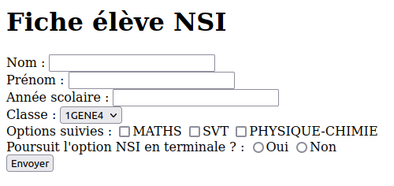

# Formulaire HTML

## Introduction

Nous souhaitons mettre en œuvre une base de données des élèves suivant l'option NSI en classe de première.
Pour l'acquisition des données, nous faisons le choix de développer un formulaire web disposant des fonctionnalités suivantes :

- Saisie du nom et du prénom de l'élève
- Saisie de l'année scolaire
- Choix de la classe, parmi la liste des classes de première du lycée
- Choix des autres options suivies par l'élève, parmi la liste des options disponibles au lycée
- Choix de la poursuite ou non de l'option en classe de Terminale
- Un bouton d'envoi du formulaire pour traitement

!!! target "Aperçu du formulaire"

    Voici un aperçu du formulaire. Notez qu'il n'y a aucune mise en forme, donc aucune utilisation du langage CSS.

    <figure class="illustration" markdown>
    {:style="border:1px solid black;padding: 5px;"}
    <em>Formulaire de saisie des informations d'un élève</em>
    </figure>

!!! target "Caractéristiques des champs"

    Voici les caractéristiques HTML des champs que vous allez devoir créer.
    Ne vous inquiétez pas si vous ne comprenez pas immédiatement le contenu du tableau, il vous sera demandé de le consuleter à plusieurs reprises au cours de ces travaux pratiques.
    

    | Libellé                | Balise            | Attribut `type` | Attribut `name`  |
    |:-----------------------|:------------------|:----------------|:-----------------|
    | Nom                    | `#!html <input>`  | `text`          | `nom`            |
    | Prénom                 | `#!html <input>`  | `text`          | `prenom`         |
    | Année scolaire         | `#!html <input>`  | `text`          | `annee_scolaire` |
    | Classe                 | `#!html <select>` | -               | `classe`         |
    | Autres options suivies | `#!html <input>`  | `checkbox`      | `options`        |
    | Poursuite en terminale | `#!html <input>`  | `radio`         | `poursuite`      |

## Préparation

### Espace de travail

Vous allez créer des dossiers afin de ne pas mélanger vos productions numériques entre vos différentes matières et
travaux pratiques.

!!! note "Organisation de l'espace travail"

    === ":material-laptop: Ordinateur portable"

        1. Lancez l'application <i class="icon file-explorer"></i> **Explorateur de fichiers** 
           <span class="keys shortcut"><kbd>:fontawesome-brands-windows:</kbd><span>+</span><kbd>E</kbd></span>
        2. Dans le dossier `Document`, s'il n'y a pas de dossier nommé `NSI`, créez-le
        3. Dans le dossier `NSI`, s'il n'y a pas de dossier nommé `chapitre_14`, créez-le
        4. Dans le dossier `chapitre_14` créez le dossier `tp1_formulaire`

    === ":material-desktop-tower: Ordinateur fixe"

        1. Depuis le bureau, double-cliquez sur l'icône intitulée **Zone personnelle**
        2. Dans la **zone personnelle**, s'il n'y a pas de dossier `NSI`, créez-le
        3. Dans le dossier `NSI`, s'il n'y a pas de dossier nommé `chapitre_14`, créez-le
        4. Dans le dossier `chapitre_14` créez le dossier `tp1_formulaire`

### Téléchargement des fichiers

Pour réaliser ces travaux pratiques, il est nécessaire de disposer de certains fichiers.

!!! note "Récupération des fichiers"

    1. Téléchargez le fichier ZIP contenant les fichiers nécessaires : [:material-download: télécharger](assets/NSI1RE14_TP1.zip){:download="NSI1RE14_TP1.zip"}
    2. Ouvrez le fichier ZIP<br>*(si le navigateur ne l'ouvre automatiquement, cliquez sur le fichier téléchargé)*
    3. Sélectionnez tous les fichiers et dossiers  <span class="shortcut">++ctrl+a++</span>
    4. Copiez tous les fichiers et dossiers <span class="shortcut">++ctrl+c++</span>
    5. Collez les fichiers dans le dossier `NSI\chapitre_14\tp1_formulaire` <span class="shortcut">++ctrl+v++</span>

## Création du formulaire

### Formulaire

L'élément HTML `#!html <form>` représente un formulaire. 
Celui-ci pourra contenir des composants graphiques interactifs permettant à un internaute de fournir des informations.

!!! example "Exemple"

    ```html
    <form>
        ...
    </form>
    ```
    
    Pour en savoir plus, consultez la documentation sur le site [:material-link: mozilla.org](https://developer.mozilla.org/fr/docs/Web/HTML/Element/form){:target="_blank"}

!!! note "Instructions"

    1. Ouvrez le fichier `index.html`
    2. Créez y simplement les balises d'ouverture et de fermeture du formulaire qui accueillera l'ensemble des composants

### Champ de saisie

L'élément HTML `#!html <input>` est utilisé pour créer un composant graphique interactif dans un formulaire web qui permet à l'utilisateur de fournir des données.
L'affichage et le fonctionnement de l'élément `#!html <input>` sont définis par son attribut `type`.

Vous allez maintenant créer des éléments `#!html <input type="text">` permettant de créer des champs de saisie de texte.
Tous les exemples de ces travaux pratiques sont interactifs, n'hésitez pas à lire la documentation et modifier le code HTML pour expérimenter.

!!! example "Exemple"

    <p class="codepen" data-height="300" data-default-tab="html,result" data-slug-hash="GRLeVPj" data-editable="true" data-user="mulot-nsi" style="height: 300px; box-sizing: border-box; display: flex; align-items: center; justify-content: center; border: 2px solid; margin: 1em 0; padding: 1em;"></p>

    :material-book-open-variant: Pour en savoir plus, consultez la documentation sur le site [:material-link: mozilla.org](https://developer.mozilla.org/fr/docs/Web/HTML/Element/input){:target="_blank"}

!!! note "Instructions"

    1. Créez le champ de saisie du **nom**
    2. Créez le champ de saisie du **prénom**
    3. Créez le champ de saisie de **l'année scolaire**

    **:material-alert: Attention**, pensez à bien renseigner l'attribut `name` de chaque balise `#!html <input>` en respectant les spécifications données en introduction.


### Cases à cocher

L'élément `#!html <input type="checkbox">` correspond à une case à cocher qui permet de sélectionner/déselectionner une valeur.

!!! example "Exemple"

    <p class="codepen" data-height="300" data-default-tab="html,result" data-slug-hash="oNOOgYV" data-editable="true" data-user="mulot-nsi" style="height: 300px; box-sizing: border-box; display: flex; align-items: center; justify-content: center; border: 2px solid; margin: 1em 0; padding: 1em;"></p>
    
    :material-book-open-variant: Pour en savoir plus, consultez la documentation sur le site [:material-link: mozilla.org](https://developer.mozilla.org/fr/docs/Web/HTML/Element/input/checkbox){:target="_blank"}

!!! note "Instructions"

    1. Créez le champ d'indication des **autres options suivies** par l'élève en utilisant plusieurs occurrences de l'élément **case à cocher**

    **:material-alert: Attention**, pensez à bien renseigner l'attribut `name` de chaque balise `#!html <input>` en respectant les spécifications données en introduction.


### Boutons radio

L'élément `<input type="radio">` correspond à un bouton radio qui permet de sélectionner une seule valeur parmi un groupe de valeurs.

!!! example "Exemple"

    <p class="codepen" data-height="300" data-default-tab="html,result" data-slug-hash="jORREBw" data-editable="true" data-user="mulot-nsi" style="height: 300px; box-sizing: border-box; display: flex; align-items: center; justify-content: center; border: 2px solid; margin: 1em 0; padding: 1em;"></p>

    :material-book-open-variant: Pour en savoir plus, consultez la documentation sur le site [:material-link: mozilla.org](https://developer.mozilla.org/fr/docs/Web/HTML/Element/input/radio){:target="_blank"}

!!! note "Mise en pratique"

    1. Créez le champ d'indication de **poursuite de l'option** en utilisant plusieurs occurrences de l'élément **bouton radio**.

    **:material-alert: Attention**, pensez à bien renseigner l'attribut `name` de chaque balise `#!html <input>` en respectant les spécifications données en introduction.


### Liste d'options

L'élément HTML `#!html <select>` représente un contrôle qui fournit une liste d'options parmi lesquelles l'utilisateur pourra faire un choix.

!!! example "Exemple"

    <p class="codepen" data-height="300" data-default-tab="html,result" data-slug-hash="MWRRggz" data-editable="true" data-user="mulot-nsi" style="height: 300px; box-sizing: border-box; display: flex; align-items: center; justify-content: center; border: 2px solid; margin: 1em 0; padding: 1em;"></p>

    :material-book-open-variant: Pour en savoir plus, consultez la documentation sur le site [:material-link: mozilla.org](https://developer.mozilla.org/fr/docs/Web/HTML/Element/select){:target="_blank"}

!!! note "Instructions"

    1. Créez le champ de sélection de la **classe de l'élève** en utilisant l'élément **liste de choix**.
    2. Saisissez en option toutes les classes de la première 1 à la première 10    

    **:material-alert: Attention**, pensez à bien renseigner l'attribut `name` de chaque balise `#!html <input>` en respectant les spécifications données en introduction.


## Transmission des données

### Bouton de soumission

Afin de pouvoir transmettre le formulaire pour traitement, celui-ci doit disposer d'un bouton d'envoi.
L'élément HTML permettant la création de ce bouton est `#!html <input type="submit">`

!!! example "Exemple"

    :material-book-open-variant: Pour en savoir plus, consultez la documentation sur le site [:material-link: mozilla.org](https://developer.mozilla.org/fr/docs/Web/HTML/Element/input/submit){:target="_blank"}

!!! note "Instructions"

    1. Créez le bouton d'envoi du formulaire
    2. Cliquez sur le bouton d'envoi du formulaire. Qu'observez-vous ?


### Destination du formulaire

Il est possible de spécifier une URL à laquelle transmettre les données du formulaire.
Nous souhaiterions les transmettre à l'URL suivante :

```
https://europe-west1-mulot-nsi.cloudfunctions.net/handle-get
```

!!! note "Instructions"

    1. Modifier l'attribut `action` du formulaire de façon à transmettre les données à l'URL indiquée
    2. Saisir des données et envoyer le formulaire. Qu'observez-vous ?
    3. Que se passe-t-il si vous modifiez les données directement depuis l'URL ?
    4. Est-il sécurisé d'avoir les données visibles depuis l'URL ?


### Méthode de transmission du formulaire

Il existe une autre méthode de transmission des données du formulaire.

!!! note "Instructions"

    1. Modifier la balise ouvrante du formulaire comme suit **(attention l'URL de l'action change)** :
    ```html
    <form method="POST" action="https://europe-west1-mulot-nsi.cloudfunctions.net/handle-post">
    ```
    2. Saisir des données et envoyer le formulaire. Qu'observez-vous ?
    3. Où sont les données selon vous ? Essayer de les retrouver en activant le **mode développeur** du navigateur et en consultant les échanges réseau.


<script async src="https://cpwebassets.codepen.io/assets/embed/ei.js"></script>