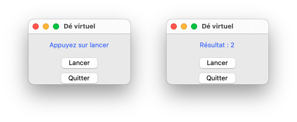
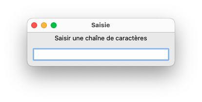
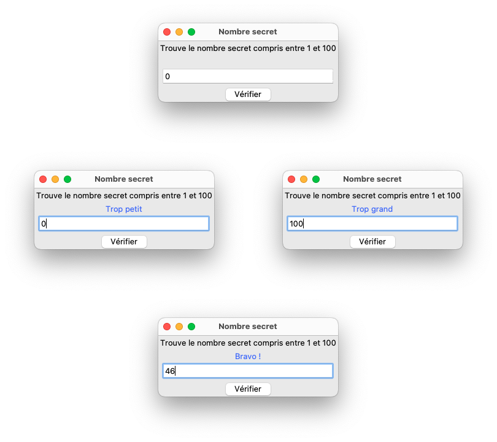

# Interface homme-machine

## Introduction

Ces travaux pratiques ont pour objectif de vous faire découvrir la bibliothèque Tkinter (de l'anglais *Tool kit interface*) dans le but de réaliser une IHM (*Interface Homme-Machine*) en Python.

## Préparation

### Espace de travail

Vous allez créer des dossiers afin de ne pas mélanger vos productions numériques entre vos différentes matières et
travaux pratiques.

!!! note "Organisation de l'espace travail"

    === ":material-laptop: Ordinateur portable"

        1. Lancez l'application <i class="icon file-explorer"></i> **Explorateur de fichiers** 
           <span class="keys shortcut"><kbd>:fontawesome-brands-windows:</kbd><span>+</span><kbd>E</kbd></span>
        2. Dans le dossier `Document`, s'il n'y a pas de dossier nommé `NSI`, créez-le
        3. Dans le dossier `NSI`, s'il n'y a pas de dossier nommé `chapitre_14`, créez-le
        4. Dans le dossier `chapitre_14` créez le dossier `tp2_tkinter`

    === ":material-desktop-tower: Ordinateur fixe"

        1. Depuis le bureau, double-cliquez sur l'icône intitulée **Zone personnelle**
        2. Dans la **zone personnelle**, s'il n'y a pas de dossier `NSI`, créez-le
        3. Dans le dossier `NSI`, s'il n'y a pas de dossier nommé `chapitre_14`, créez-le
        4. Dans le dossier `chapitre_14` créez le dossier `tp2_tkinter`

### Téléchargement des fichiers

Pour réaliser ces travaux pratiques, il est nécessaire de disposer de certains fichiers.

!!! note "Récupération des fichiers"

    1. Téléchargez le fichier ZIP contenant les fichiers nécessaires : [:material-download: télécharger](assets/NSI1RE14_TP2.zip){:download="NSI1RE14_TP2.zip"}
    2. Ouvrez le fichier ZIP<br>*(si le navigateur ne l'ouvre automatiquement, cliquez sur le fichier téléchargé)*
    3. Sélectionnez tous les fichiers et dossiers  <span class="shortcut">++ctrl+a++</span>
    4. Copiez tous les fichiers et dossiers <span class="shortcut">++ctrl+c++</span>
    5. Collez les fichiers dans le dossier `NSI\chapitre_14\tp2_tkinter` <span class="shortcut">++ctrl+v++</span>


## 1. Première fenêtre

Le module Python `tkinter` permet de créer des interfaces graphiques (*Graphical User Interface* ou *GUI* en anglais).
C'est une adaptation de la bibliothèque [:material-link: Tcl/Tk](https://fr.wikipedia.org/wiki/Tool_Command_Language#Histoire_de_Tcl-Tk){:target="_blank"} utilisée pour concevoir des applications fenêtrées.

!!! info "La programmation orientée objet"

    Le module `tkinter` s'utilise selon le paradigme de programmation objet qui fait partie de l'enseignement de la spécialité NSI en terminale.
    Voici quelques notions qui vous seront utiles pour mieux appréhender la syntaxe python des exercices qui suivront.
    
    Un **objet** est une **instance** (une copie indépendante) d'un type construit décrit au moyen d'une **classe** :
    ```python
    # Création de l'objet "moi" qui est une instance de la classe "Humain"
    moi = Humain()
    ```
    
    Un objet peut contenir des variables appelées **propriétés** (mais aussi appelées **champs** ou **attributs**) :
    ```python
    moi.nom            # Lecture d'une propriété "nom" de l'objet "moi"
    moi.nom = "Gaston" # Affectation d'une valeur à la propriété "nom" de l'objet "moi"
    ```
    
    Un objet peut disposer de **méthodes**. Une méthode est une fonction rattachée et qu'il est possible d'appeler ainsi :
    ```python
    moi.manger() # Appel de la méthode "manger" de l'objet "moi"
    ```

!!! tip "Ressources"

    Voici des ressources en ligne dédiées au module tkinter ou TCL/TK. La documentation en français est complète et instructive.

    - [:material-link: Documentation non officielle](http://pascal.ortiz.free.fr/contents/tkinter/tkinter/index.html){:target="_blank"} (en français)
    - [:material-link: Documentation](http://tkdocs.com/tutorial/index.html){:target="_blank"} (en anglais)
    - [:material-link: Site officiel de TCL/TK](https://www.tcl.tk){:target="_blank"} (en anglais)

### Application

!!! note "Instructions"

    1. Ouvrez le fichier `exercice1.py`
    2. Exécutez le programme et observez le résultat
    3. Testez le programme en mettant en commentaire l'instruction `fenetre.mainloop()`
    4. Testez le programme en mettant en commentaire l'instruction `fenetre.geometry("400x300")`
    5. Testez la modification du titre de la fenêtre
    6. Testez la modification des dimensions de la fenêtre
    7. Testez les dimensions `"400x300+300+500"` et essayez de comprendre l'effet de l'ajout de `+300+500`
    8. Veillez à bien enregistrer toute modification

### Synthèse

L'instruction `#!python fenetre = Tk()` affecte une instance de la classe `#!python TK` à la variable `#!python fenetre`. Cet objet correspond à la fenêtre principale de votre application.
L'appel de la méthode `#!python geometry()` sur cet objet permet de fixer les dimensions de la fenêtre.

L'instruction `#!python fenetre.mainloop()` entraine l'affichage de la fenêtre et le démarrage de son gestionnaire d'événements.
Cette instruction est nécessaire pour que l'application soit à l'écoute des événements déclenchés depuis la fenêtre comme un clic de souris, ou l'appui sur une touche du clavier.


## 2. Premiers composants

Une fenêtre est un composant graphique (*widgets* en anglais) capable de contenir d'autres composants graphiques et de gérer leur positionnement.
Voici une liste non exhaustive de composants graphiques qu'il est possible d'ajouter à une fenêtre :

- Étiquette (classe `Label`)
- Bouton (classe `Button`)
- Champ de saisie simple (classe `Entry`)
- Case à cocher (classe `Checkbutton`)
- Bouton radio (classe `Radiobutton`)
- Zone graphique(classe `Canvas`)

### Application

!!! note "Instructions"

    1. Ouvrez le fichier `exercice2.py`
    2. Exécutez le programme et observez le résultat
    3. Expérimentez de façon à comprendre le fonctionnement de chaque ligne et de chaque paramètre
    4. Ajoutez les 4 commentaires explicatifs manquants
    5. Veillez à bien enregistrer toute modification

### Synthèse

Le composant graphique **Label** l'affichage d'un texte. Sa classe dispose de nombreux paramètres d'instanciation dont :

| Paramètre | Description                             |
|:----------|:----------------------------------------|
| `text`    | Fixe le texte affiché                   |
| `fg`      | Fixe la couleur du texte (*foreground*) |
| `bg`      | Fixe la couleur de fond (*background*)  |
| `width`   | Fixe la largeur                         |
| `height`  | Fixe la hauteur                         |

Le composant graphique **Button** permet d'afficher un bouton cliquable. Sa classe dispose de nombreux paramètres d'instanciation dont :

| Paramètre | Description                                      |
|:----------|:-------------------------------------------------|
| `text`    | Fixe le texte du bouton                          |
| `command` | Fixe la fonction ou la méthode à appeler au clic |


## 3. Les événements

### Introduction

Une application dotée d'une IHM doit être en mesure de réagir aux actions de l'utilisateur et mettre à jour l'état de ses composants graphiques en conséquence.

!!! info "Modifier un composant graphique"

    Vous pouvez modifier les propriétés de tout composant graphique après sa création grâce à la méthode `config()`.
    Voici l'exemple d'un appel à la méthode `config()` permettant de modifier le contenu textuel d'une étiquette :

    ```python
    # Création d'une étiquette
    message = Label(fenetre, text="Texte initial")
    message.pack()
    
    # Modification du texte du composant
    message.config(text="Texte modifié")
    ```

!!! info "Réagir à un événement"

    La propriété `command` du composant **Button** permet de définir la fonction à appeler à chaque clic :

    ```python
    # Fonction effectuant un traitement
    def quitter_application():
        """Ferme la fenetre principale"""
        fenetre.destroy()
    
    # Bouton dont l'action au clic est définie via la propriété "command"
    bouton = Button(fenetre, text="Quitter", command=quitter_application)
    ```

### Application

!!! note "Instructions"

    1. Ouvrir le fichier `exercice3.py`
    2. Complétez la fonction `changer_texte` afin de modifier le texte de `label` en `Au revoir !`
    3. Modifiez la propriété `command` du bouton afin que le texte soit modifié au lieu de quitter l'application
    4. Veillez à bien enregistrer toute modification


## 4. Lancer de dé

Vous allez devoir compléter le code Python d'une application simple de lancer de dé.
Il y a peu de différences par rapport à l'exercice précédent, si ce n'est un bouton supplémentaire et un traitement un peu plus élaboré.

!!! note "Consigne"

    1. Ouvrir le fichier `exercice4.py`
    2. Complétez tout code manquant signalé par un `...`
    3. Veillez à bien enregistrer toute modification

    <figure class="illustration" markdown>
        
    </figure>


## 5. Saisie de données

Vous allez maintenant découvrir comment mettre en œuvre une saisie utilisateur.

!!! info "Le composant de saisie de texte"

    Le composant graphique **Entry** est utilisé pour créer des champs de saisie :
    ```python
    from tkinter import *
    
    fenetre = Tk()
    fenetre.title("Saisie")
    
    # Étiquette permettant d'afficher les instructions
    texte = Label(fenetre, text='Saisir une chaîne de caractères')
    texte.pack()
    
    # Champ de saisie
    entree = Entry(fenetre, width=30)
    entree.pack(padx=10, pady=10)
    
    # Gestionnaire d'événements
    fenetre.mainloop()
    ```
    
    <figure class="illustration" markdown>
        
    </figure>
    
    Pour récupérer la valeur saisie, nous utilisons ce qu'on appelle une **variable de contrôle**.
    Une variable de contrôle est un objet chargé de stocker une valeur.
    Il est possible de lier une variable de contrôle à un composant graphique afin de récupérer une valeur, mais aussi de lui en fixer une.

!!! info "Les variables de contrôle"

    Pour disposer d'une variable de contrôle, il vous suffit d'utiliser la classe adaptée au type de valeur que vous souhaitez mémoriser :

    - `v = DoubleVar()` contient un nombre à virgule flottant dont la valeur par défaut est `0.0`
    - `v = IntVar()` contient un nombre entier dont la valeur par défaut est `0`
    - `v = StringVar()` contient une chaine de caractères dont la valeur par défaut est `""`

    Toutes les variables de contrôle disposent des méthodes suivantes :

    - `v.get()` renvoie la valeur courante de la variable de contrôle
    - `v.set(valeur)` modifie la valeur de la variable de contrôle

### Application

!!! info "Instructions"

    1. Ouvrez le fichier `exercice5.py`
    2. Exécuter le programme et comprendre son fonctionnement
    3. Compléter la description de la fonction `afficher` en détaillant son fonctionnement
    4. Complétez tous commentaires manquant signalé par un `...`
    5. Veillez à bien enregistrer toute modification

## 6. Le nombre secret

Vous allez maintenant créer le jeu du nombre secret, dont voici les règles :

!!! tip "Règles du jeu"

    - L'ordinateur choisit un aléatoirement un nombre entier compris entre 0 et 100
    - L'utilisateur doit réussir à le retrouver en transmettant ses tentatives

!!! note "Instructions"

    1. Créez le fichier `secret.py` qui contiendra le code de votre jeu
    2. Commencez par créer et placer tous les composants graphiques
    3. Créez une variable de contrôle permettant de récupérer la saisie de l'utilisateur
    4. Créez une variable de contrôle permettant de modifier le texte indiquent le résultat
    5. Créez la fonction `verifier()` qui sera appelée au clic sur le bouton "Vérifier". Cette fonction :
        - Récupère la saisie de l'utilisateur
        - La compare avec le nombre secret
        - Ajuste le texte du résultat en conséquence

    <figure class="illustration" markdown>
       
    </figure>


!!! danger "Vous avez terminé ?"
    - Compressez le dossier **tp2_tkinter** au format zip et déposez-le dans Pronote
    - Améliorez le jeu en offrant la possibilité de relancer une partie et en comptant le nombre de tentatives.
      Consultez la documentation [:material-link: Géométrie des widgets](http://pascal.ortiz.free.fr/contents/tkinter/tkinter/informations_generales_et_transversales.html#geometrie-des-widgets){:target="_blank"}
      afin de découvrir de nouvelles techniques de positionnement des composants.
    - Une fois vos modifications terminées, vous pouvez rendre une seconde fois votre travail

