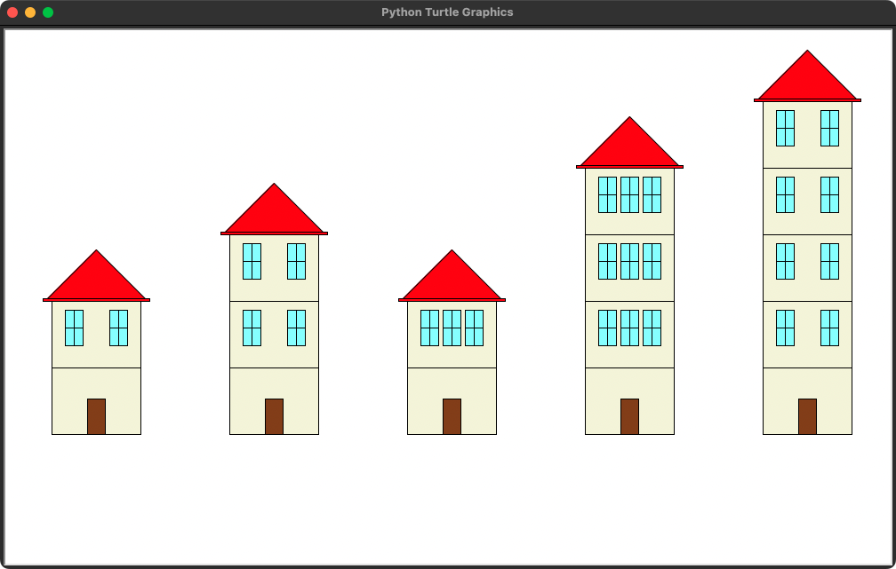

# Paysage aléatoire

## Objectif
Le projet consiste en la génération d'un paysage urbain aléatoire.
Ce paysage sera construit à partir d'un unique élément paramétrable. 

## Tracé paramétrable
L'élément paramétrable à dessiner est une **habitation**. Celle-ci peut varier de diverses façons :

- Le nombre d'étages
- La forme du toit
- La taille du toit
- La présence de balcons à certaines fenêtres
- La présence de jardinières à certaines fenêtres
- La présence de paraboles
- La couleur de la façade
- La couleur du toit
- ...

Les paramètres doivent donc permettre d'ajuster le tracé de l'objet et potentiellement ses couleurs.

<h3>Nombre de paramètres</h3>

Le nombre de paramètres attendus, indépendamment des paramètres de positionnement, est de six (quatre paramètres de tracé et deux paramètres de couleur).
C'est un critère d'évaluation. Vous pouvez en implémenter moins, mais la note maximale sera ajustée en conséquence.
Voici les configurations de paramètres envisageables triées par difficulté décroissante.

1. Une habitation à quatre paramètres de tracé et deux paramètres de couleur
2. Une habitation à quatre paramètres de tracé
3. Une habitation à deux paramètres de tracé et deux paramètres de couleur
4. Une habitation à deux paramètres de tracé

!!! example "Exemple d'habitation à deux paramètres"

    L'objet que nous souhaitons dessiner dans le cadre de cet exemple est une maison.
    Le tracé de celle-ci est ajustable selon deux paramètres : le nombre d'étages et le nombre de fenêtres par étage.
    
    ```python
    def maison(x, y, nb_etages, nb_fenetres):
        """
        Dessine une maison
        
        x           -- position x du coin inférieur gauche
        y           -- position y du coin inférieur gauche
        nb_etages   -- nombre d'étages
        nb_fenetres -- nombre de fenêtres par étage
        """
    ```

    Voici un exemple de paysage construit à partir de plusieurs appels d'une fonction de tracé d'une habitation à **deux paramètres** tracé :
    
    ```python
    def dessiner_paysage():
        """
        Dessine le paysage de la ville
        """
        maison(-450, -150, 1, 2)
        maison(-250, -150, 2, 2)
        maison(-50,  -150, 1, 3)
        maison(150,  -150, 3, 3)
        maison(350,  -150, 4, 2)
    ```

    <figure markdown>
    
    </figure>

## Livrable

Votre projet devra être transmis à l'enseignant au format zip. Le code Python devra être séparé en deux modules minimum.
Un ou plusieurs modules contiendront la définition de vos fonctions de tracé et idéalement du code de test.
Un module appelé `main.py` contiendra la configuration Turtle et l'appel à la fonction de tracé du paysage.

!!! example "Exemple de fichier `main.py`"

    ```python
    import turtle            # Module turtle
    import ville             # Nom arbitraire du module contenant les fonctions de dessin
    
    turtle.hideturtle()      # Masque la tortue
    turtle.tracer(False)     # Tracé instantané
    ville.dessiner_paysage() # Génère le paysage aléatoire
    turtle.tracer(True)      # Réactive les mouvements de la tortue
    turtle.mainloop()        # Boucle des événements
    ```

## Critères d'évaluation

!!! success "Livrable"

    - Déposé sur Pronote à l'heure
    - Envoyé sous forme d'un fichier ZIP
    - Tous les auteurs sont mentionnées dans le code source
    - Le programme s'exécute depuis le fichier `main.py`
    - Le programme s'exécute sans anomalie
    - La fenêtre reste ouverte à la fin du tracé

!!! success "Respect des contraintes"

    - Fonction unique de génération du paysage
    - Appel de la fonction de génération du paysage depuis le fichier `main.py`
    - Fonction dédiée au tracé de l'habitation
    - Fonction de tracé de l'habitation comportant, des paramètres de tracé (hors `x` et `y`) et des paramètres de couleur

!!! success "Programmation"

    - Les variables, fonctions et modules sont correctement nommés
    - Les docstrings décrivent la fonction et ses paramètres
    - Le code est bien organisé et factorisé
    - Le code est commenté lorsque c'est nécessaire
    - Tous les fichiers inutiles ont été supprimés

!!! success "Qualité du rendu"

    - Les habitations comportent des éléments réalistes et travaillés
    - Le paysage est aléatoire tout en restant cohérent
    - Le paysage comporte des éléments en plus des habitations

!!! tip "Conseil"

    Ne vous précipitez pas immédiatement sur vos ordinateurs. Préparez vos tracés et vos algorithmes sur papier.
