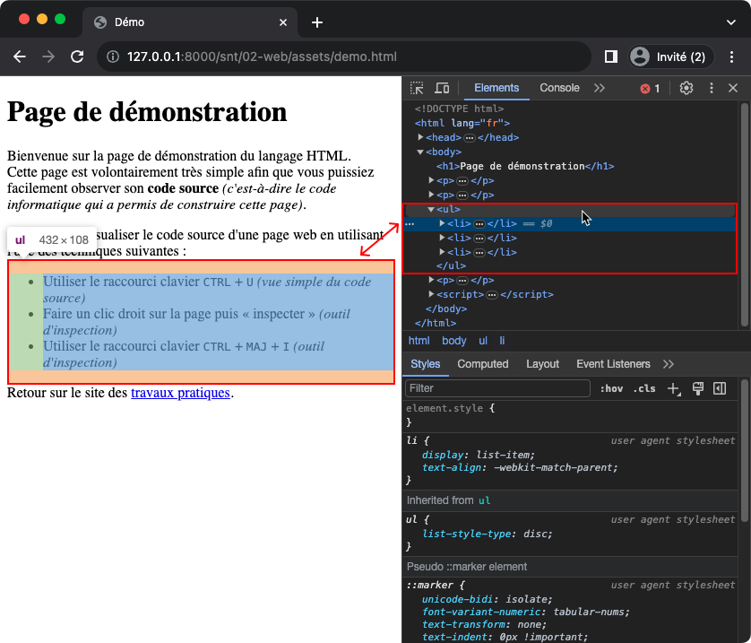
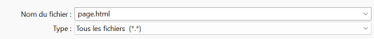

# Le langage HTML

## Introduction

Toutes les pages que vous pouvez consulter sur le Web sont construites à partir d'un même langage informatique :
le langage **HTML** *(pour HyperText Markup Language)*.
Dans le cadre de ces travaux pratiques, vous allez découvrir ce langage HTML et créer votre propre page.

!!! danger "Important"

    Ces travaux pratiques ont vocation à vous préparer au projet de chapitre consistant à créer un mini-site web.
    Suivez attentivement chaque consigne, lisez chaque explication et signalez toute incompréhension.

## Préparation

Vous allez créer des dossiers afin de ne pas mélanger vos productions numériques entre vos différentes matières et
travaux pratiques.

!!! note "Organisation de l'espace travail"

    === ":material-laptop: Ordinateur portable"

        1. Lancez l'application <i class="icon file-explorer"></i> **Explorateur de fichiers** 
           <span class="keys shortcut"><kbd>:fontawesome-brands-windows:</kbd><span>+</span><kbd>E</kbd></span>
        2. Accédez à votre dossier <i class="icon onedrive"></i> **OneDrive**
        3. Dans le dossier `OneDrive`, s'il n'y a pas de dossier nommé `SNT`, créez-le
        4. Dans le dossier `SNT`, s'il n'y a pas de dossier `web`, créez-le
        5. Dans le dossier `web`, créez le dossier `langage_html`

    === ":material-desktop-tower: Ordinateur fixe"

        1. Depuis le bureau, double-cliquez sur l'icône intitulée **Zone personnelle**
        2. Dans la **zone personnelle**, s'il n'y a pas de dossier nommé `SNT`, créez-le
        3. Dans le dossier `SNT`, s'il n'y a pas de dossier `web`, créez-le
        4. Dans le dossier `web`, créez le dossier `langage_html`

## Code source d'une page web

### Affichage du code source

En informatique, on appelle **code source** les instructions textuelles d'exécution d'un programme ou de création d'un
contenu.
Une page web est un contenu construit à partir d'un code source écrit en langage **HTML**.

Pour voir visualiser une page web, vous avez besoin d'un **navigateur web** *(Chrome, Firefox, ...)*.
C'est une application capable d'afficher une page web à partir de son code HTML. Mais à quoi ressemble du code HTML ?

!!! note "Visualisation du code source"

    Il est possible de visualiser le code source de n'importe quelle page web directement depuis un navigateur web.

    1. Rendez-vous sur la page de démonstration en cliquant sur ce lien : [:material-link: demo.html](assets/demo.html){:target="_blank"}
    2. Une fois sur cette page, utilisez le raccourci clavier ++ctrl+u++
    3. Observez et essayez de faire la distinction entre le contenu et le code permettant de structurer ce contenu

!!! info "Cours - Les balises HTML"

    En observant le code source, vous devriez avoir constaté que certaines portions de texte telles que `<body>`, `<p>` ou `<strong>` sont mises en valeur.
    Ces textes sont des « **balises** ». Ils constituent le langage HTML et permettent de définir et structurer le contenu d'une page web.

!!! example "Exemple - L'élément paragraphe"

    La balise `<p>` permet de définir un élément paragraphe.
    Il est donc possible de structurer un contenu sous forme d'un paragraphe en le délimitant :
    
    - par une balise ouvrante `<p>` *(début du paragraphe)* ; 
    - et une balise fermante `</p>` *(fin du paragraphe)*.
    
    === ":material-code-tags: Code"
        ```html
        <p>Ceci est un premier paragraphe</p>
        <p>Ceci est un second paragraphe</p>
        ``` 
    === ":material-application-outline: Affichage"
        Ceci est un premier paragraphe

        Ceci est un second paragraphe

!!! example "Exemple - L'élément important"

    La balise `<strong>` permet de signaler une portion de texte comme étant importante.
    Il est possible de structurer un contenu ainsi en le délimitant :

    - par une balise ouvrante `<strong>` *(début du texte important)* ; 
    - et une balise fermante `</stong>` *(fin du texte important)*.

    === ":material-code-tags: Code"
        ```html
        <p>
            Ceci est un premier paragraphe.
            Il est plus <strong>important</strong> que le second !
        </p>
        <p>Ceci est un second paragraphe.</p>
        ``` 
    === ":material-application-outline: Affichage"
        Ceci est un premier paragraphe.
        Il est plus **important** que le second !

        Ceci est un second paragraphe

    :material-alert: Vous noterez que les espaces et les sauts de ligne du code source ne sont pas pris en compte pour l'affichage.

### Inspection du code source

Il existe une autre façon de consulter le code source d'une page web en utilisant la fonction **inspecter** du
navigateur.
Celle-ci permet de retrouver le code HTML associée à une partie visible de la page ou inversement, de retrouver la zone
d'affichage correspondant à une portion du code source.

!!! note "Inspection du code source"

    1. Retournez sur la page de démonstration : [:material-link: demo.html](assets/demo.html){:target="_blank"}
    2. Depuis cette page, lancez l'inspecteur de code source en utilisant l'une des méthodes suivantes :
        - Faire un clic droit sur la page puis « Inspecter »
        - Utiliser le raccourci clavier ++ctrl+shift+i++
    3. Identifiez les balises permettant la construction de la liste à puces<br>
       *(visuellement, c'est la liste des techniques d'accès au code source d'une page web)*

    

## Création d'une page web

Vous allez créer votre première page web.
Pour cela, vous pouvez simplement utiliser l'application **Bloc-notes** pour l'écriture du code.
La visualisation de la page se fera dans un navigateur Web.

!!! note "Création d'un page web"

    1. Lancez l'application **Bloc-notes**
    2. Copiez/collez le code HTML suivant :
        ```html
        <!doctype html>
        <html lang="fr">
            <head>
                <meta charset="utf-8">
                <meta name="author" content="Personne">
                <meta name="description" content="Ma toute première page HTML !">
                <title>Ma page !</title>
            </head>
            <body>
                <h1>Bienvenue</h1>
                <p>
                  Bonjour, ceci est <br> ma première page HTML !
                </p>
            </body>
        </html>
        ```
    3. Enregistrez le fichier dans le dossier `SNT\web\langage_html` en le nommant `page.html`.<br>**Attention à bien choisir « Tous les fichiers (\*.\*) » comme type de fichier** :<br>
       
    4. Lancez l'application <i class="icon file-explorer"></i> **Explorateur de fichiers** 
       <span class="keys shortcut"><kbd>:fontawesome-brands-windows:</kbd><span>+</span><kbd>E</kbd></span>
    5. Déplacez-vous dans le dossier `SNT\web\langage_html`
    6. Double-cliquez sur le fichier `page.html`<br>
       *(un navigateur Web doit se lancer automatiquement et présenter le contenu de celle-ci)*

Une page web est donc un simple **fichier texte** d'extension `.html`.
Attention à ne pas confondre les fichiers textes avec les documents textes élaborés à partir de logiciels comme
Microsoft Word
Un fichier texte ne contient que des caractères sans mise en forme *(taille des caractères, couleur,
soulignement, ...)*.

## Modification d'une page web

### Modification du titre

La balise `#!html <title></title>` permet de définir l'élément **titre** d'une page. Elle est contenue entre les
balises `#!html <head></head>`
qui définissent l'élément **en-tête**. Ce dernier élément est utilisé pour préciser certaines caractéristiques et
informations concernant la page.
Aucune des données renseignées n'est directement visible pour l'internaute à l'exception du titre.

!!! tip "Culture - Les métadonnées"

    Les informations renseignées via les balises `#!html <meta name="author" ...>` et `#!html <meta name="description" ...>`
    sont des **métadonnées**. Celles-ci donnent des informations sur le contenu d'une page web.
    Elles sont entre autres utilisées par les moteurs de recherche *(Google, Bing, ...)* pour afficher le résumé de 
    chaque élément du résultat d'une recherche.

!!! note "Modification du titre d'une page web"

    1. Retournez au **Bloc-notes** avec le fichier `page.html` ouvert
    2. Retrouvez le texte **« Ma page ! »** au sein du code. Il est situé au niveau des balises `#!html <title></title>`.
    3. Remplacez **« Ma page ! »** par le texte de votre choix
    4. Enregistrez vos modifications <span class="keys shortcut">++ctrl+s++</span>
    5. Retournez dans le **navigateur web** avec la page `page.html` ouverte
    6. Rechargez cette page afin de rendre visible vos modifications :
        - en appuyant sur la touche ++f5++
        - ou en utilisant le raccourci clavier ++ctrl+r++ 
    7. Localisez l'endroit, dans tout le navigateur, où est affiché votre nouveau titre (cherchez bien 🧐 !). 
       <br>Constatez-vous le changement ?

### Modification du corps

La balise `#!html <body></body>` permet de définir l'élément **corps** d'une page, c'est-à-dire le contenu visible dans
le
navigateur Web.

!!! note "Saisie d'un nouveau texte"

    1. Remplacez le contenu des balises `#!html <p></p>` *(sans supprimer celles-ci)* par cet extrait de *La Cigale et la Fourmi* de Jean de La Fontaine :
    ```
    La Cigale, ayant chanté
    Tout l'été,
    Se trouva fort dépourvue
    Quand la bise fut venue.
    Pas un seul petit morceau
    De mouche ou de vermisseau.
    Elle alla crier famine
    Chez la Fourmi sa voisine,
    La priant de lui prêter
    Quelque grain pour subsister
    Jusqu'à la saison nouvelle.
    ```
    
    2. Remplacez le contenu des balises `#!html <h1></h1>` *(sans supprimer celles-ci)* par le texte suivant :
    ```
    La Cigale et la Fourmi
    ```
    
    3. Enregistrez votre fichier <span class="keys shortcut">++ctrl+s++</span>
    4. Retournez dans le navigateur
    5. Actualisez la page <span class="keys shortcut">++f5++ ou ++ctrl+r++</span>
    6. Qu'observez-vous ?

!!! tip "Explication"

    En HTML, les sauts de ligne présents dans le code source ne sont pas pris en compte, tout comme les espacements multiples.
    Tout saut de ligne doit être explicitement indiqué par la balise `#!html <br>`

!!! note "Gestion des sauts de ligne"

    Ajoutez la balise `<br>` à la fin de chaque ligne afin de correctement mettre en forme le texte.

??? Success "Correction - Code source final"

    ```html
    <!doctype html>
    <html lang="fr">
        <head>
            <meta charset="utf-8">
            <meta name="author" content="Jean de La Fontaine">
            <meta name="description" content="La Cigale et la Fourmi de Jean de La Fontaine">
            <title>Fables - La Cigale et la Fourmi</title>
        </head>
        <body>
            <h1>La Cigale et la Fourmi</h1>
            <p>
                La Cigale, ayant chanté<br>
                Tout l'été,<br>
                Se trouva fort dépourvue<br>
                Quand la bise fut venue.<br>
                Pas un seul petit morceau<br>
                De mouche ou de vermisseau.<br>
                Elle alla crier famine<br>
                Chez la Fourmi sa voisine,<br>
                La priant de lui prêter<br>
                Quelque grain pour subsister<br>
                Jusqu'à la saison nouvelle.
            </p>
        </body>
    </html>
    ```

## Structuration du texte

### Une nouvelle page

Vous allez maintenant créer une page web dédiée à la description de votre film préféré (ou série préférée).

!!! question "Pas de film préféré ?"

    À défaut d'avoir un film préféré, décrire le film *Intouchables*. C'est actuellement le 3<sup>ème</sup> film ayant
    totalisé le plus d'entrées en France à ce jour avec 19 490 688 entrées.

!!! note "Création d'une nouvelle page web"

    1. Créez un nouveau fichier dans avec le Bloc-notes
    2. Copiez/collez le code de l'amorce de page ci-dessous :
    ```html
    <!doctype html>
    <html lang="fr"> 
        <head>
            <meta charset="utf-8">
            <title>Mon Film Préféré</title>
        </head>
        
        <body>
            TITRE DU FILM
            
            <p></p>
            
            <p><em>Ce document a été réalisé par PRENOM NOM</em></p>
            
            Informations générales
            
            <ul>
                <li>Année de Sortie :</li>
                <li>Réalisateur :</li>
                <li>Acteurs Principaux :</li>
                <li>Genre :</li>
            </ul>
            
            Résumé
            
            Sources des informations et médias
        </body>
    </html>
    ```
    4. Enregistrez immédiatement le fichier dans le dossier `SNT\web\langage_html` en le nommant `film.html`
    5. Visualisez votre page dans un navigateur

### Les éléments de titre

En HTML, il est possible de créer des éléments de titre au sein d'une page grâce aux balises suivantes :

- `#!html <h1></h1>` *(titre)*,
- `#!html <h2></h2>` *(sous-titre)*,
- `#!html <h3></h3>` *(sous-sous-titre)*
- ...
- `#!html <h6></h6>`

!!! note "Définition du titre principal"

    1. Remplacez le texte « TITRE DU FILM » par le nom de votre film préféré
    2. Englobez le nom du film par des balises `#!html <h1></h1>` afin de créer un élément « titre de niveau 1 » *(ou titre)* 
    3. Enregistrez vos modifications et visualisez le résultat dans le navigateur    

!!! example "Exemple de titre principal"

    === "Avant"

        ```html
        TITRE DU FILM
        ```

    === "Après"

        ```html
        <h1>La Belle et la Bête</h1>
        ```

!!! note "Définition des titres secondaires"

    1. Recherchez les textes listés ci-dessous **dans le contenu** de la page web :
        - Informations générales
        - Résumé
        - Sources d'information
    2. Englobez chacun d'eux par des balises `#!html <h2></h2>`. 
       Ces balises permettent de créer des éléments « titre de niveau 2 » *(ou sous-titres)*.
    3. Visualiser le résultat *(toujours en enregistrant et actualisant)*

!!! example "Exemple de titre secondaire"

    === "Avant"

        ```html
        Informations générales
        ```

    === "Après"

        ```html
        <h2>Informations générales</h2>
        ```

### L'élément de haute importance

Vous allez compléter la section *Information générale* et utiliser une nouvelle balise pour mettre en valeur les
descripteurs *(Année de sortie, Réalisateur, ...)*.

!!! note "Mise en valeur de portions de texte"

    1. Renseignez les informations générales du film choisi
    2. Englobez chacun des textes suivants par le couple de balises `#!html <strong></strong>` :
        - Année de Sortie :
        - Réalisateur :
        - Acteurs Principaux :
        - Genre :

!!! example "Exemple de mise en valeur"

    === "Avant"
        
        ```html 
        <li>Année de Sortie :</li>
        <li>Réalisateur :</li>
        ```

    === "Après"

        ```html
        <li><strong>Année de sortie :</strong> 1968</li>
        <li><strong>Réalisateur :</strong> Stanley Kubrick</li>
        ```

### L'élément paragraphe

Vous allez ajouter du contenu à la section *Résumé*. Sur papier, les longs textes sont structurés en paragraphes.
Il est possible de faire de même en HTML à l'aide de l'élément paragraphe défini par le couple de
balise `#!html <p></p>`.

!!! note "Gestion des paragraphes"

    1. Retrouvez un résumé de votre film
    2. Copiez/collez le texte trouvé *(vous êtes autorisés pour cette fois-ci, mais ça reste du plagiat et c'est interdit)*
    3. Le structurez en paragraphes à l'aide de couples de balises `#!html <p></p>`

!!! example "Exemple de paragraphes"

    Exemple de paragraphe très court.
    
    ```html
    <p>Une seule ligne</p>
    ```
    
    Les sauts de ligne n'étant pas significatifs, il est possible d'écrire ce même paragraphe comme ci-dessous.
    
    ```html
    <p>
        Une seule ligne
    </p>
    ```
    
    Il est possible de définir plusieurs paragraphes à la suite.
    Un passage à la ligne est automatiquement appliqué par le navigateur après chaque paragraphe.
    
    ```html
    <p>Paragraphe 1</p>
    <p>Paragraphe 2</p>
    ```

### L'élément lien hypertexte

L'une des fonctionnalités révolutionnaires du Web est le **lien hypertexte**, c'est-à-dire la possibilité d'insérer un
lien vers une autre page située n'importe où sur le Web.
Un élément lien hypertexte se crée grâce au couple de balises `#!html <a href=""></a>`. Vous constaterez une différence
par
rapport aux autres balises déjà rencontrées par la présence de `href=""`.

!!! info "Cours - Les attributs d'une balise HTML"

    Le texte `href=""` est un *attribut* de la balise `#!html <a>`. Tout attribut a un nom (ici `href`) et une valeur (écrite entre guillemets).
    Les attributs permettent de transmettre des informations à une balise dont le fonctionnement se verra impacté.
    
    L'attribut `href` permet d'indiquer l'URL du contenu vers lequel nous souhaitons faire pointer le lien hypertexte.
    Le texte englobé par les balises `#!html <a>` sera mis en valeur et rendu cliquable.

!!! example "Exemple - L'élément lien hypertexte"

    Voici un texte comportant un lien hypertexte vers le site de lycée. Le texte cliquable sera *site du lycée*.
    
    === ":material-code-tags: Code"
        ```html
        Rendez-vous sur le <a href="http://www.lyceebachelardchelles.fr">site du lycée</a>
        ``` 
    === ":material-application-outline: Affichage"
        Rendez-vous sur le [site du lycée](http://www.lyceebachelardchelles.fr){:target="_blank"}

!!! note "Création de liens hypertextes"

    1. Retrouvez l'URL des pages où vous avez trouvé les informations concernant votre film
    2. Ajoutez dans la section **Sources** un paragraphe précisant les sites utilisés en insérant un lien vers chacun

### L'élément image

Il est possible d'insérer un élément image sur une page Web grâce à la balise `#!html `. Elle dispose des attributs
suivants :

- L'attribut `src` qui est le chemin ou l'URL d'une image
- L'attribut `alt` qui est un texte alternatif qui sera présenté par le navigateur si l'affichage de l'image se révèle
  impossible

!!! example "Exemple - L'élément image"

    Nous avons téléchargé un fichier image `image_800x600.jpg` que nous avons enregistré dans le même dossier que notre page web.
    Cette image représente l'affiche du film *Intouchable*. Voici ci-dessous le code de la balise `#!html ` dans cette situation.

    === ":material-code-tags: Code"
        ```html
        
        ```
    === ":material-application-outline: Affichage"
        

!!! note "Insertion d'une image"

    1. Trouvez sur le Web une image de l'affiche de votre film au format `.jpg` ou `.png`
    2. Téléchargez l'image et enregistrez-la dans le même dossier que le fichier `film.html`
    3. Modifiez la balise `` déjà présente dans la page en conséquence
    4. Visualisez le résultat

## Vous avez terminé ?

### Les métiers du Web

Vous pouvez découvrir les métiers du Web sur le site de l'ONISEP.

!!! info "Les métiers du Web"

    - [:material-link: Intégrateur/trice web](https://www.onisep.fr/Ressources/Univers-Metier/Metiers/integrateur-integratrice-web){:target="_blank"}
    - [:material-link: Webdesigner](https://www.onisep.fr/Ressources/Univers-Metier/Metiers/webdesigner){:target="_blank"}
    - [:material-link: Web-ergonome](https://www.onisep.fr/Ressources/Univers-Metier/Metiers/web-ergonome){:target="_blank"}
    - [:material-link: Spécialiste de l'accessibilité numérique](https://www.onisep.fr/Ressources/Univers-Metier/Metiers/specialiste-de-l-accessibilite-numerique){:target="_blank"}
    - [:material-link: Traffic Manager](https://www.onisep.fr/Ressources/Univers-Metier/Metiers/traffic-manager){:target="_blank"}
    - [:material-link: Chef/fe de projet Web](https://www.onisep.fr/Ressources/Univers-Metier/Metiers/chef-cheffe-de-projet-web-mobile){:target="_blank"}
    - [:material-link: Webmestre](https://www.onisep.fr/Ressources/Univers-Metier/Metiers/webmestre){:target="_blank"}
    - [:material-link: Rédacteur/trice](https://www.onisep.fr/Ressources/Univers-Metier/Metiers/redacteur-redactrice-on-line){:target="_blank"}