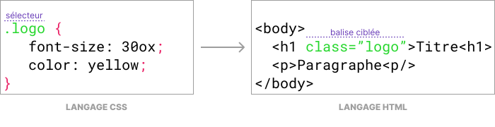

# Le langage CSS

## Introduction

L’activité « [:material-link: TP1 - Langage HTML](tp1-langage-html.md) » a consisté à utiliser le langage HTML pour
définir le **contenu
et la structure** d'une page web.

Ces travaux pratiques ont pour objectif de vous faire découvrir la **mise en forme** d'une page web.
Pour cela, vous apprendrez à utiliser le langage CSS *(Cascading Style Sheets)* aussi appelé *feuilles de style* en
français.

!!! target "Objectifs"

    - Comprendre le rôle du langage CSS
    - Savoir faire la distinction entre le langage HTML et le langage CSS
    - Comprendre la structure du langage CSS
    - Savoir ce qu'est un selecteur
    - Savoir ce qu'est une propriété CSS

## Préparation

### Espace de travail

Vous allez créer des dossiers afin de ne pas mélanger vos productions numériques entre vos différentes matières et
travaux pratiques.

!!! note "Organisation de l'espace travail"

    === ":material-laptop: Ordinateur portable"

        <h5>Étape 1 - Activation de la sauvegarde sur le cloud OneDrive</h5>
        
        1. Connectez-vous en cliquant sur le nuage situé en bas à droite à proximité de l'heure
        2. Acceptez d'utiliser votre adresse **@monlycee.net**
        3. Acceptez la synchronisation automatique des dossiers de votre ordinateur
        4. Une fois la connection réussie, le nuage doit devenir bleu <i class="icon onedrive"></i> 

        <h5>Étape 2 - Créaction des dossiers</h5>

        1. Lancez l'application <i class="icon file-explorer"></i> **Explorateur de fichiers**
        2. Dans le dossier `Document`, s'il n'y a pas de dossier nommé `SNT`, créez-le
        3. Dans le dossier `SNT`, s'il n'y a pas de dossier `web`, créez-le
        4. Dans le dossier `web`, créez le dossier `langage_css`

    === ":material-desktop-tower: Ordinateur fixe"

        1. Depuis le bureau, double-cliquez sur l'icône intitulée **Zone personnelle**
        2. Dans la **zone personnelle**, s'il n'y a pas de dossier nommé `SNT`, créez-le
        3. Dans le dossier `SNT`, s'il n'y a pas de dossier `web`, créez-le
        4. Dans le dossier `web`, créez le dossier `langage_css`

### Téléchargement des fichiers

Pour effectuer ce TP, il est nécessaire de télécharger certains fichiers :

!!! note "Récupération des fichiers"

    1. Téléchargez le fichier ZIP contenant les fichiers nécessaires à ce TP : [:material-download: télécharger](assets/SNT02_TP2.zip){:download="SNT02_TP2.zip"}
    2. Ouvrez le fichier ZIP<br>*(le navigateur l'ouvre automatiquement ou cliquez sur le fichier téléchargé)*
    3. Sélectionnez tous les fichiers et dossiers  <span class="shortcut">++ctrl+a++</span>
    4. Copiez tous les fichiers et dossiers <span class="shortcut">++ctrl+c++</span>
    5. Collez les fichiers dans le dossier `SNT\Web\langage_css` <span class="shortcut">++ctrl+v++</span>

## Application des styles

### Association d'un fichier CSS

Le fichier `index.html` correspond à la page web à mettre en forme.
L'ensemble des règles de mise en forme CSS sont écrites dans le fichier `style.css`.
Ce fichier est une **feuille de style**. Celle-ci est dite «&nbsp;externe&nbsp;» car les règles de mise en forme sont
définies à l'extérieur de la page web `index.html`.

??? info "Culture numérique"

    Pour définir la mise en forme des éléments d'une page web, il existe plusieurs méthodes :

    - Utiliser l'attribut `style` des balises HTML ([:material-link: référence](https://developer.mozilla.org/fr/docs/Web/HTML/Global_attributes/style){:target="_blank"})
    - Utiliser la balise HTML `#!html <style></style>` sur la page à mettre en forme (*feuille de style interne*) ([:material-link: référence](https://developer.mozilla.org/fr/docs/Web/HTML/Element/style){:target="_blank"})
    - Utiliser un lien vers une ressource externe à la page à mettre en forme (*feuille de style externe*) ([:material-link: référence](https://developer.mozilla.org/fr/docs/Web/HTML/Element/link){:target="_blank"})

Dans le cadre de ces travaux pratiques, nous n'utiliserons que la méthode de la feuille de style **externe**.
Vous allez maintenant procéder à l'association d'une feuille de style à une page web :

!!! note "Visualisation de la page web à styliser"

    1. Lancez l'application <i class="icon file-explorer"></i> **Explorateur de fichiers**
       <span class="keys shortcut"><kbd>:fontawesome-brands-windows:</kbd><span>+</span><kbd>E</kbd></span>
    2. Placez-vous dans le dossier `SNT\web\langage_css`
    3. Double-cliquez sur le fichier `index.html` afin de l'ouvrir dans un navigateur web
    4. **Gardez le navigateur ouvert**

!!! note "Association d'une feuille de style à la page web"

    <h5>Étape 1 - Ouverture du fichier `index.html`</h5>

    1. Lancez l'application **Bloc-notes**
    2. Depuis le Bloc-notes, ouvrez le fichier `index.html`<br>
       :material-alert: Lors de la sélection du fichier, bien choisir **Tous les fichiers (\*.\*)** au lieu de **Fichiers texte (\*.txt)**  pour le voir

    <h5>Étape 2 - Association d'une feuille de style</h5>

    1. Cherchez le couple de balises `#!html <head> ... </head>` en début de fichier
    2. Insérez le code HTML ci-dessous n'importe où **entre** les balises `#!html <head> ... </head>` : 
       ``` html
       <link href="style.css" rel="stylesheet">
       ```
      Le code de l'en-tête de la page web doit maintenant ressembler à ceci :
       ``` html hl_lines="4"
       <head>
           <meta charset="utf-8">
           <title>PMDb - Personal Movie Database</title>
           <link href="style.css" rel="stylesheet">
       </head>
       ```
    3. Enregistrez vos modifications <span class="shortcut">++ctrl+s++</span>
    4. **Ne fermez pas l'application Bloc-notes**, vous allez encore beaucoup l'utiliser

    <h5>Étape 3 - Visualisation du résultat</h5>

    1. Retournez dans le navigateur web
    2. Actualisez la page `index.html` <span class="shortcut">++f5++ ou ++ctrl+r++</span><br> 
        *(des changements doivent être observables)*

!!! tip "Cours - La feuille de style"

    La page web `index.html` est maintenant reliée au fichier `style.css`.
    Le fichier `style.css` est appelé **feuille de style**.
    Celle-ci contient des règles de mise en forme écrites en **langage CSS**.

### Sélecteur de type

Nous allons étudier plus en détail la feuille de style `style.css` afin comprendre les principes et la syntaxe du
langage CSS.

!!! note "Découverte du langage CSS"

    1. Retournez à l'application **Bloc-notes**
    2. Ouvrez le fichier `style.css` <span class="shortcut">++ctrl+o++</span>
    3. Le code présent au début du fichier doit être similaire à celui-ci :
    ``` css
    body {
        margin: 0;
        background-color: purple;
    }
    
    header {
        background-color: #121212;
        color: white;
        padding: 20px;
    }
    ```
    4. Lisez **attentivement** les notions de cours sur le langage CSS ci-après

!!! tip "Cours - Le langage CSS"

    Une feuille de styles contient un ensemble de **déclarations**. Chaque déclaration est constituée de deux parties :

    - Un **sélecteur**, qui permet de sélectionner la **balise** de l'élément à mettre en forme
    - Un **ensemble de règles** entre accolades `{ }`. Les règles permettent d'ajuster les **valeurs** des **propriétés** de mise en forme

    <figure markdown>
        
        <figcaption>Exemple de déclaration CSS ciblant la balise </em><code>body</code></figcaption>
    </figure>

    Dans le cas ci-dessus, il est question du **sélecteur** `body`.
    Il s'agit d'un **sélecteur de type**, c'est-à-dire qu'il permet de cibler la balise de type `<body>` qui se verra alors appliquer l'ensemble des règles définies (marge à 0 et couleur de fond à violet).

??? example "Expérimentation"

    <p class="codepen" data-height="300" data-default-tab="html,result" data-slug-hash="vYbjZGb" data-editable="true" data-user="mulot-nsi" style="height: 300px; box-sizing: border-box; display: flex; align-items: center; justify-content: center; border: 2px solid; margin: 1em 0; padding: 1em;">
      <span>See the Pen <a href="https://codepen.io/mulot-nsi/pen/vYbjZGb">
      Untitled</a> by Mulot NSI (<a href="https://codepen.io/mulot-nsi">@mulot-nsi</a>)
      on <a href="https://codepen.io">CodePen</a>.</span>
    </p>
    <script async src="https://cpwebassets.codepen.io/assets/embed/ei.js"></script>

Vous allez maintenant déclarer un style CSS dont le sélecteur va cibler la balise `<h1>` de la page web.
Celle-ci est utilisée pour structurer le titre principal de la page (*« Intouchable »*).

!!! note "Déclaration d'un nouveau style"

    1. Retournez à l'application **Bloc-notes**
    2. Consultez le fichier `style.css`
    3. **Ajoutez** la déclaration CSS ci-dessous à la fin du fichier `style.css`<br>
       *(les espacements et les sauts de ligne n'ont pas d'importance)* :
    ```css
    h1 {
        color: red;
    }
    ```

    4. Enregistrez vos modifications <span class="shortcut">++ctrl+s++</span>
    5. Retournez dans le navigateur web
    6. Actualisez la page `index.html` <span class="shortcut">++f5++ ou ++ctrl+r++</span><br> 
       *(le titre du film en haut de la page doit changer de couleur)*

### Sélecteur de classe

Avec le sélecteur de type, il n'est pas possible de choisir précisément l'élément sur lequel nous souhaitons appliquer
un style.
Pour résoudre ce problème, il existe un autre genre de sélecteur.

!!! note "Observation"

    1. Retournez à l'application **Bloc-notes**
    2. Consultez le fichier `style.css`
    3. Recherchez et **observez simplement** la déclaration CSS ayant pour sélecteur `.logo` :

    ```css
    .logo {
        background-color: #f5c518;
        ...
        justify-content: center;
    }
    ```
    4. Lisez **attentivement** les notions de cours sur le sélecteur de classe ci-après

!!! tip "Cours - Le sélecteur de classe"

    Le sélecteur `.logo` ne correspond à aucune balise HTML. 
    Vous observerez que son nom est précédé d'un **point**.
    Cela signifie qu'il s'agit d'un **sélecteur de classe**.
    Ce sélecteur permet de cibler tout élément dont la balise dispose l'attribut `class` avec pour valeur `logo`.

    <figure markdown>
        
        <figcaption>Exemple de déclaration CSS ciblant les balises disposant de la classe </em><code>logo</code></figcaption>
    </figure>

??? example "Expérimentation"

    <p class="codepen" data-height="300" data-default-tab="html,result" data-slug-hash="yLZjXaM" data-editable="true" data-user="mulot-nsi" style="height: 300px; box-sizing: border-box; display: flex; align-items: center; justify-content: center; border: 2px solid; margin: 1em 0; padding: 1em;">
      <span>See the Pen <a href="https://codepen.io/mulot-nsi/pen/yLZjXaM">
      Sélecteurs de type</a> by Mulot NSI (<a href="https://codepen.io/mulot-nsi">@mulot-nsi</a>)
      on <a href="https://codepen.io">CodePen</a>.</span>
    </p>
    <script async src="https://cpwebassets.codepen.io/assets/embed/ei.js"></script>

!!! note "Utilisation d'une classe pour appliquer un style à un élément"

    1. Retournez à l'application **Bloc-notes**
    2. Consultez le fichier `index.html`
    3. Retrouvez la ligne suivante dans le fichier `index.html`:
    ```html
    <a href="https://www.imdb.com/video/vi59285529">PMDb</a>
    ```
    4. **Modifiez** la balise `#!html <a>` en lui ajoutant l'attribut `#!html class="logo"` comme ceci :
    ```html
    <a class="logo" href="https://www.imdb.com/video/vi59285529">PMDb</a>
    ```
    5. Enregistrez vos modifications <span class="shortcut">++ctrl+s++</span>
    6. Retournez dans le navigateur web
    7. Actualisez la page `index.html` <span class="shortcut">++f5++ ou ++ctrl+r++</span><br> 
       *(des changements doivent être observables)*
    8. Lisez attentivement le bilan ci-après et **assurez-vous d'avoir bien compris**

!!! info "Bilan"

    Pour qu'un style s'applique à une balise, il faut pouvoir la cibler finement.
    Pour cela, nous avons étudié deux sélecteurs :

    - les **sélecteurs de type** qui ciblent un type de balise précis
    - les **sélecteurs de classe** qui ciblent les balises dont l'attribut `class` a une valeur précise

## Propriétés CSS

### Gestion des couleurs

Les propriétés CSS `background-color` et `color` permettent d'ajuster respectivement la **couleur de fond** d'un élément
et la **couleur du texte** contenu par celui-ci.

Pour la couleur, il est possible de renseigner son **nom** (par exemple `red`), en le choisissant parmi une
[:material-link: liste de noms de couleur](https://fr.wikipedia.org/wiki/Couleur_du_Web){:target="_blank"} prédéfinis.

Il est également possible définir une couleur à partir d'un code numérique appelé **code hexadécimal**
(par exemple `#ff0000`).
Des [:material-link: outils en ligne](https://mdn.github.io/css-examples/tools/color-picker/){:target="_blank"}
permettent d'obtenir facilement ce code.

!!! info "Propriétés CSS"

    | Propriété          | Description                         | Documentation                                                                                                            |
    |--------------------|-------------------------------------|--------------------------------------------------------------------------------------------------------------------------|
    | `background-color` | Couleur d'arrière-plan d'un élément | [:material-book-open-variant: Mozilla](https://developer.mozilla.org/fr/docs/Web/CSS/background-color){:target="_blank"} |
    | `color`            | Couleur du texte d'un élément       | [:material-book-open-variant: Mozilla](https://developer.mozilla.org/fr/docs/Web/CSS/color){:target="_blank"}            |

??? example "Exemple"

    Voici un exempple de déclaration CSS permettant de modifier à la fois la **couleur de fond** et la **couleur du texte**
    du contenu de la balise `body` (donc de tout le document HTML).

    ```css
    body {
        background-color: yellow; 
        color: #00ffff;
    }
    ```

!!! note "Modification de la couleur de la page"

    1. Retournez au fichier `style.css` depuis le **Bloc-notes**
    2. **Retrouvez** la déclaration CSS ciblant la balise `body` 
    3. Changez la couleur d'arrière plan en attributant la couleur de votre choix à la propriété `background-color`
    3. Enregistrez vos modifications et visualisez le résultat *(la couleur de toute la page doit changer)*

!!! note "Modification de la couleur des sous-titres"

    1. Retournez au fichier `style.css` depuis le **Bloc-notes** 
    2. **Ajoutez une nouvelle déclaration CSS** ciblant la balise `h2`
    3. Changez la couleur du texte en ajoutant à cette déclaration la propriété `color`<br>
       *(inspirez-vous de l'exemple d'utilisation ou de ce qui a été fait pour la balise `h1`)*
    4. Enregistrez vos modifications et visualisez le résultat *(la couleur des sous-titres doit changer)*

### Gestion du texte

Les propriétés CSS `font-size` et `text-decoration` permettent respectivement d'ajuster la **taille** du texte et la
**décoration** du texte *(soulignement)*.

!!! info "Propriétés CSS"

    | Propriété         | Description                  | Documentation                                                                                                           |
    |-------------------|------------------------------|-------------------------------------------------------------------------------------------------------------------------|
    | `font-size`       | Taille du texte d'un élément | [:material-book-open-variant: Mozilla](https://developer.mozilla.org/fr/docs/Web/CSS/font-size){:target="_blank"}       |
    | `text-decoration` | Soulignement d'un élément    | [:material-book-open-variant: Mozilla](https://developer.mozilla.org/fr/docs/Web/CSS/text-decoration){:target="_blank"} |

??? example "Exemple"

    Voici un exemple de déclaration CSS permettant de grossir et souligner le texte de toute balise de classe `super`,
    c'est-à-dire ayant l'attribut `class="super"` :
    
    ```css
    .super {
        font-size: 150px;
        text-decoration: underline;
    }
    ```

!!! note "Modification de la taille du titre et soulignement des sous-titres"

    1. Retournez à l'application **Bloc-notes**
    2. Consultez le fichier `style.css`
    3. **Modifiez** la déclaration CSS ciblant la balise `h1` de façon à grossir la **taille du texte** du titre principal
    4. **Modifiez** la déclaration CSS ciblant la balise `h2` de façon à **souligner** les sous-titres
    5. Enregistrez vos modifications <span class="shortcut">++ctrl+s++</span>
    6. Retournez dans le navigateur web
    7. Actualisez la page `index.html` <span class="shortcut">++f5++ ou ++ctrl+r++</span>

### Gestion des dimensions

Les propriétés CSS `width` et `height` permettent d'ajuster respectivement la largeur et la hauteur d'un élément.

!!! info "Propriétés CSS"

    | Propriété | Description          | Documentation                                                                                                  |
    |-----------|----------------------|----------------------------------------------------------------------------------------------------------------|
    | `width`   | Largeur d'un élément | [:material-book-open-variant: Mozilla](https://developer.mozilla.org/fr/docs/Web/CSS/width){:target="_blank"}  |
    | `height`  | Hauteur d'un élément | [:material-book-open-variant: Mozilla](https://developer.mozilla.org/fr/docs/Web/CSS/height){:target="_blank"} |

??? example "Exemple"

    Voici une déclaration CSS permettant de fixer la largeur de tout élément de classe `icone` à 50 pixels de large:
    
    ```css
    .icone {
        width: 50px;
    }
    ```

!!! note "Modification de la taille de l'affiche"

    <h5>Étape 1 - Définition du style</h5>

    1. Consultez le fichier `style.css` depuis l'application **Bloc-notes**
    3. **Ajoutez** une déclaration CSS ayant pour sélecteur `.petite-image`
    4. Ajoutez à cette déclaration la propriété `width: 150px;` qui fixe la largeur de l'élément à 150 pixels.
    4. Enregistrez vos modifications <span class="shortcut">++ctrl+s++</span>

    <h5>Étape 2 - Application du style</h5>

    1. Consultez le fichier `index.html` depuis l'application **Bloc-notes**
    2. Recherchez la seule balise `` présente dans le code HTML<br>
       *(celle-ci correspond à l'élément image de l'affiche du film)*
    3. Modifiez la balise `` en lui ajouter la classe `petite-image`<br>
      *(revoir la section « [Sélecteur de classe](#selecteur-de-classe) » si vous avez des difficultés ou voir la solution juste après)*
    4. Enregistrez vos modifications <span class="shortcut">++ctrl+s++</span>
    5. Retournez dans le navigateur web
    6. Actualisez la page `index.html` <span class="shortcut">++f5++ ou ++ctrl+r++</span>

!!! success "Solution"

    === ":material-file-outline: `style.css`"
        
        Déclaration à ajouter à la feuille de style :

        ```css
        .petite-image {
            width: 150px;
        }
        ```

    === ":material-file-code-outline: `index.html`"

        Modification à apporter à la balise `` :

        ```html
        
        ```

## Envoi du travail

### Création d'un fichier ZIP

Pour faciliter l'envoi de plusieurs fichiers et dossiers, il est possible de tous les regrouper dans un unique fichier
au format ZIP. Suivez les instructions selon l'ordinateur utilisé :

!!! info "Création d'un fichier ZIP"

    === ":material-laptop: Ordinateur portable"

        - Lancez l'application <i class="icon file-explorer"></i> **Explorateur de fichiers** 
          <span class="keys shortcut"><kbd>:fontawesome-brands-windows:</kbd><span>+</span><kbd>E</kbd></span>
        - Accédez au dossier `SNT\web`
        - Effectuez un clic droit sur le dossier `langage_css` afin d'afficher son menu contextuel
        - Choisissez l'option :material-folder-zip-outline: **Compresser dans un fichier ZIP**
        - Conservez `langage_css` comme nom de fichier
    
    === ":material-desktop-tower: Ordinateur fixe"

        - Lancez l'application <i class="icon file-explorer"></i> **Explorateur de fichiers**
        - Depuis votre dossier personnel, accédez au dossier `SNT\web`
        - Effectuez un clic droit sur le dossier `langage_css` afin d'afficher son menu contextuel
        - Choisissez l'option **Envoyer vers ▸ Dossier compressé**
        - Conservez `langage_css` comme nom de fichier

### Envoi du fichier ZIP

Une fois votre fichier ZIP créé, vous pouvez le déposer sur Pronote.

!!! info "Dépot du travail sur Pronote"

    1. Connectez-vous à l'ENT : [:material-link: https://ent.iledefrance.fr](https://ent.iledefrance.fr){:target="_blank"}
    3. Accédez à l'application **Pronote**
    4. Depuis l'accueil, recherchez le devoir **SNT02 - TP2 Langage CSS**
    5. Cliquez sur le bouton <span class="pronote-button">Déposer ma copie</span>
    6. Cliquez sur le bouton **Un seul fichier (*.pdf, *.doc, ...)**
    7. Déposez votre fichier ZIP

## Expérimentation

Vous avez terminé et il reste plus de 5 minutes avant la fin de la séance ? Bravo !
Il vous reste encore beaucoup à découvrir et d'autres propriétés peuvent se révéler intéressantes :

<figure markdown>
| Propriété          | Description                       | Documentation                                                                                                            |
|--------------------|-----------------------------------|--------------------------------------------------------------------------------------------------------------------------|
| `text-align`       | Alignement du texte               | [:material-book-open-variant: Mozilla](https://developer.mozilla.org/fr/docs/Web/CSS/text-align){:target="_blank"}       |
| `border`           | Bordure autour d'un élément       | [:material-book-open-variant: Mozilla](https://developer.mozilla.org/fr/docs/Web/CSS/border){:target="_blank"}           |
| `margin-bottom`    | Marge inférieure d'un élément     | [:material-book-open-variant: Mozilla](https://developer.mozilla.org/fr/docs/Web/CSS/margin-bottom){:target="_blank"}    |
| `background-image` | Image d'arrière-plan d'un élément | [:material-book-open-variant: Mozilla](https://developer.mozilla.org/fr/docs/Web/CSS/background-image){:target="_blank"} |
</figure>

!!! example "Expérimentation"

    <p class="codepen" data-height="300" data-default-tab="html,result" data-slug-hash="rNPvwzp" data-editable="true" data-user="mulot-nsi" style="height: 300px; box-sizing: border-box; display: flex; align-items: center; justify-content: center; border: 2px solid; margin: 1em 0; padding: 1em;">
      <span>See the Pen <a href="https://codepen.io/mulot-nsi/pen/rNPvwzp">
      Sélecteurs de type</a> by Mulot NSI (<a href="https://codepen.io/mulot-nsi">@mulot-nsi</a>)
      on <a href="https://codepen.io">CodePen</a>.</span>
    </p>
    <script async src="https://cpwebassets.codepen.io/assets/embed/ei.js"></script>