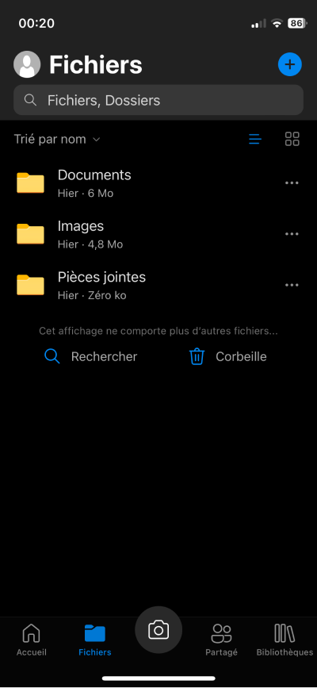

# Stockage sur le cloud

## Introduction

Ces travaux pratiques ont pour objectif l'étude du fonctionnement d'un service de stockage de fichiers sur le Cloud.
Nous utiliserons le service **OneDrive** de la société Microsoft pour lequel tout élève de la région Île-de-France dispose d'un accès et d'un espace de stockage de **1 To**.

## Préparation

### Ordinateurs

Vous allez travailler à la fois sur votre ordinateur portable et l'ordinateur fixe du lycée.

!!! note "Instructions"

    1. Connectez-vous à l'ordinateur du lycée
    2. Revenez sur votre ordinateur portable et effectuez les travaux pratiques jusqu'à ce qu'il vous soit demandé d'utiliser l'ordinateur du lycée

### Sondage

Afin de mieux connaître vos usages numériques, veuillez répondre au sondage ENT intitulé **Stockage sur le cloud**.

!!! note "Instructions"

    1. [:material-link: Connectez-vous à l'ENT](https://ent.iledefrance.fr/){:target="_blank"}
    2. Accédez à l'application **Formulaires**
    3. Accédez à la section **Mes réponses**
    4. Accédez au sondage **Stockage sur le cloud**
    5. Répondez aux questions et n'oubliez pas de cliquer sur **Terminer et envoyer** sur la page récapitulative

## Découverte

### Activation de OneDrive

!!! target "Objectif"
    
    S'assurer du bon fonctionnement de OneDrive sur votre ordinateur portable.
    Si n'avez pas votre ordinateur portable et que vous n'utilisez que l'ordinateur du lycée, passez directement à la section [:material-link: Activation sur le téléphone](#activation-sur-le-telephone)

L'état du service OneDrive est indiqué par un nuage situé à droite de la barre des tâches. 

<figure markdown>
{:style="max-width:100%;"}
<figcaption>Barre des tâches sous Windows 11</figcaption>
</figure>

Selon l'état sur service, vous pouvez vous trouver dans l'une des situations décrites ci-après.
Identifiez celle qui correspond à l'état du service sur votre ordinateur et suivez ses instructions.

??? note "Situation 1 - Le nuage n'est pas visible dans la barre des tâches"
    
    L'absence de nuage signifie que l'application OneDrive n'a pas été lancée automatiquement au démarrage de votre ordinateur.

    1. Recherchez l'application OneDrive sur votre ordinateur
    2. Lancez l'application et attendez l'apparition du nuage
    3. Selon la couleur du nuage, rendez-vous à la situation 2 ou 3

??? note "Situation 2 - Le nuage est visible dans la barre des tâches, mais il est barré ou gris"

    Un nuage est gris et barré signifie que vous n'êtes pas connecté au service.

    1. Cliquez sur le nuage
    2. Cliquez sur **se connecter**
    3. Connectez-vous au service en utilisant votre adresse email de l'ENT 
       *:material-comment-alert: pour rappel, celle-ci est de la forme `prenom.nom@monlycee.net`*
    4. Activez la sauvegarde des dossiers `Documents` et `Images` lorsqu'on vous le demandera

    ??? help "Aide - Activer le service OneDrive"

        
<iframe src="https://www.loom.com/embed/772ad6b8261a42d097a83a52566e4c5c?sid=ee6f1959-49cb-4eae-a53b-b01d3b9f4f4a" frameborder="0" webkitallowfullscreen mozallowfullscreen allowfullscreen style="position: absolute; top: 0; left: 0; width: 100%; height: 100%;"></iframe>

??? note "Situation 3 - Le nuage est visible dans la barre des tâches et il est bleu"

    Un nuage est bleu signifie que vous êtes bien connecté au service. Vous pouvez donc passer à la suite.

### Activation de la sauvegarde

!!! target "Objectif"
    
    S'assurer de la sauvegarde automatique des dossiers Documents et Images de votre ordinateur portable.

Le service OneDrive vous offre la possibilité de sauvegarder automatiquement sur le *cloud* le contenu des éléments suivants :

- :material-folder: Documents
- :material-folder: Images
- :material-monitor: Bureau

Prenez l'habitude d'enregistrer vos travaux dans le dossier `Documents` et donc à ne pas travailler directement depuis le dossier `Téléchargements`.
En procédant ainsi et en activant la sauvegarde automatique, vous avez l'assurance de ne rien perdre de vos travaux.

!!! note "Instructions"

    1. Cliquez sur le nuage depuis la barre des tâches
    2. Cliquez sur **:material-cog-outline: Paramètres**
    3. Dans la section **:material-sync: Synchronisation et sauvegarde**, cliquez sur **Gérer la sauvegarde**
    4. Activez la sauvegarde pour les dossiers `Documents` et `Images` 
       *:material-comment-alert: et éventuellement `Bureau` si vous avez l'habitude d'y mettre des fichiers*
    5. Cliquez sur **Enregistrer les modifications**

??? help "Aide - Configurer la sauvegarde"
    
    
<iframe src="https://www.loom.com/embed/6747e2b6939c4999874fa286a4336b72?sid=0c113062-d3c7-4dbf-8f1f-5d15dc1c0ae5" frameborder="0" webkitallowfullscreen mozallowfullscreen allowfullscreen style="position: absolute; top: 0; left: 0; width: 100%; height: 100%;"></iframe>

### Activation sur le téléphone

!!! target "Objectif"
    
    Installer l'application OneDrive sur le téléphone afin de pourvoir l'utiliser pour consulter ou déposer des documents.

Si vous avez suivi les instructions de préparation de ces travaux pratiques donnés en devoir, vous devriez disposer de l'application OneDrive sur votre téléphone.
Vous allez maintenant vous connecter au service.

!!! note "Instructions"

    1. Prenez votre téléphone portable
    2. Lancez l'application **OneDrive**
    3. Connectez-vous en utilisant votre adresse email de l'ENT 
       *:material-comment-alert: pour rappel, celle-ci est de la forme `prenom.nom@monlycee.net`*
    4. Une fois connecté, vous devriez au moins constater la présence des dossiers `Documents` et `Images`

??? success "Résultat attendu"

    <figure markdown>
    {:style="max-width:200px"}
    <figcaption>Application OneDrive sous iOS</figcaption>
    </figure>

### Accès depuis le Web

!!! target "Objectif"
    
    Accéder à vos documents stockés sur le *cloud* depuis n'importe quel appareil.

Imaginons que vous utilisiez un ordinateur sur lequel il vous est impossible d'installer le service OneDrive.
Pour contourner ce problème, les services de stockage sur le *cloud* fournissent un accès depuis une interface web.

!!! note "Instructions"

    1. Utilisez maintenant l'ordinateur du lycée
    2. Lancez un navigateur web
    3. Accédez au site du service OneDrive : [:material-link: https://www.onedrive.com](https://www.onedrive.com){:target="_blank"}
    4. Connectez-vous en utilisant votre adresse email de l'ENT 
       *:material-comment-alert: pour rappel, celle-ci est de la forme `prenom.nom@monlycee.net`*
    5. Une fois connecté, accédez à la section **Mes fichiers**
    6. Vous devriez au moins constater la présence des dossiers `Documents` et `Images`

### Synchronisation

!!! target "Objectif"
    
    Apprécier le principe de synchronisation entre tous vos appareils.

Que vous utilisiez le service de stockage sur le *cloud* depuis votre ordinateur ou votre téléphone, toute action aboutit à modifier l'état des données sur le *cloud*.
Ces changements d'état sont ensuite répercutés sur tous les appareils utilisant le service, c'est la **synchronisation**.
 
!!! note "Instructions"

    1. Utilisez maintenant votre **ordinateur portable**
    2. Déposez une image quelconque dans le dossier `Images`
    3. Consultez l'image depuis l'applicaion OneDrive de votre téléphone
    4. Consultez l'image depuis l'interface web de l'ordinateur fixe du lycée

### Partage

!!! target "Objectif"
    
    Partager un fichier ou un dossier à un autre utilisateur.

Les services de stockage *cloud* disposent généralement de fonctions de partage des dossiers et des fichiers.
Vous pouvez également autoriser des utilisateurs à modifier les dossiers et les fichiers partagés.

!!! note "Instructions"

    1. Connectez-vous à l'**interface web** de OneDrive depuis l'ordinateur du lycée ou votre ordinateur portable
    2. Accédez au dossier `Documents`
    3. Créez-y un dossier intitulé `Test partage`
    4. Survolez le dossier `Test partage` et cliquez sur l'icone de paramétrage :material-dots-horizontal:
    5. Cliquez sur **Gérer l'accès**
    6. Accordez l'accès à un camarade à proximité de vous en lui autorisant les droits de modification et en **gardant cochée** l'option **Avertir les utilisateurs**
    7. Demandez à votre camarade de consultrer sa messagerie ENT, il devrait avoir reçu un lien d'accès à votre dossier
    8. Demandez à votre camarade d'y créer ou déposer un document quelconque

??? help "Aide - Partager un dossier"
    
    
<iframe src="https://www.loom.com/embed/527b26ae3eb34fa18f4db6d2864516d6?sid=e8550187-bba0-4e85-8807-cdd1052cb36a" frameborder="0" webkitallowfullscreen mozallowfullscreen allowfullscreen style="position: absolute; top: 0; left: 0; width: 100%; height: 100%;"></iframe>

## Mise en pratique

Maintenant que vous vous êtes familiarisé avec un service de stockage sur le *cloud*, effectuez l'ensemble des actions suivantes :

!!! note "Instructions - Espace de stockage"
    
    1. Connectez-vous à l'interface web
    2. Trouvez comment vérifier l'espace de stockage encore disponible sur le *cloud*

!!! note "Instructions - Sauvegarde du travail"
    
    1. Utilisez l'ordinateur du lycée
    2. Chargez sur le *cloud* dans le dossier `Documents` tous vos travaux stockés dans votre dossier personnel du réseau du lycée

!!! note "Instructions - Numériser un document"
    
    1. Utilisez l'application mobile
    2. Accédez au dossier `Documents`
    3. Appuyer sur le bouton :material-plus:
    4. Testez la fonction **Numériser** en numérisant le contenu d'une feuille de papier de votre choix
    5. Visualisez ensuite le document créé sur votre ordinateur portable ainsi que l'interface web

!!! note "Instructions - Prendre une photo"
    
    1. Utilisez l'application mobile
    2. Accédez au dossier `Documents`
    2. Appuyer sur le bouton :material-plus:
    3. Testez la fonction **Photo ou vidéo** en prenant une photo  
       *:material-comment-alert: veillez à ne photographier personne de la salle*
    4. Visualiser ensuite l'image créée sur votre ordinateur portable et l'interface web

!!! note "Instructions - Créer un lien"

    1. Utilisez l'interface web
    2. Accédez au dossier `Documents`
    3. Ajoutez un nouveau contenu de type **:material-web: Lien** en le faisant pointer vers `https://www.mulot-nsi.fr`
    4. Vérifiez le bon fonctionnement du lien depuis votre ordinateur portable

!!! note "Instructions - Création d'un document Word"

    1. Utilisez l'interface web depuis l'ordinateur du lycée
    2. Accédez au dossier `Documents`
    3. Créez un nouveau document Word
    4. Écrivez le texte : *Document créé depuis l'interface Web*
    5. Gardez l'interface web ouverte et modifiez le document avec Word depuis votre ordinateur portable en ajoutant la ligne : *Document créé depuis Word sur mon ordinateur*
    6. Renommez le document en `synchro.docx`

!!! note "Instructions - Historique des versions"

    1. Utilisez l'interface web
    2. Retrouvez le document en `synchro.docx`
    3. Survolez le fichier avec la souris et cliquez sur les :material-dots-horizontal:
    4. Cliquez sur **Historique des versions**
    5. Téléchargez la version **2.0** et visualisez son contenu

## Autres services

Il existe de nombreux services de stockage sur le cloud dont voici une liste non exhaustive :

- [:material-link: Microsoft OneDrive](https://www.microsoft.com/fr-fr/microsoft-365/onedrive/online-cloud-storage){:target="_blank"}
- [:material-link: Google Drive](https://www.google.com/intl/fr/drive/){:target="_blank"}
- [:material-link: Apple iCloud](https://www.apple.com/fr/icloud/){:target="_blank"}
- [:material-link: Proton Drive](https://proton.me/fr/drive){:target="_blank"}
- [:material-link: pCloud](https://www.pcloud.com/){:target="_blank"}
- [:material-link: Kdrive](https://www.infomaniak.com/fr/kdrive){:target="_blank"}
- [:material-link: Mega](https://mega.io/){:target="_blank"}
- [:material-link: Ice Drive](https://icedrive.net/){:target="_blank"}

Après avoir consulté les caractéristiques de chacun, lequel choisiriez-vous ? 