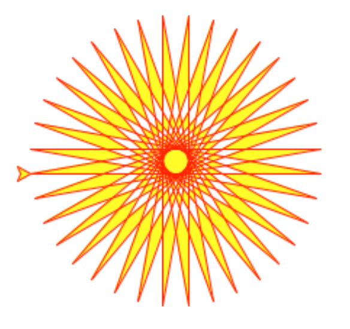
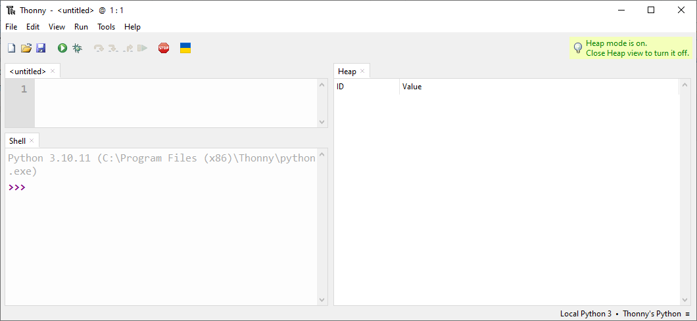
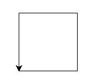
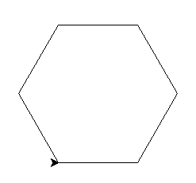
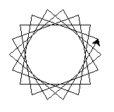
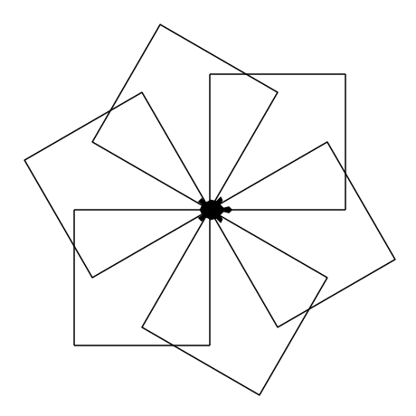
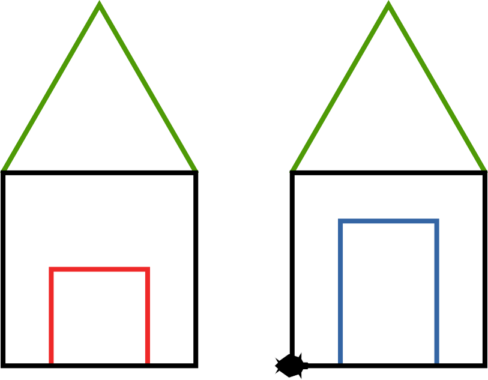
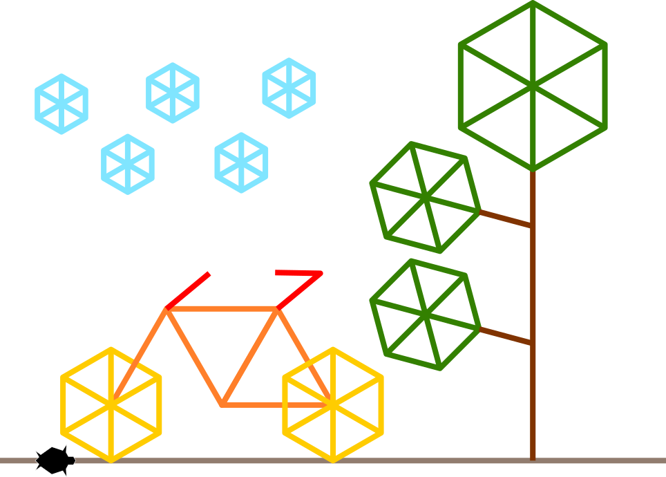

# Turtle


!!! info "Cours - La bibliothéque Graphique Turtle"

    Turtle est une bibliothèque graphique, permettant de faire des dessins, inspiré de la vieille bibliothèque logo, crée en 1967 et qui été à l'époque en langage "Basic".
    <figure markdown>
      
      L'exemple de la documentation de la biliothèque Turtle en python
    </figure>
    
    
    
    
!!! info "Cours - Le concept de Turtle"

    On dirige un crayon avec des ordres simple afin de faire un dessin.

    Ordre possible:

    - Déplacement:
        - forward: avancer

    - Tourner:

      	- left: tourner vers la gauche
        - right: tourner vers la gauche
    
    - Contrôle du crayon:
    	- up: lever le crayon (il n'écrira plus)
    	- down: baisser le crayon
    
    	- color: change la couleur du crayon
        
        
!!! note "Organisation de l'espace travail"

    1. Depuis l'explorateur de fichier, double-cliquez sur l'icône intitulée **Documents**
    2. Une fois dans votre zone personnelle, créez un nouveau dossier nommé **SNT** *(s'il n'existe pas déjà)*
    3. Entrez dans le dossier **SNT** et créez-y un nouveau dossier nommé **scripts** *(s'il n'existe pas déjà)*
    
    
!!! note "A vous de jouer !"

    1. Depuis le bureau, lancer l'application **Thonny**
    2. Cliquer dans le menu Fichier/Nouveau (ou File/New)
    3. Puis dans le menu Fichier/Enregistrer sous (ou File/save as)
    4. Dans la fenêtre qui apparait, enregistrer votre fichier dans Documents/SNT/scripts/turtle_square.py
    
    
        
    
!!! note "Création d'un nouveau script dans Thonny"

    1. Depuis le bureau, lancez l'application **Thonny**
    <figure markdown>
      
      L'application Thonny
    </figure>
    2. Cliquer dans le menu **Fichier/Nouveau** (ou File/New)
    3. Puis dans le menu **Fichier/Enregistrer sous...*** (ou File/save as...)
    4. Dans la fenetre qui apparait, enregistrez votre fichier dans **Documents/SNT/scripts** sous le nom **turtle_first.py**
    
    
!!! note "Votre premier script"
    Nous allons tester Turtle:
    
    1. Taper ce script dans Thonny:
    
        ``` py
        from turtle import *
        forward(100)
        left(90)
        forward(100)
        ```
    
    2. Puis appuyer sur la touche F5 pour que l'ordinateur exécute votre script.
    
    3. Vous devriez voir une figure comme celle ci:
    <figure markdown>
      
      Votre premier résultat
    </figure>
    
!!! note "Déssinons un carré"
    L'objectif est maintenant de dessiner un carré avec Turtle.
    
    1. Modifier le script précédent jusqu'a obtenir ce résultat:
    <figure markdown>
      
      Un carré !
    </figure>
    
    
!!! note "Utilisation d'une boucle"
    L'objectif est toujours de dessiner un carré avec Turtle, mais en utilisant une boucle:
    
    1. Taper ce script dans Thonny:
    
        ``` py
        from turtle import *
        for i in range(2):
            left(90)
            forward(100)
        ```
    
    2. Puis changer le chiffre **2** par un autre chiffre jusqu'à avoir un carré comme précédemment.
        <figure markdown>
      
      Encore un carré !
    </figure>
    
!!! note "Un hexagone"
    L'objectif est maintenant de dessiner un hegagone.
    
    1. Modifier le script précédent jusqu'à avoir cette forme:
        <figure markdown>
      
      Un hexagone !
    </figure>


!!! info "Turtle: Toutes les commandes utiles"

    - forward( distance ): avancer d'une certaine distance
    - left( angle ): tourner vers la gauche d'un certain angle (en degrés par défaut)
    - right( angle ): (idem left)
    - up(): lever le crayon
    - down(): baisser le crayon
    - color(c): changer la couleur, par exemple:
        - color("blue")
        - color("#2850FF")
        - color(1,0.5,0.2)
    - circle(rayon): dessine un cercle d'un certain rayon
    - circle(rayon, 90): dessine un quart de cercle (90 indique la portion en degré à dessiner)
    - goto(x,y): déplacer le crayon sur une position absolue
    - speed(vitesse): accélérer au maximum la vitesse de déplacement de la tortue.
    
    
!!! note "A vous de dessiner"
    A l'aide des commandes ci-dessus, dessinez ce que vous voulez!
    
    Voici quelques exemples pour vous inspirer:
        <figure markdown>
      {width=300}
      Une rosace à bout carré
      
      {width=300}
      Un moulin moderne
      
            
      {width=300}
      2 maisons
      
                
      {width=300}
      Un paysage bucolique
    </figure>
