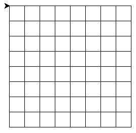
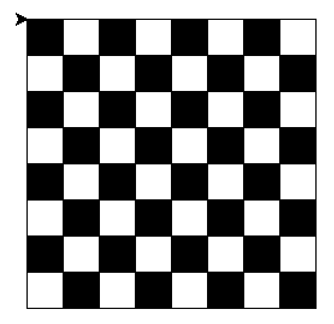

# Turtle en Python: Utilisation de boucles et fonctions

!!! info "Rappel - Utilisation de boucle"

    Les boucles sont de bons moyens de demander à l'ordinateur de faire des choses répétitives.
    
    Voici un exemple de boucle:
    
    ``` py
    from turtle import *
    for i in range(4):
        left(90)
        forward(100)
    ```
    Voici un autre exemple de boucle avec l'utilisation d'une variable:
    ``` py
    from turtle import *
    
    taille = 100
    for i in range(4):
        left(90)
        forward(taille)
        taille = taille + 100
    ```
     
!!! info "Cours - Utilisation de fonctions"

    Les fonctions permettent de réutiliser plusieurs fois le même code, sans faire de copier/coller.
    
    Voici un exemple de fonction:
    
    ``` py
    from turtle import *
    
    # Voici la définition d'une fonction:
    def carre(longueur):
        for i in range(4):
            left(90)
            forward(longueur)
        
    # Maintenant que l'ordinateur connait cette nouvelle fonction;
    # on peut l'utiliser:
    carre(100)
    carre(150)
    carre(300)
    ```
    

        
!!! note "Organisation de l'espace travail"

    1. Depuis l'explorateur de fichier, double-cliquez sur l'icône intitulée **Documents**
    2. Une fois dans votre zone personnelle, créez un nouveau dossier nommé **SNT** *(s'il n'existe pas déjà)*
    3. Entrez dans le dossier **SNT** et créez-y un nouveau dossier nommé **scripts** *(s'il n'existe pas déjà)*
            
    
!!! note "Création d'un nouveau script dans Thonny"

    1. Depuis le bureau, lancez l'application **Thonny**
    <figure markdown>
      
      L'application Thonny
    </figure>
    2. Cliquer dans le menu **Fichier/Nouveau** (ou File/New)
    3. Puis dans le menu **Fichier/Enregistrer sous...*** (ou File/save as...)
    4. Dans la fenetre qui apparait, enregistrez votre fichier dans **Documents/SNT/scripts** sous le nom **turtle_boucle.py**
    
    


!!! info "Turtle: Toutes les commandes utiles"

    - forward( distance ): avancer d'une certaine distance
    - left( angle ): tourner vers la gauche d'un certain angle (en degrés par défaut)
    - right( angle ): (idem left)
    - up(): lever le crayon
    - down(): baisser le crayon
    - color(c): changer la couleur, par exemple:
        - color("blue")
        - color("#2850FF")
        - color(1,0.5,0.2)
    - circle(rayon): dessine un cercle d'un certain rayon
    - circle(rayon, 90): dessine un quart de cercle (90 indique la portion en degré à dessiner)
    - goto(x,y): déplacer le crayon sur une position absolue
    - speed(vitesse): accélérer au maximum la vitesse de déplacement de la tortue.
    - begin_fill(): indique le début d'un dessin qu'il faudra remplir
    - end_fill(): remplis tout ce qui a été déssiner depuis l'appel à begin_fill

!!! warning "Attention"

    L'usage de **ChatGPT** va vous rendre **idiot**.
    
    - Ce TP est adapté à votre niveau.
    - Sa progression est réfléchie.
    - Si au lieu de réfléchir, vous allez pomper une solution de ChatGPT ou équivalent, vous n'apprendrez rien, vous vous ennuierez dans les prochains TPs et vous risquez d'avoir du mal lors de l'interrogation, et vous aurez donc une mauvaise image de vous et de vos capacités, ce qui est fort dommage.
    - Il est donc fortement recommandé de [réfléchir]("La reflexion vous aidera à avoir le contrôle de votre vie.")  par vous-même.
    - Si vous êtes coincé, demandez de l'aide à votre professeur, il est là pour ça.

!!! note "Une ligne"
    L'objectif est de dessiner un quadrillage, on va commencer par faire une ligne de carré.
    
    1. Réutiliser le script du haut de la page pour tracer un carré.
    2. Répéter ce carré plusieurs fois afin d'obtenir une ligne de carré.
    
         Vous pouvez utiliser une boucle dans une boucle 
         
         ou mieux une fonction carré appelé depuis la boucle, si vous avez vu cela en cours.
    
      <figure markdown>
        {width=400}
        Une ligne !
      </figure>
      
!!! note "Un quadrillage"
    L'objectif est donc de dessiner un quadrillage.
    
    1. Réutiliser le script précédent pour faire une ligne de carrés.
    2. Répéter cette ligne plusieurs fois afin d'obtenir un quadrillage.
    
         Vous pouvez utiliser une boucle dans une boucle 
         
         et appellé la fonction carré depuis la boucle intérieure.
    
      <figure markdown>
        {width=400}
        Oh un quadrillage !
      </figure>
      
!!! note "Un échiquier"
    L'objectif est maintenant de dessiner un quadrillage avec une case noire sur 2.
    
    1. Modifier le programme précédent pour peindre une case sur deux.
    
         Pour cela, jetez un oeil aux fonctions begin_fill() et end_fill() dans les commandes ci-dessus.
    
      <figure markdown>
        {width=400}
        Quel bel échiquier !
      </figure>
      
!!! note "Un échiquier avec des pions"
    L'objectif est maintenant de rajouter des pions sur l'échiquier
    
    1. Ecrire une fonction dessine_pion() qui va dessiner un pion
    2. Appeller cette fonction plusieurs fois pour remplir l'échiquier de pion.
    3. Bonus: faire des pions blancs et noirs !
    4. Ultra bonus: dessiner d'autres pièces présentes aux echecs.
    
         Par exemple: le fou qui est un peu comme un pion, mais en plus gros.
    
      <figure markdown>
        {width=400}
        
        Inspiration pour les pions...
      </figure>

