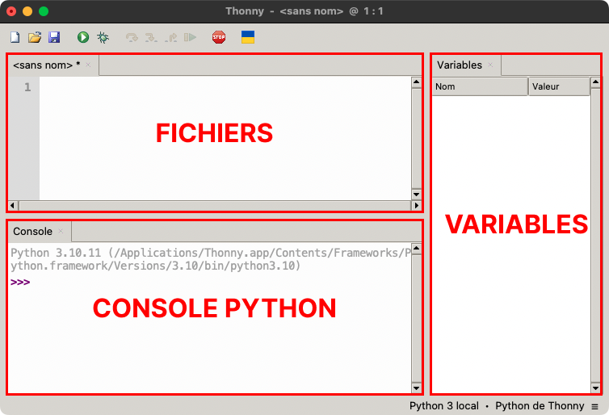

# Remédiation


## Introduction

Ces travaux pratiques ont pour objectifs de revoir toutes les notions des bases de la programmation afin
de s'assurer qu'elles soient bien assimilées.

!!! target "Objectifs"

    - Revoir les variables et les types de données
    - Revoir les structures conditionnelles
    - Revoir les boucles
    - Revoir les fonctions

## Préparation

<h3>Espace de travail</h3>

Vous allez créer des dossiers afin de ne pas mélanger vos productions numériques entre vos différentes matières et
travaux pratiques.

!!! note "Organisation de l'espace travail"

    === ":material-laptop: Ordinateur portable"

        1. Lancez l'application <i class="icon file-explorer"></i> **Explorateur de fichiers** 
           <span class="keys shortcut"><kbd>:fontawesome-brands-windows:</kbd><span>+</span><kbd>E</kbd></span>
        2. Accédez à votre dossier <i class="icon onedrive"></i> **OneDrive**
        3. Dans le dossier `OneDrive`, s'il n'y a pas de dossier `NSI`, créez-le
        4. Dans le dossier `NSI`, s'il n'y a pas de dossier `chapitre_04`, créez-le
        5. Dans le dossier `chapitre_04` créez le dossier `remediation`

    === ":material-desktop-tower: Ordinateur fixe"

        1. Depuis le bureau, double-cliquez sur l'icône intitulée **Zone personnelle**
        2. Dans la **zone personnelle**, s'il n'y a pas de dossier `NSI`, créez-le
        3. Dans le dossier `NSI`, s'il n'y a pas de dossier `chapitre_04`, créez-le
        4. Dans le dossier `chapitre_04` créez le dossier `remediation`

<h3>Environnement de développement</h3>

Pour ces travaux pratiques, l'utilisation de **Thonny** est **obligatoire**. 
Cet IDE a été conçu pour l'apprentissage du langage Python.

*[IDE]: Intergrated Development Environment

??? note "Installation de Thonny"

    Thonny devrait normalement être déjà installé sur votre ordinateur portable.
    Si ce n'est pas le cas ou si vous utilisez un ordinateur fixe du lycée, voici les instructions pour l'installer :
    
    1. Rendez vous sur le [:material-link: site officiel](https://thonny.org/){:targer="_blank"}
    2. Approchez la souris de **Windows** dans la zone de téléchargement
    3. Téléchargez la version **Portable variant with 64-bit Python 3.10**
    4. Décompressez l'archive ZIP téléchargée
    5. Déplacez le dossier décompressé dans votre dossier **Documents**
    6. Lancez Thonny en double-cliquant sur l'exécutable `Thonny.exe`

<h3>Configuration de Thonny</h3>

Configurez Thonny de façon à ce que l'organisation de l'interface soit la suivante :

<figure class="illustration" markdown>

</figure>

!!! note "Configuration de Thonny"

    - Accédez au menu **affichage**
    - Activez **Console** et **Variables** s'ils ne sont pas actifs
    - Désactivez tout autre affichage

## Les variables

!!! note "Préparation"

    1. Lancez l'application Thonny
    2. Créez un nouveau fichier <span class="keys shortcut">++ctrl+n++</span>
    3. Enregistrez le immédiatement dans `NSI/chapitre_04/remediation/variables.py` <span class="keys shortcut">++ctrl+s++</span>

!!! warning "Important"

    Le code de chaque exercice sera écrit dans le même fichier Python. Il sera systématiquement précédé d'un commentaire indiquant le numéro de l'exercice.

??? tip "Exercice A01 - Chaînes de caractères"

    1. Écrivez en commentaire *« Exercice 1 »* 
    2. Affectez à la variable `s1` une chaîne de caractères quelconque
    3. Exécutez le programme <span class="keys shortcut">++f5++</span>
    4. Vérifiez la valeur de la variable `s1` dans la section **Variables** de Thonny
    5. Vérifiez la valeur de la variable `s1` dans la **console Python**

??? tip "Exercice A02 - Chaînes de caractères"

    1. Écrivez en commentaire *« Exercice 2 »*
    2. Affectez une nouvelle chaîne de caractères à la variable `s1`
    3. Vérifiez la bonne affection dans **Variables** ainsi que la **Console Python**  

??? tip "Exercice A03 - Chaînes de caractères"

    1. Écrivez en commentaire *« Exercice 3 »*
    2. Affectez la chaîne de caractères ci-dessous à la variable `s2`
    ```
    Python c'est "facile" !
    ```
    3. Vérifiez la bonne affection dans **Variables** ainsi que la **Console Python**

??? tip "Exercice A04 - Nombres et calculs"

    La formule de calcul de l'aire de la surface d'un disque est : $\pi \times R^2$.
    Nous souhaitons calculer l'aire pour un disque de rayon 2,5 cm.

    <h5>Étape 1</h5>

    1. Écrivez en commentaire *« Exercice 4 »*
    2. Affectez à la variable `pi` l'approximation 3,14159365
    3. Affecter à la variable `rayon` la longueur du rayon
    4. Testez le calcul de l'aire dans la console Python en utilisant les variables `pi` et `rayon`

    <h5>Étape 2</h5>

    1. Revenez à votre script Python
    2. Écrivez une instruction permettant d'effectuer le calcul et de l'affecter à la variable `surface`
    3. Vérifiez la valeur de la variable `surface` dans **Variables** ainsi que la **Console Python**

    <h5>Étape 3</h5>

    Ajoutez une ligne de code permettant d'afficher dans la console « Surface : *valeur de la variable surface* ». <br>
    Attention, vous ne pouvez utiliser la fonction `print` qu'avec **un seul** paramètre.
    Il vous faut donc savoir convertir une valeur numérique en chaîne de caractères et concaténer deux chaînes.

??? tip "Exercice A05 - Expression booléenne"

    Vous disposez d'un pot de peinture dont la quantité permet de couvrir une surface de 5 m<sup>2</sup>.
    Vous avez un mur à peindre de trois mètres de long et deux mètres de haut. Votre pot est-il suffisant ?

    1. Réfléchissez à comment évaluer si le pot est suffisant en faisant abstraction de toute notion de programmation
    2. Tansformez le fruit de votre réflexion en une expression booléenne dont la valeur sera affectée à la variable `suffisant` 

### B. Les structures conditionnelles

!!! note "Préparation"

    1. Lancez l'application Thonny
    2. Créez un nouveau fichier <span class="keys shortcut">++ctrl+n++</span>
    3. Enregistrez le immédiatement dans `NSI/chapitre_04/remediation/conditions.py` <span class="keys shortcut">++ctrl+s++</span>

!!! warning "Important"

    Le code de chaque exercice sera écrit dans le même fichier Python. Il sera systématiquement précédé d'un commentaire indiquant le numéro de l'exercice.

??? tip "Exercice B01 - Condition simple"
    
    Soit le code ci-dessous permettant d'afficher les nombres de 1 à 10 à l'aide d'une boucle non bornée :

    ```python
    n = 1
    while n <= 10:
        print(n)
        n = n + 1
    ```

    1. Écrivez en commentaire *« Exercice 1 »*
    2. Copiez/collez le code fourni dans le fichier `conditions.py`
    3. Vérifiez que la boucle fonctionne correctement
    4. Ajoutez une condition afin que ne soient affichés que les nombres impairs

??? tip "Exercice B02 - Conditions multiples"

    Soit le code ci-dessous permettant d'afficher les notes de 0 à 20 à l'aide d'une boucle non bornée :

    ```python
    note = 0
    while note <= 20:
        mention = "sans mention"
        
        print(str(note).ljust(2, ' ') + " - " + mention)
        note = note + 1
    ```

    <h5>Étape 1</h5>

    1. Écrivez en commentaire *« Exercice 2 »*
    2. Copiez/collez le code fourni dans le fichier `conditions.py`
    3. Vérifiez que la boucle fonctionne correctement
    4. Ajoutez une condition afin d'afficher en face de chaque note :
        
        - *« mention très bien »* si la note est supérieure ou égale à 16
        - *« sans mention »* sinon

    <h5>Étape 2</h5>

    Modifiez maintenant la condition afin d'afficher en face de chaque note :
        
    - *« mention très bien »* si la note est supérieure ou égale à 16
    - *« mention bien »* si la note est supérieure à 14 et inférieure strictement à 16
    - *« sans mention »* sinon

    <h5>Étape 3</h5>

    Modifiez maintenant la condition afin d'afficher en face de chaque note :
        
    - *« mention très bien »* si la note est supérieure ou égale à 16
    - *« mention bien »* si la note est supérieure à 14 et inférieure strictement à 16
    - *« mention assez bien »* si la note est supérieure à 12 et inférieure strictement à 14
    - *« sans mention »* sinon

??? tip "Exercice B03 - Conditions imbriquées"

    Soit le code ci-dessous permettant d'afficher les entiers de 1 à 20 à l'aide d'une boucle non bornée :

    ```python
    n = 1
    while n <= 30:
        selection = "non"
        
        print(str(n).ljust(2, ' ') + " - " + selection)
        n = n + 1
    ```

    <h5>Étape 1</h5>

    1. Écrivez en commentaire *« Exercice 3 »*
    2. Copiez/collez le code fourni dans le fichier `conditions.py`
    3. Vérifiez que la boucle fonctionne correctement
    4. Ajoutez une condition afin d'afficher en face de chaque nombre :
        
        - *« oui »* si le nombre est un multiple de 3
        - *« non »* sinon

    <h5>Étape 1</h5>

    Modifiez maintenant la condition afin d'afficher en face de chaque nombre :
    
    - *« oui »* si le nombre est un multiple de 3 **ET** de 5
    - *« non »* sinon

    **Attention**, vous n'êtes pas autoriseé à utiliser l'opérateur `and`.


### C. Les boucles

!!! note "Préparation"

    1. Lancez l'application Thonny
    2. Créez un nouveau fichier <span class="keys shortcut">++ctrl+n++</span>
    3. Enregistrez le immédiatement dans `NSI/chapitre_04/remediation/boucles.py` <span class="keys shortcut">++ctrl+s++</span>

!!! warning "Important"

    Le code de chaque exercice sera écrit dans le même fichier Python. Il sera systématiquement précédé d'un commentaire indiquant le numéro de l'exercice.

??? tip "Exercice C01 - Boucle simple"
    
    1. Écrivez en commentaire *« Exercice 1 »*
    2. Écrivez un programme permettant d'afficher 5 fois votre prénom

??? tip "Exercice C02 - Boucle avec indice décroissant"
    
    1. Écrivez en commentaire *« Exercice 2 »*
    2. Écrivez un programme permettant d'afficher les nombres de 1 à 10 dans l'ordre **décroissant**

??? tip "Exercice C03 - Boucle et somme de valeurs"

    Soit un programme permettant d'afficher la valeur des pièces d'un porte monnaie.
    La valeur de chaque pièce est stockée dans un type construit appelé **tableau** :
    
    ```python
    monnaie = [1, 1, 2, 0.5, 0.5, 1, 0.20]
    i = 0
    
    while i < len(monnaie):
        valeur_piece = monnaie[i]
        print(valeur_piece)
        i = i + 1
    ```

    Calculez et affichez la somme totale d'argent dans le porte monnaie.
    
??? tip "Exercice C04 - Somme de valeurs"

    Nous souhaitons disposer d'un programme permettant de calculer la somme des entiers de 1 à *n*.

    <h5>Étape 1</h5>
    
    1. Écrivez en commentaire *« Exercice 4 »*
    2. Affectez la valeur 20 à la variable `n`
    3. Écrivez une boucle non bornée affichant les valeurs de 1 à *n* en utilisant comme indice de boucle la variable `i`

    <h5>Étape 2</h5>

    Calculez et affichez la somme des valeurs de 1 à *n*


### D. Les fonctions

!!! note "Préparation"

    1. Lancez l'application Thonny
    2. Créez un nouveau fichier <span class="keys shortcut">++ctrl+n++</span>
    3. Enregistrez le immédiatement dans `NSI/chapitre_04/remediation/fonctions.py` <span class="keys shortcut">++ctrl+s++</span>

!!! warning "Important"

    Le code de chaque exercice sera écrit dans le même fichier Python. Il sera systématiquement précédé d'un commentaire indiquant le numéro de l'exercice.

??? tip "Exercice D01 - Afficher et renvoyer"
    
    Vous allez écrire un programme permettant d'afficher votre prénom dans la console Python.

    <h5>Étape 1</h5>
    
    1. Écrivez en commentaire *« Exercice 1 »*
    2. Écrivez la fonction `prenom` qui affiche votre prénom dans la console Python
    3. Ajoutez un appel à cette fonction
    4. Lancez votre programme et vérifiez le bon affichage de votre prénom

    <h5>Étape 2</h5>

    1. Modifiez la fonction `prenom` de manière à ce qu'elle renvoie votre prénom
    2. Lancez votre programme. Plus rien ne s'affiche dans la console, comprenez-vous pourquoi ?

    <h5>Étape 3</h5>

    1. Modifiez l'appel de la fonction de manière à ce votre prénom s'affiche de nouveau dans la console
    2. Modifiez l'appel de la fonction de manière à ce que s'affiche « Bonjour *prenom*, comment vas-tu ? » dans la console

??? tip "Exercice D02 - Paramètre"
    
    Vous allez écrire un programme permettant de calculer l'aire de la surface d'une sphére.
    La formule mathématique permettant ce calcul est : $4 \times \pi \times R^2$ 

    1. Écrivez en commentaire *« Exercice 2 »*
    2. Importer le module `math` afin de pouvoir utiliser la constante `math.pi`
    3. Écrivez la fonction `aire_sphere` prenant en paramètre la longueur du rayon `r` d'une sphère et renvoyant l'aire de sa suface
    4. Testez cette fonction dans la console Python en calculant l'aire de la surface de la Terre dont le rayon est de 6371 km

??? tip "Exercice D03 - Appel d'une fonction depuis une fonction"

    Nous souhaitons créer les fonctions `max2` et max3` renvoyant respectivement le maximum de deux et trois nombres.

    <h5>Étape 1</h5>

    1. Écrivez en commentaire *« Exercice 3 »*
    2. Écrivez la fonction `max2` qui renvoie le maximum de deux nombres
    3. Testez la fonction dans la console Python

    <h5>Étape 3</h5>
    
    1. Écrivez la fonction `max3` qui renvoie le maximum de trois nombres
    2. Testez la fonction dans la console Python