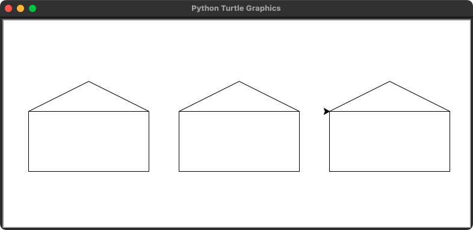
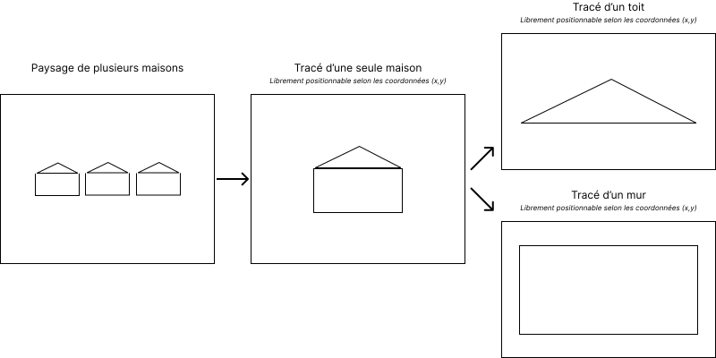
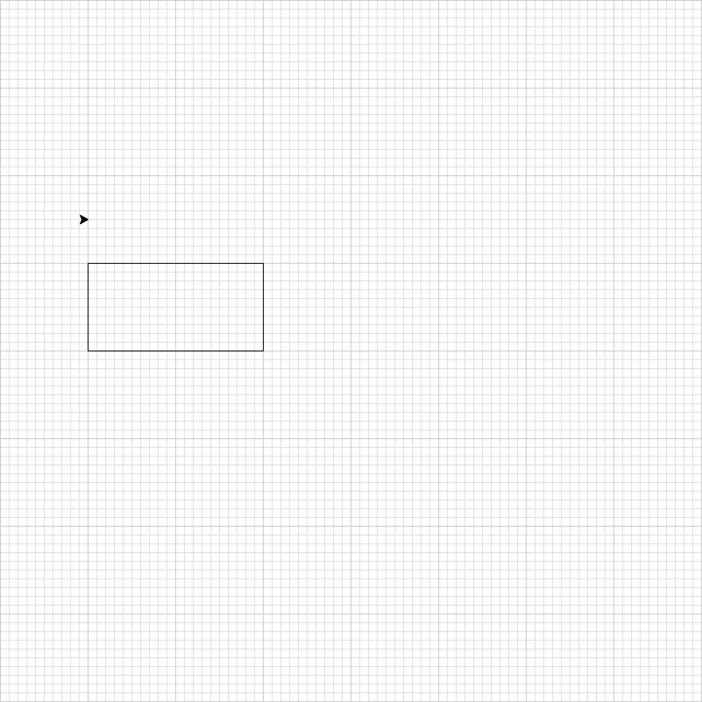
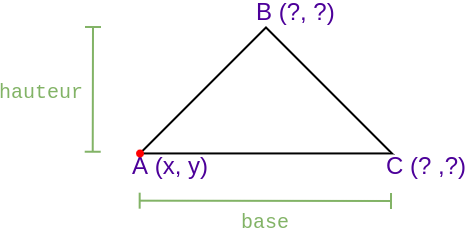
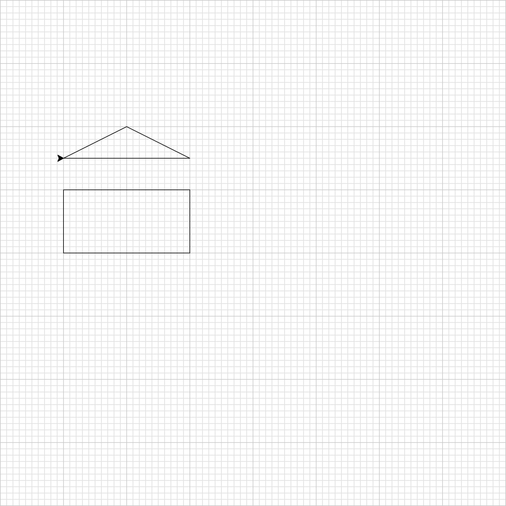
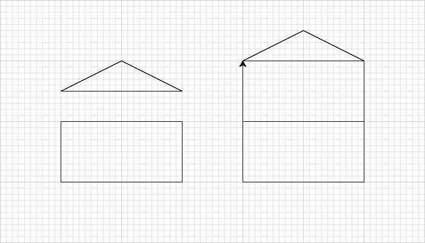

# Décomposition d'un problème en sous-problèmes

## Introduction

L'une des compétences à acquérir dans le cadre de la spécialité NSI est de savoir
*« décomposer un problème en sous-problèmes »*.
Ces travaux pratiques consistent à dessiner un ensemble de maisons, mais pas n'importe comment.

<figure class="illustration" markdown>

</figure>

L'objectif n'est pas d'apprendre à réaliser une image sous Turle, mais de comprendre
l'intérêt et la façon de décomposer le problème *« dessiner un ensemble de maisons »* en sous-problèmes plus simples à
résoudre.

!!! target "Objectifs"

    - Comprendre le principe de décomposition d'un problème en sous-problèmes
    - Savoir définir et appeler une fonction ([:material-book-open-variant: Définir des fonctions](https://docs.python.org/fr/3.9/tutorial/controlflow.html#defining-functions){:target="_blank"})
    - Savoir documenter une fonction à l'aide d'une *docstring* ([:material-book-open-variant: Chaînes de documentation](https://docs.python.org/fr/3.9/tutorial/controlflow.html#tut-docstrings){:target="_blank"})
    - Savoir utiliser les paramètres d'une fonction

## Préparation

### Espace de travail

Vous allez créer des dossiers afin de ne pas mélanger vos productions numériques entre vos différentes matières et
travaux pratiques.

!!! note "Organisation de l'espace travail"

    === ":material-laptop: Ordinateur portable"

        1. Lancez l'application <i class="icon file-explorer"></i> **Explorateur de fichiers** 
           <span class="keys shortcut"><kbd>:fontawesome-brands-windows:</kbd><span>+</span><kbd>E</kbd></span>
        2. Accédez à votre dossier <i class="icon onedrive"></i> **OneDrive**
        3. Dans le dossier `OneDrive`, s'il n'y a pas de dossier `NSI`, créez-le
        4. Dans le dossier `NSI`, créez le dossier `chapitre_04`
        5. Dans le dossier `chapitre_04` créez le dossier `tp1`

    === ":material-desktop-tower: Ordinateur fixe"

        1. Depuis le bureau, double-cliquez sur l'icône intitulée **Zone personnelle**
        2. Dans la **zone personnelle**, s'il n'y a pas de dossier `NSI`, créez-le
        3. Dans le dossier `NSI`, créez le dossier `chapitre_04`
        4. Dans le dossier `chapitre_04` créez le dossier `tp1`

### Téléchargement

Pour réaliser ces travaux pratiques, il est nécessaire de disposer de certains fichiers.

!!! note "Récupération des fichiers"

    1. Téléchargez le fichier ZIP contenant les fichiers nécessaires : [:material-download: télécharger](assets/NSI1RE04_TP1.zip){:download="NSI1RE04_TP1.zip"}
    2. Ouvrez le fichier ZIP<br>*(si le navigateur ne l'ouvre automatiquement, cliquez sur le fichier téléchargé)*
    3. Sélectionnez tous les fichiers et dossiers  <span class="shortcut">++ctrl+a++</span>
    4. Copiez tous les fichiers et dossiers <span class="shortcut">++ctrl+c++</span>
    5. Collez les fichiers dans le dossier `NSI\chapitre_04\tp1` <span class="shortcut">++ctrl+v++</span>

## Démarrage

### Décomposition

Voici une illustration d'une décomposition possible du tracé de plusieurs maisons :

<figure markdown>

</figure>


Nous souhaitons tracer un nombre quelconque de maisons identiques.
Pour cela, un premier niveau de décomposition pourrait être de *« tracer une seule maison »*.
Le tracé d'une seule maison pourrait à son tour être décomposé en sous-problèmes qui pourraient être :
*« tracer le toit d'une maison »* et *« tracer le mur d'une maison »*

### Structure du code

Vous ne partirez pas de zéro. Un code Python a été préparé de facon à refléter la décomposition en sous-problèmes
décrite précédemment.

!!! note "Instructions"

    - Lancez l'application **Thonny** *(ou l'IDE ayant votre préférence)*
    - Ouvrez le fichier `paysage.py`
    - Parcourez le code source

Le fichier `paysage.py` contient la définition de quatre procédures :

- `#!python mur()`
- `#!python toit()`
- `#!python maison()`
- `#!python dessiner_paysage()`

!!! info "Procédure ou fonction ?"

    Pour rappel, une **procédure** désigne une fonction ne renvoyant aucune valeur (donc sans instruction `#!python return`).
    Cependant, par souci de simplicité, nous n'utiliserons que le terme **fonction** pour la suite de l'énoncé. 

Ces fonctions sont en charge d'un tracé allant du plus spécifique avec `#!python mur()` et `#!python toit()`, au plus
général avec `#!python dessiner_paysage()`.

Chaque fonction dispose d'une *docstring* décrivant le comportement attendu et le rôle de chaque paramètre.

Les fonctions `#!python mur()` et `#!python toit()` ne disposent que du code de positionnement de la tortue,
le tracé reste à implémenter. Les fonctions `#!python maison()` et `#!python dessiner_paysage()` ne disposent que de
leur *docstring*.

## Sous-problèmes

### Factorisation

La portion de code ci-dessous, présent dans les fonctions `#!python mur()` et `#!python toit()`, permet de positionner la tortue aux coordonnées *(x, y)* :

```python
turtle.penup()
turtle.goto(x, y)
turtle.pendown()
```

Ce code est donc utilisé à deux reprises.
Il serait judicieux de le **factoriser** en créant une fonction dédiée au positionnement de la tortue.

!!! note "Instructions"

    1. Ouvrez le fichier `paysage.py`
    2. Exécutez-le et mémorisez le déplacement de la tortue. 
       Si tout fonctionne correctement, la tortue devra se déplacer de la même manière après vos modifications
    3. Créez la fonction `#!python positionner` ayant deux paramètres `x` et `y` correspondant aux nouvelles coordonnées de la tortue.
       Écrivez sa définition à la suite des instructions d'import.
    4. Ajoutez en *docstring* le texte suivant : « Positionne la tortue aux coordonnées (x, y). »
    5. Remplacez l'ancien code de positionnement des fonctions `#!python mur()` et `#!python toit()` par un appel à la fonction `positionner()`
    6. Exécutez le fichier `paysage.py` et vérifiez que le déplacement de la tortue n'ait pas changé

??? success "Solution"
    
    

    === "Avant"

        ```python
        import turtle
        import aide

        def mur(x, y, largeur, hauteur):
            turtle.pu()
            turtle.goto(x, y)
            turtle.pd()
         
        def toit(x, y, base, hauteur):
            turtle.pu()
            turtle.goto(x, y)
            turtle.pd()
        ```

    === "Après"

        La correction ci-dessous ne comporte que les modifications.
        **Ne supprimez pas les docstrings des fonctions `#!python mur()` et `#!python toit()` ni le reste du code du fichier !**

        ```python
        import turtle
        import aide
    
        def positionner(x, y):
            """
            Positionne la tortue aux coordonnées (x, y).
            """
            turtle.pu()
            turtle.goto(x, y)
            turtle.pd()
    
        def mur(x, y, largeur, hauteur):
            positionner(x, y)
         
        def toit(x, y, base, hauteur):
            positionner(x, y)
        ```

### Tracé d'un mur

Vous allez commencer par implémenter la fonction `#!python mur`.
Celle-ci a pour paramètres la position *(x, y)* du coin inférieur gauche du mur ainsi que ses dimensions.

Le tracé du mur doit se faire en utilisant **uniquement** la fonction
[:material-book-open-variant: goto](https://docs.python.org/fr/3.9/library/turtle.html#turtle.goto){:target="_blank"} du
module `turtle`.
Vous devrez donc calculer les coordonnées de chaque point du rectangle formant le mur pour déplacer la tortue.

??? info "Conseils"

    Soit **ABCD** le rectangle utilisé pour représenter le mur d'une maison.
    La *docstring* précise que les paramètres `x` et `y` correspondent aux coordonnées du coin inférieur gauche du mur, donc le point **A**.
    Pour tracer le mur, vous devez :

    - calculer les coordonnées de B, C et D par rapport à *A* en utilisant les paramètres `hauteur` et `largeur`
    - déplacer la tortue sur chacun des points en utilisant la fonction `goto`

    <figure markdown>
        
    </figure>

!!! note "Instructions"

    1. Ouvrez le fichier `paysage.py`
    2. Modifiez **uniquement** le corps de la fonction `mur` pour effectuer le tracé en n'utilisant que la fonction `goto`
    3. Exécutez le fichier `paysage.py` pour vérifier le tracé

??? success "Affichage attendu"

    <figure markdown>
        
    </figure>

??? success "Solution"

    **Ne faites pas de copier/coller, comprenez le fonctionnement, fermez la solution et codez par vous-même**

    ```python
    def mur(x, y, largeur, hauteur):
        """
        Dessine le mur d'une maison.
    
        x       -- position x du coin inférieur gauche du mur
        y       -- position y du coin inférieur gauche du mur
        largeur -- largeur du mur
        hauteur -- hauteur du mur
        """
        positionner(x, y)                     # Positionnement de la tortue au point A
        turtle.goto(x, y + hauteur)           # Tracé du segment AB
        turtle.goto(x + largeur, y + hauteur) # Tracé du segment BC
        turtle.goto(x + largeur, y)           # Tracé du segment CD
        turtle.goto(x, y)                     # Tracé du segment DA
    ```

### Tracé d'un toit

Vous allez maintenant implémenter la fonction `#!python toit`.
Celle-ci a pour paramètres la position *(x, y)* du coin inférieur gauche du toit ainsi que ses dimensions.

??? info "Conseils"

    Soit **ABC** le triange utilisé pour représenter le toit d'une maison.
    La *docstring* précise que les paramètres `x` et `y` correspondent aux coordonnées du coin inférieur gauche du toit, donc le point **A**.

    <figure markdown>
        
    </figure>

!!! note "Instructions"

    1. Ouvrez le fichier `paysage.py`
    2. Modifiez **uniquement** le corps de la fonction `toit` pour effectuer le tracé en n'utilisant que la fonction `goto`
    3. Exécutez le fichier `paysage.py` pour vérifier le tracé

??? success "Affichage attendu"

    <figure markdown>
        
    </figure>

??? success "Solution"

    Avez-vous vraiment besoin de la solution ? Allez, cherchez encore :smile: !

### Tracé d'une maison

Vous avez résolu les premiers sous-problèmes.
Vous êtes maintenant en mesure d'implémenter la fonction `maison` en suivant la description donnée par la *docstring* et
en
utilisant les fonctions `mur` et `toit`.

!!! note "Instructions"

    1. Ouvrez le fichier `paysage.py`
    2. Modifiez **uniquement** le corps de la fonction `maison` pour effectuer le tracé. 
       Celui-ci devra se faire en appelant les fonctions `toit` et `mur` avec des arguments en accord avec la description des dimensions de la maison indiquées dans la *docstring*
    3. Exécutez le fichier `paysage.py` pour vérifier le tracé

??? success "Affichage attendu"

    <figure markdown>
        
    </figure>

??? success "Solution"

    La solution ci-dessous ne comporte que le strict nécessaire. **Ne supprimez pas** les docstrings des fonctions ou le code manquant !

    ```python
    def maison(x, y):
        # Caractéristiques de tracé d'une maison
        largeur = 200
        hauteur_mur = 100
        hauteur_toit = 50
    
        # Tracé de la maison
        mur(x, y, largeur, hauteur_mur)                 # Tracé du mur
        toit(x, y + hauteur_mur, largeur, hauteur_toit) # Tracé du toit juste au dessus du mur
    ```

## Problème principal

Vous avez traité l'ensemble des sous-problèmes.
Il reste maintenant à résoudre le problème principal qui pour rappel, consiste à dessiner un ensemble de maisons.
Mais avant celà, veuillez prendre connaissance de l'introduction au principe de modules et de l'usage de la variable
spéciale `__name__`.

### Exécution ou import d'un module

Vous avez probablement remarqué les lignes suivantes à la fin du fichier `paysage.py` :

```python
if __name__ == "__main__":
    mur(0, 0, 200, 100)
    toit(-300, 0, 200, 100)
    turtle.mainloop()
```

Mais quelle est la finalité de la condition `#!python if __name__ == "__main__":` ?

Avant toute chose, pour simplifier, considérez que tout fichier Python est
un [:material-book-open-variant: module](https://docs.python.org/fr/3.9/tutorial/modules.html){:target="_blank"}.
Un module peut être directement **exécuté**, c'est-à-dire que son fichier est celui à partir duquel vous lancez
l'interpréteur Python.
Un module peut aussi être **importé**, c'est-à-dire qu'il est inclus dans un autre module via
l'instruction `#!python import`.

La variable `#!python  __name__` permet de savoir si un module est exécuté ou importé.
En effet Python, définit une variable `#!python  __name__` automatiquement pour chaque module.
Celle-ci a pour valeur la chaîne de caractères `#!python  "__main__"` si le module est exécuté, ou le nom du module si
celui-ci est importé.

!!! info "Cas de l'exécution du fichier `paysage.py`"

    Si un ficher (ou module) est exécuté, alors la variable `__name__` aura pour valeur la chaîne de caractères `#!python "__main__"`.

    Ainsi, lorsqu'on lance l'interpréteur Python à partir du fichier `paysage.py`, la valeur de `__name__` à
    l'intérieur du module `paysage.py` sera `#!python "__main__"`.

    === ":material-file-outline: `paysage.py`"
        
        ```python
        print(__name__)
        if __name__ == "__main__":
            print("Exécution code paysage")
        ```

    === ":material-console: Console"
        
        ```
        > python paysage.py
        __main__
        Exécution code paysage
        ```

!!! info "Cas de l'import du fichier `paysage.py`"

    Si un fichier (ou module) est importé, alors la variable `__name__` aura pour valeur le nom du module importé.
    
    Ainsi, si on importe `paysage` et que l'exécution se fait depuis un autre module, alors la valeur de `__name__` à l'intérieur de `paysage.py` sera `#!python "paysage"`.


    === ":material-file-outline: `main.py`"

        ```python
        import paysage

        print("Exécution code main")
        ```


    === ":material-file-outline: `paysage.py`"
        
        ```python
        print(__name__)
        if __name__ == "__main__":
            # Dans le cas d'un import, cette portion de code ne sera pas exécutée 
            # car __name__ ==  "paysage" donc différent de "__main__"
            print("Exécution du code")
        ```

    === ":material-console: Console"
        Notez que c'est le module `main.py` qui est maintenant exécuté, le module `paysage` y étant importé :        

        ```
        > python main.py
        paysage
        Exécution code main
        ```

Dans le cadre de ces travaux pratiques, le point de départ du programme final sera le fichier `main.py` d'où sera
importé `paysage`.
Mais avant d'en arriver là, nous souhaitions pouvoir tester les fonctions du module `paysage`.
C'est le rôle de ces quelques lignes à la fin du fichier `paysage.py`.

### Tracé du paysage

Vous allez maintenant implémenter la fonction `dessiner_paysage` en suivant la description donnée par la *docstring*,
c'est-à-dire dessiner trois maisons.
Vous êtes libre de leur positionnement. Pour vérifier le tracé, vous exécuterez cette fois-ci le fichier `main.py`.

!!! note "Instructions"

    1. Ouvrez le fichier `paysage.py`
    2. Modifiez **uniquement** le corps de la fonction `dessiner_paysage` pour effectuer le tracé
    3. Exécutez le fichier `main.py` pour vérifier le tracé

## Évolutions

Vous pensez peut-être qu'il aurait été plus simple d'effectuer tous les tracés directement, sans décomposer et passer
par des fonctions.
Ne perdez pas de vue que c'est grâce à cette décomposition que vous pouvez modifier ou ajouter des maisons sans aucune
duplication de code.
Celle-ci sera encore plus appréciable maintenant qu'il va être question de faire évoluer le tracé.

### Gestion des étages

Vous allez modifier la procédure `maison` de façon à indiquer le nombre d'étages de la maison grâce au
paramètre `etages` :

```python
def maison(x, y, etages):
    """
    Dessine une maison de 200px de largeur. 
    Le mur fait 100px de hauteur et le toit, 50px de hauteur.
    
    x      -- position x du coin inférieur gauche de la maison
    y      -- position y du coin inférieur gauche de la maison
    etages -- nombre d'étages de la maison
    """
```

Les tests seront modifiés de façon à prendre en compte ce nouveau paramètre :

```python hl_lines="5"
if __name__ == "__main__":
    aide.grille()
    mur(-300, 0, 200, 100)
    toit(-300, 150, 200, 50)
    maison(0, 0, 2)
    turtle.mainloop()
```

!!! note "Instructions"

    1. Ouvrez le fichier `paysage.py`
    2. Modifiez les tests en ajoutant l'argument `2` *(pour deux étages)* à l'appel de fonction `maison`
    3. Modifiez les paramètre et le corps de la fonction `maison` pour gérer les étages
    4. Exécutez le fichier `paysage.py` pour vérifier le tracé

??? success "Affichage attendu"

    <figure markdown>
        
    </figure>

### Suggestions

Vous avez terminé ? Voici quelques suggestions pour faire évoluer le tracé de votre paysage et vous avancer pour le
prochain projet :

- Personnaliser le tracé de la maison
- Tracer une porte
- Tracer des fenêtres et rendre paramétrable leur nombre
- Tracer le paysage de facon aléatoire
- Concevoir un algorithme de tracé aléatoire plus harmonieux