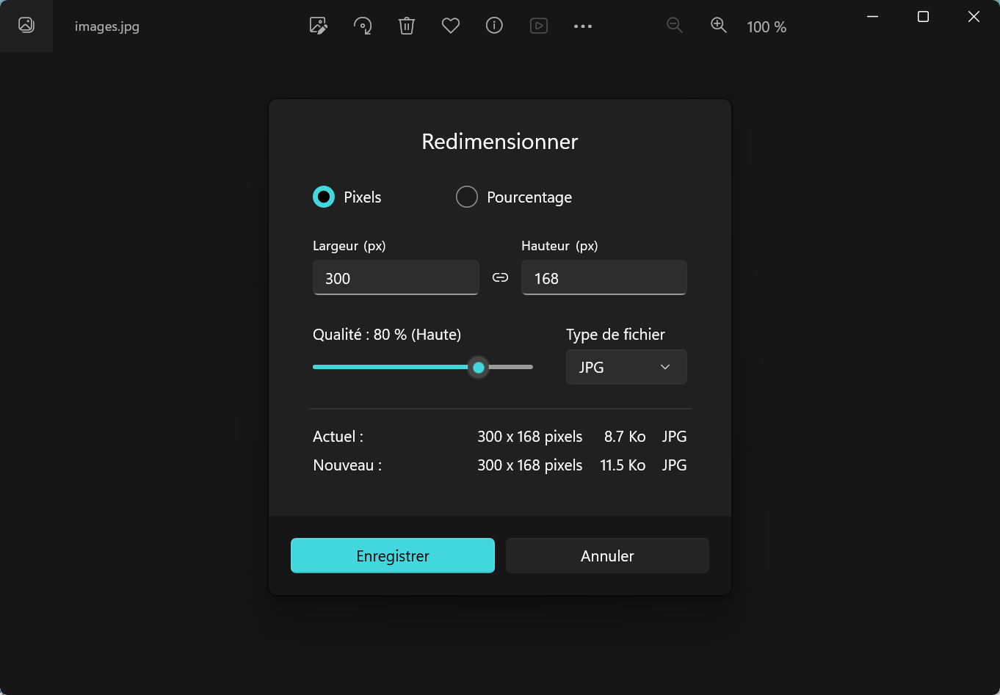

# Minisite web - Questions fréquentes

## Création du minisite

!!! info "Comment ajouter des pages à mon minisite web ?"

    Pour créer une page supplémentaire à votre site, vous devez : 
    
    - Créer un nouveau fichier HTML
    - Créer un lien hypertexte vers ce nouveau fichier depuis la page d'accueil (fichier `index.html`)

    C'est ce qui vous est proposé en exemple avec le fichier `page-exemple.html` et le lien hypertexte présent sur la page d'accueil dont voici le code pour rappel :
    
    ```html
     <a href="page-exemple.html">Lien hypertexte</a> vers une page intérieure.
    ```
    
## Envoi du minisite

!!! info "Comment créer un fichier ZIP ?"

    Tout est détaillé dans l'énoncé du projet : 
    [:material-link: Envoi du travail](https://www.mulot-nsi.fr/snt/02-web/prj-minisite/#envoi-du-travail){:target="_blank"}<br>
    En cas de difficultés, beaucoup de vos camarades s'en sortent très bien. Demandez-leur !

!!! info "Nous avons fait le site à plusieurs, qui doit déposer le fichier ZIP ?"

    Un seul membre de votre groupe doit déposer le fichier. Veillez à bien renseigner le nom des membres à deux endroits :

    - Le nom du dossier de votre minisite
    - Le ou les auteurs de chaque page (attribut `content` de la balise `#!html <meta name="author" content="ICI">`)

    :material-alert: Attention, quoi que vous puissiez dire, si le projet ne contient aucune mention écrite me permettant de vous relier à lui, c'est **ZÉRO**.

!!! info "J'ai déposé mon site sur Pronote, mais quand je vérifie, tout est cassé ! Pourquoi ?"

    Pour vérifier votre dépôt sur Pronote, téléchargez-le et **décompressez-le** (Fonction *« Extraire tout... »* de l'explorateur de fichiers).
    Si vous le visualisez directement depuis le fichier ZIP, votre minisite apparaîtra systématiqement sans image et sans style .

!!! info "Je ne peux pas déposer mon site, il est trop volumineux. Comment faire ?"

    Le fichier ZIP de votre site ne doit pas dépasser 4Mo. Si c'est le cas, plusieurs options s'offre à vous :

    - Faites le ménage et supprimez tous les fichiers inutiles
    - Réduisez la taille des images en utilisant l'application « **Photo** » de Windows.
      Celle-ci se lance automatiquement lorsque vous double-cliquez sur une image depuis l'explorateur de fichiers.
      Cette application dispose de la fonctionnalité « **Redimensionner l'image** » disponible en cliquant sur l'icône « **...** »

    {:style="width:80%;display:block;margin:0 auto;"}

    :material-alert: Si vous êtes bloqué, vous pouvez toujours transmettre votre minisite autrement mais **vous perdrez des points**. 
    Vous pouvez :
    
    - Déposer le fichier ZIP dans le casier de l'ENT
    - Ajouter le fichier ZIP en pièce jointe d'un email *(20 Mo maximum)*

