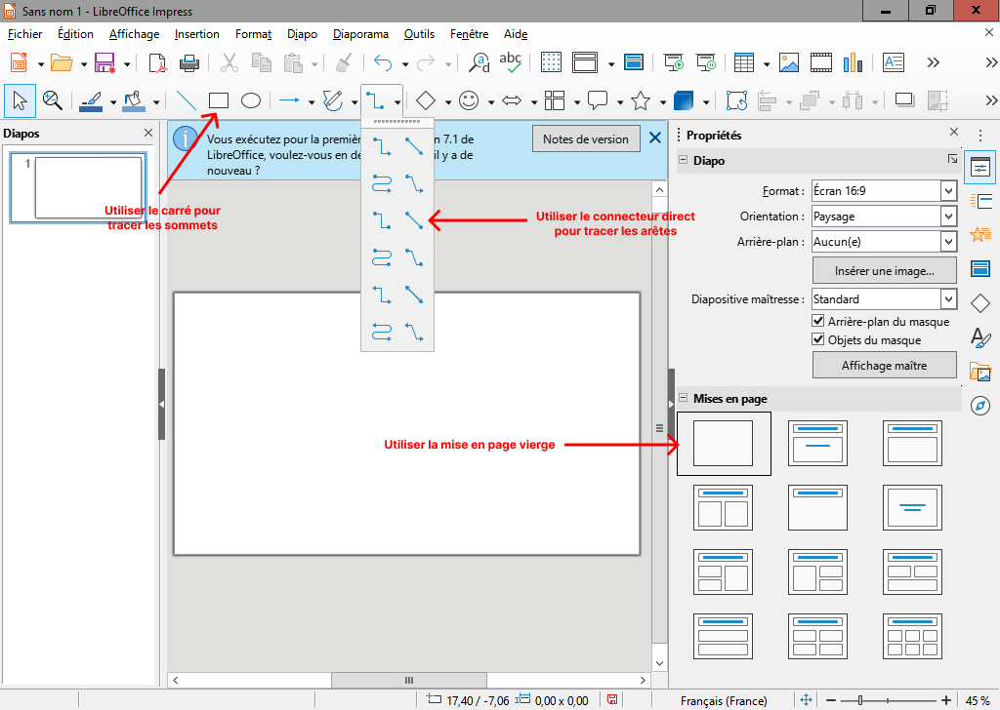
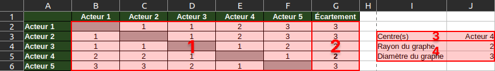

# Modélisation d'un réseau social

## Introduction

Vous êtes un acteur ou une actrice reconnu(e) pour vos nombreux rôles dans des séries télévisées.
Après tous ces succès, vous n'avez qu'un objectif, accéder au monde du cinéma.
Vous voulez entrer par la grande porte en jouant dans un film du réalisateur Christopher Nolan.
Celui-ci a cependant la réputation d'être impossible à joindre si vous n'êtes pas connu(e) de son cercle d'acteurs.

Il vous faut donc avant toute chose connaître plus précisément le réseau d'acteurs des films de Christopher Nolan.
Heureusement pour vous, vous avez suivi des cours de SNT au lycée et vous entreprenez de modéliser ce réseau sous forme
d'un graphe.

!!! danger "Travail à rendre"

    Le travail réalisé dans le cadre de ces travaux pratiques est à rendre en fin de séance selon les modalités décrites dans la section **Envoi du travail**.
    Deux documents seront à rendre :

    - La représentation sous forme de graphe du réseau social, réalisée à l'aide des fonctions graphiques des logiciels de création de diaporama
    - Un tableau des caractéristiques du graphe, réalisé à l'aide d'un logiciel tableur

## Préparation

Vous allez créer des dossiers afin de ne pas mélanger vos productions numériques entre vos différentes matières et
travaux pratiques.

!!! note "Organisation de l'espace travail"

    === ":material-laptop: Ordinateur portable"

        1. Lancez l'application <i class="icon file-explorer"></i> **Explorateur de fichiers**
        2. Dans le dossier `Document`, s'il n'y a pas de dossier nommé `SNT`, créez-le
        3. Dans le dossier `SNT`, créez-le dossier `Réseaux sociaux`

    === ":material-desktop-tower: Ordinateur fixe"

        1. Depuis le bureau, double-cliquez sur l'icône intitulée **Zone personnelle**
        2. Dans la **zone personnelle**, s'il n'y a pas de dossier nommé `SNT`, créez-le
        3. Dans le dossier `SNT`, créez-le `Réseaux sociaux`

## Graphe d'un réseau social

Vous souhaitez disposer d'un graphe des acteurs de Christopher Nolan. Chaque sommet représente donc un acteur.
Les liens entre les sommets, les arêtes, symbolisent le fait que deux acteurs se connaissent.
On considère que deux acteurs se connaissent à partir du moment où ils ont joué au moins une fois dans le même film.

Voici un tableau à double entrée d'acteurs et de films réalisés par Christopher Nolan.
Le symbole **✓** signifie que l'acteur a joué dans le film mentionné en en-tête de colonne.
Nous observons ainsi que **Tom Hardy** a joué dans le film *Inception* avec **Cillian Murphy** et **Michael Cain**. Ces
trois personnes se connaissent.

|                       | Le Prestige | Inception | Interstellar | Dunkerque | Tenet | Oppenheimer |
|:---------------------:|:-----------:|:---------:|:------------:|:---------:|:-----:|:-----------:|
|    Christian Bale     |      ✓      |           |              |           |       |             |
|    Cillian Murphy     |             |     ✓     |              |     ✓     |       |      ✓      |
|       Tom Hardy       |             |     ✓     |              |     ✓     |       |             |
|     Michael Caine     |      ✓      |     ✓     |      ✓       |     ✓     |   ✓   |             |
|      Gary Oldman      |             |           |              |           |       |      ✓      |
|     Anne Hathaway     |             |           |      ✓       |           |       |             |
| John David Washington |             |           |              |           |   ✓   |             |

!!! note "Consigne"

    À partir des informations du tableau, construire un graphe dont les sommets représentent **les acteurs**
    et dont les arêtes représentent le fait que deux acteurs **se connaissent** (c'est-à-dire qu'ils ont joué au moins une fois dans le même film).

    1. Téléchargez l'amorce de graphe : [:material-download: télécharger](assets/SNT03_graphe.odp){:download="SNT03_graphe.odp"}
    2. Déplacez le fichier `SNT03_graphe.odp` téléchargé dans le dossier `Réseaux sociaux`
    3. Ouvrez le fichier avec **LibreOffice Impress** (ou à défaut, *Microsoft PowerPoint*) :
        - *Christian B.* et *Michael C.* sont liés car ils se connaissent pour avoir joué dans *Le Prestige*
        - *Michael C.* et *Anne H.* sont liés car ils se connaissent pour avoir joué dans *Interstellar*
    4. Complétez le graphe après avoir lu le bloc **:material-lightbulb-on-outline: aide à la construction du graphe** ci-après

!!! help "Aide à la construction du graphe"

    - Construire le graphe en utilisant des **rectangles** et des **connecteurs directs**
    - Il est possible d'insérer du texte dans un rectangle en **double-cliquant dessus**
    - Les connecteurs restent attachés aux rectangles même lorsqu'ils sont déplacés

    <figure markdown>
        {:style="max-width:100%;border:1px solid black;"}
    </figure>

!!! warning "Attention"

    Pensez à enregistrer **fréquemment** votre travail. Nommez correctement votre fichier en précisant votre classe, votre
    nom ainsi qu'un mot-clé en rapport avec son contenu. Exemple :

    - `SEC01_Mark_Zukerberg_graphe.odp` *(.odp est l'extension des fichiers LibreOffice Impress)* 
    - `SEC01_Mark_Zukerberg_graphe.ppt` *(.ppt est l'extension des fichiers Microsoft Powerpoint)*

## Tableau des propriétés

Maintenant que votre graphe est prêt, vous vous interrogez sur la ou les personnes qu'il serait judicieux de contacter
en premier.
Heureusement, grâce à vos cours de SNT, vous savez qu'il est possible de trouver le (ou les) centre(s) d'un graphe. En
quoi est-ce utile ?
Dans le cas présent, trouver le centre du graphe, c'est trouver la personne qui a accès à l'ensemble des membres du
réseau en faisant intervenir le moins d'intermédiaires possible.

Pour trouver le centre du graphe, il vous faut déterminer l'ensemble des distances puis l'écartement de chaque sommet.
Une fois le(s) centre(s) trouvé(s), il vous restera à préciser le rayon et le diamètre du graphe.

| N° | Caractéristique | Définition                                                                 |
|:--:|:---------------:|:---------------------------------------------------------------------------|
| 1  |    Distance     | Nombre **minimum** d'arêtes reliant deux sommets                           |
| 2  |   Écartement    | **La plus grande distance** entre un sommet et tout autre sommet du graphe |
| 3  |    Centre(s)    | Sommet(s) dont **l'écartement** est le plus petit                          |
| 4  |      Rayon      | Plus petit écartement du graphe (écartement d'un centre)                   |
| 4  |    Diamètre     | Plus grand écartement du graphe                                            |

!!! note "Consigne"

    Vous trouverez en téléchargement ci-dessous un début de tableau de caractéristiques
    qu'il vous faut compléter avec l'ensemble des acteurs et des caractéristiques demandées.
    Pensez à consulter l'aide pour voir ce à quoi doit ressembler votre tableau une fois terminé.

    1. Téléchargez l'amorce du tableau des caractéristiques : [:material-download: télécharger](assets/SNT03_caracteristiques.ods){:download="SNT03_caractéristiques.ods"}
    2. Déplacez le fichier `SNT03_caractéristiques.ods` téléchargé dans le dossier `Réseaux sociaux`
    3. Ouvrez le fichier avec **LibreOffice Calc** (ou à défaut, *Microsoft Excel*) :
        - Il y a une distance de 2 entre *Christian B.* et *Cillian M.* car deux arêtes les séparent sur le graphe  
        - Il y a une distance de 1 entre *Cillian M.* et *Tom H.* car ils sont directement liés par une arête
    4. Complétez le tableau après avoir lu le bloc **:material-lightbulb-on-outline: aide à la construction du tableau des distances** ci-après

!!! help "Aide à la construction du tableau des distances"

    Voici ce à quoi pourrait ressembler votre tableau des caractéristiques.
    La numérotation en surimpression correspond à la liste des caractéristiques mentionnées plus haut et à déterminer pour
    votre propre graphe :

    1. Les distances *(nombre minimum d'arêtes reliant deux sommets)*
    2. Les écartements *(la plus grande distance** entre un sommet et les autres sommets du graphe)*
    3. Le ou les centres *(sommet(s) dont l'écartement** est le plus petit)*  
    4. Le rayon et le diamètre *(plus petit et plus grand écartement)*  

    <figure markdown>
        {:style="max-width:100%;border:1px solid black;"}
    </figure>

!!! warning "Attention"

    Pensez à enregistrer **fréquemment** votre travail. Nommez correctement votre fichier en précisant votre classe, votre
    nom ainsi qu'un mot-clé en rapport avec son contenu. Exemple :

    - `SEC01_Mark_Zukerberg_caracteristiques.ods` *(.ods est l'extension des fichiers LibreOffice Calc)* 
    - `SEC01_Mark_Zukerberg_caracteristiques.xlsx` *(.xlsx est l'extension des fichiers Microsoft Excel)*

## Envoi du travail

### Création d'un fichier ZIP

Pour faciliter l'envoi de plusieurs fichiers et dossiers, il est possible de tous les regrouper dans un unique fichier
au format ZIP. Suivez les instructions selon l'ordinateur utilisé :

!!! info "Création d'un fichier ZIP"

    === ":material-laptop: Ordinateur portable"

        - Lancez l'application <i class="icon file-explorer"></i> **Explorateur de fichiers** 
          <kbd>:fontawesome-brands-windows:</kbd>+<kbd>E</kbd>
        - Accédez au dossier `SNT`
        - Effectuez un clic droit sur le dossier `Réseaux sociaux` afin d'afficher son menu contextuel
        - Choisissez l'option :material-folder-zip-outline: **Compresser dans un fichier ZIP**
        - Conservez `Réseaux sociaux.zip` comme nom de fichier
    
    === ":material-desktop-tower: Ordinateur fixe"

        - Lancez l'application <i class="icon file-explorer"></i> **Explorateur de fichiers**
        - Depuis votre dossier personnel, accédez au dossier `SNT`
        - Effectuez un clic droit sur le dossier `Réseaux sociaux` afin d'afficher son menu contextuel
        - Choisissez l'option **Envoyer vers ▸ Dossier compressé**
        - Conservez `Réseaux sociaux.zip` comme nom de fichier

### Envoi du fichier ZIP

Une fois votre fichier ZIP créé, vous pouvez le déposer sur Pronote.

!!! info "Dépot du travail sur Pronote"

    1. Connectez-vous à l'ENT : [:material-link: https://ent.iledefrance.fr](https://ent.iledefrance.fr){:target="_blank"}
    3. Accédez à l'application **Pronote**
    4. Depuis l'accueil, recherchez le devoir **SNT03 - TP1 Modélisation**
    5. Cliquez sur le bouton Déposer ma copie
    6. Cliquez sur le bouton **Un seul fichier (*.pdf, *.doc, ...)**
    7. Déposez votre fichier ZIP