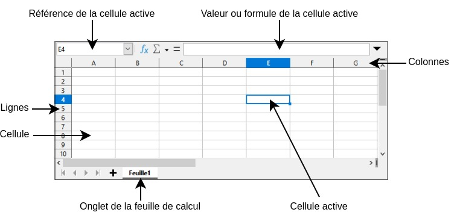
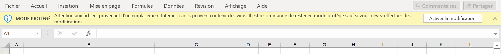

# Données ouvertes

## Introduction

Ces travaux pratiques ont pour objectif de vous faire découvrir ce que sont les données ouvertes *(Open Data)* et vous faire manipuler des données à l'aide d'un tableur.

## Préparation

Vous allez créer des dossiers afin de ne pas mélanger vos productions numériques entre vos différentes matières et
travaux pratiques.

!!! note "Organisation de l'espace travail"

    === ":material-laptop: Ordinateur portable"

        1. Lancez l'application <i class="icon file-explorer"></i> **Explorateur de fichiers**
        2. Dans le dossier `Document`, s'il n'y a pas de dossier nommé `SNT`, créez-le
        3. Dans le dossier `SNT`, créez-le dossier `Données structurées`
        4. Dans le dossier `Données structurées`, créez-le dossier `TP1 - Données ouvertes`

    === ":material-desktop-tower: Ordinateur fixe"

        1. Depuis le bureau, double-cliquez sur l'icône intitulée **Zone personnelle**
        2. Dans la **zone personnelle**, s'il n'y a pas de dossier nommé `SNT`, créez-le
        3. Dans le dossier `SNT`, créez-le dossier `Données structurées`
        4. Dans le dossier `Données structurées`, créez-le dossier `TP1 - Données ouvertes`

## Les données ouvertes

### Découverte du site data.gouv.fr

!!! note "Consigne"

    1. Rendez-vous sur le site [data.gouv.fr](https://data.gouv.fr){:target="_blank"}
    2. Repérez le menu principal *(le bandeau de liens en haut de page ou l'icône :material-menu:)*
    3. Depuis le menu principal, cliquez sur l'entrée **Commencer sur data.gouv.fr** puis **Qu'est-ce que data.gouv.fr ?**
    4. Lisez le contenu de la page intitulée **À propos de data.gouv.fr**

!!! question "Question"

    Qu'est-ce que **data.gouv.fr** et dans quel but ce site a-t-il été créé ?

??? success "Réponse"

    Data.gouv.fr est une plateforme en ligne qui a pour objectif de faciliter le partage, l'accès et la réutilisation des données publiques. 
    On y trouve par exemple des données relatives aux élections, la santé ou l'enseignement.

### Découverte d'un jeu de données

#### :material-link-variant: Accès aux jeux de données

!!! note "Consigne"
    
    1. Restez sur le site [data.gouv.fr](https://data.gouv.fr){:target="_blank"}
    2. Depuis le menu principal, cliquez sur l'entrée **Données**
    3. Une fois sur la page **Jeux de données**, trouvez la mention du nombre total de jeux de données disponibles

!!! question "Question"
    
    Quel est le nombre total de jeux de données disponibles sur le site data.gouv.fr ?

??? success "Réponse"

    À l'heure où ses travaux pratiques ont été rédigés, le site data.gouv.fr disposait de **47 508** jeux de données

#### :material-magnify: Recherche d'un jeu de données

!!! note "Consigne"
    
    1. Restez sur la page [Jeux de données](https://www.data.gouv.fr/fr/datasets/){:target="_blank"}
    2. Effectuez la recherche de jeux de données suivante : `films million entrées` 
       *:material-comment-alert: Attention, ne confondez pas avec le champ de recherche du site*
    3. Cliquez sur le résultat intitulé [Films ayant réalisé plus d'un million d'entrées](https://www.data.gouv.fr/fr/datasets/films-ayant-realise-plus-dun-million-dentrees/){:target="_blank"}
    4. Trouvez sur la page descriptive du jeu de données les réponses aux questions ci-après

!!! question "Questions"
    
    - Qui a produit et partagé ce jeu de données ?
    - Quelle est la période couverte par ces données ? 
      *:material-comment-alert: consultez le contenu de l'onglet **Informations** pour répondre à cette question*

??? success "Réponses"

    - Ce jeu de données a été produites et partagées par le CNC *(Centre National du Cinéma et de l'image animée)*
    - Il est indiqué que la période couverte par le jeu de données est **2003 à 2013**.
      Cependant ce jeu de données a été mis à jour en 2023. Vous constaterez en l'étudiant que la période couverte est finalement **2003 à 2022**.

#### :material-download: Téléchargement des données

!!! note "Consigne"

    1. Restez sur la page [Films ayant réalisé plus d'un million d'entrées](https://www.data.gouv.fr/fr/datasets/films-ayant-realise-plus-dun-million-dentrees/){:target="_blank"}
    2. Accédez à l'onglet **Fichiers**
    3. Cliquez sur le bouton :material-download: pour télécharger le fichier au format `xlsx`  
       *:material-comment-alert: le format `xlsx` correspond au format de l'application Microsoft Excel*

!!! danger "Le téléchargement ne fonctionne pas ?"

    En cas de problème de téléchargement, le fichier est directement disponible ici : 
    [:material-download: Films ayant réalisé plus d'un million d'entrées](assets/liste_des_films_plus_million_entrees.xlsx){:target="_blank"}

!!! note "Consigne"

    1. **Fermez le fichier téléchargé** si celui-ci est ouvert 
       *:material-comment-alert: il n'est pas possible de déplacer un fichier ouvert*
    2. Déplacez le fichier vers le dossier de travail `SNT\Données structurées\TP1 - Données ouvertes`
    3. Double-cliquez sur le fichier pour l'ouvrir 
       *:material-comment-alert: l'application Microsoft Excel ou LibreOffice Calc doit se lancer*

## Les tableurs

!!! info "Fonctionnement d'un tableur"

    - Un **tableur** est un logiciel permettant la manipulation de données organisées sous forme de tableaux.
      Il est possible d'appliquer sur ces données divers traitements tels que : des tris, des filtres ou des calculs.
    - Un document créé via un tableur *(LibreOffice Calc, Microsoft Excel, ...)* est appelé **classeur**.
      Un classeur contient des feuilles de calcul organisées en onglets.
    - Une **feuille de calcul** correspond à un tableau pouvant contenir des valeurs ou des formules de calcul.
      Les cases du tableau sont appelées cellules.
    - Chaque **cellule** est identifiable par sa **référence**.
      Une référence est formée de la lettre de la colonne suivie du numéro de ligne de la cellule.

    <figure markdown>
        {:style="max-width:100%;"}
    </figure>

### Analyse simple des données

!!! note "Consigne"

    1. S'il n'est pas déjà ouvert, ouvrez le classeur des **films ayant réalisé plus d'un million d'entées**
    2. Naviguez entre les années en cliquant sur les onglets pour changer de feuille de calcul 
       *:material-comment-alert: les onglets se trouvent en bas de la fenêtre*
    3. Trouvez les réponses aux questions ci-après en explorant le classeur

!!! question "Préparation du QCM"

    - Quel film a fait le plus d'entrées en 2020 ?
    - Quel film français a fait le plus d'entrées en 2013 ?
    - Quelle est la nationalité du film ayant fait le plus d'entrées en 2005 ?

??? success "Réponses"

    - Le film ayant fait le plus d'entrées en 2020 est **Tenet**
    - Le film français ayant fait le plus d'entrées en 2013 est **Les Profs**
    - Le film ayant fait le plus d'entrées en 2005 est **américain** 

### Filtrage des données

#### Activer les filtres

!!! warning "Attention"

    Si le classeur est en **mode protégé**, cliquer sur **Activer la modification** avant d'aller plus loin.

    <figure markdown>
        {:style="max-width:100%;"}
    </figure>

!!! note "Consigne"

    1. **Activez la modification** si le classeur est en mode protégé
    2. Rendez-vous sur la feuille de calcul de l'année **2018**
    3. Sélectionnez l'intégralité de la 7ème ligne. Celle-ci contient les en-têtes du tableau 
       *:material-comment-alert: cliquez sur la case grise contenant le numéro de la ligne. Ne confondez pas avec le film de rang 7*
    4. Activez les tris et les filtres en sélectionnant la fonction appropriée selon le logiciel utilisé 
       *:material-comment-alert: consultez l'aide ci-dessous*

!!! help "Activer les filtres"

    === ":material-microsoft-excel: Microsoft Excel"

        - *menu* ▸ Données ▸ Filtrer
        - raccourci clavier ++ctrl+shift+l++

    === ":material-table: Libre office Calc"

        - *menu* ▸ Données ▸ Filtre automatique
        - raccourci clavier ++ctrl+shift+l++

#### Utiliser les filtres

!!! note "Consigne"

    Nous souhaitons ne visualiser que les films français. Pour cela :

    - Cliquez sur le triangle qui est apparu à droite de l'en-tête de colonne **Nationalité**
    - Décochez tout sauf **FR** et répondez à la question 
      *:material-comment-alert: seuls les films français doivent désormais être visibles*

!!! question "Question"
    
    Quels sont les trois films français ayant fait le plus d'entrées en 2018 ?

??? success "Réponse"
    
    Les trois films français ayant fait le plus d'entrées en 2018 sont :
    
    - Les Tuche 3
    - La Ch'tite famille
    - Le grand bain 

### Les fonctions de calcul

#### Nombre de films

!!! note "consigne"
    
    Nous souhaitons compter le nombre de films affichés une fois le filtre appliqué :

    1. Retournez sur la feuille de calcul de 2018
    2. Sélectionnez la cellule `C51`
    3. Saisissez-y la formule `=SOUS.TOTAL(3;C8:C49)` 
       *:material-comment-alert: respectez bien chaque élément de ponctuation (`=`, `;` et `:`)* 
       *:material-comment-alert: une fois la formule saisie, le nombre de films affichés devrait apparaître dans la cellule `C51`.*

!!! info "Explications"

    La fonction `SOUS.TOTAL` permet d'appliquer un traitement (le traitement numéro 3) sur un groupe de cellules
    (`C8:C49`). Ici `C8` correspond à la cellule du coin supérieur gauche de la sélection et `C49` celle du coin inférieur droit.
    Ces deux cellules faisant partie de la même colonne `C`, nous appliquons donc finalement le traitement sur les cellules de la ligne `8` à la ligne `49` de la colonne `C`.

    La documentation complète de cette fonction est disponible sur le [:material-link: support Microsoft](https://support.microsoft.com/fr-fr/office/sous-total-sous-total-fonction-7b027003-f060-4ade-9040-e478765b9939)

!!! question "Question"
    
    Combien de films français ont dépassé le million d'entrées en 2018 ?

??? success "Réponse"

    **11 films** français ont dépassé le million d'entrées en 2018.

#### Nombre d'entrées

!!! note "consigne"

    Nous souhaitons maintenant connaître le nombre d'entrées cumulées d'une sélection de films :

    1. Retournez sur la feuille de calcul de 2018
    2. Sélectionnez la cellule `E51`
    3. Saisissez-y la formule `=SOUS.TOTAL(9;E8:E49)` 
       *:material-comment-alert: une fois la formule saisie, le nombre d'entrées cumulées devrait apparaître dans la cellule `E51`*

!!! question "Questions"
    
    - Combien y a-t-il eu d'entrées cumulées pour les films français en 2018 ?
    - Combien y a-t-il eu d'entrées cumulées pour les films étrangers en 2018 ?

??? success "Réponses"
    
    - Le nombre d'entrées cumulées pour les films français en 2018 est de **32,25 millions**
    - Le nombre d'entrées cumulées pour les films étrangers en 2018 est de **72,90 millions**

#### Filtres et tris

!!! warning "Attention"

    Si la colonne **sortie** contient des `###`, cela signifie qu'elle n'est pas assez large pour afficher correctement les données.
    Il est possible de l'élargir. Pour cela :

    - Placer le curseur de la souris entre les lettres `D` et `E`
    - Maintenir le bouton gauche de la souris pressé
    - Glisser la souris vers la droite

!!! note "Consigne"

    1. Retournez sur la feuille de calcul de 2018
    2. Réinitialisez tous les filtres de façons à afficher tous les films de 2018 **(important)**
    3. Triez les films selon leur date de sortie croissante 
        *:material-comment-alert: Cliquez sur le triangle à droite de l'en-tête de colonne « sortie »*
    4. Vous devez constater la présence de quatre films sortis en 2017
    5. Appliquez le filtre permettant de les masquer
    6. En ajustant les autres filtres et le tri, répondez aux questions ci-après.

!!! question "Question"

    - Pour les films sortis en 2018 strictement, combien ont dépassé le million d'entrés ?
    - Quels sont les deux films américains en tête de liste ?

??? success "Réponses"

    - **38 films** sortis en 2018 ont dépassé le million d'entrés
    - Les deux films américains en tête de liste sont **Les indestructibles 2** et **Avengers : Infinity War**

## Nouveau jeu de données

!!! note "Consigne"

    1. Rendez-vous sur la page des jeux de données de [data.gouv.fr](https://www.data.gouv.fr/fr/datasets/){:target="_blank"}
    2. Dans le champ de recherche, saisissez les mots-clés : `salles cinéma`
    3. Accédez au jeu de données **Les salles de cinéma en Île-de-France** 
       *:material-comment-alert: celui fourni par la région Ile-de-France et mis à jour le 6 décembre 2021*
    4. Téléchargez le fichier au format `csv` et ouvrez-le avec un tableur
    5. **En utilisant les fonctionnalités de filtrage et de calcul**, répondez aux questions ci-après 
        *:material-comment-alert: conservez cette fois vos réponses dans un fichier texte*

!!! danger "Le téléchargement ne fonctionne pas ?"

    En cas de problème de téléchargement, le fichier est directement disponible ici : 
    [:material-download: Les salles de cinéma en Île-de-France](assets/les_salles_de_cinemas_en_ile-de-france.csv){:target="_blank"}

!!! question "Questions"

    - Quelle est la salle de cinéma en Île-de-France ayant le plus de fauteuils ? Donner la ville, le nom de la salle et le nombre de fauteuils.
    - Combien d'écrans et de fauteuils dispose l'unique cinéma de Chelles ?
    - Combien de cinémas « Art et Essai » y a-t-il en Île-de-France ?
    - Combien de fauteuils ont l'ensemble des dix plus gros cinémas d'Île-de-France (en nombre de fauteuils) ?
    - Combien de fauteuils ont l'ensemble des cinémas « Art et Essai » à Paris ?

!!! note "Consigne"
    
    Une fois que vous avez notez vos réponses dans un fichier texte, vérifiez vos résultats avec Pronote : 
    
    1. Connectez-vous à Pronote
    2. Accédez au **Cahier de textes**
    3. Accédez à **Contenu et ressources**
    4. Affichez le contenu des séances de **SC.NUMERIQ.TECHNOL.**
    5. Trouvez la séance **Chapitre 4 - TP1 - Données ouvertes** et exécuter le QCM