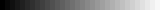
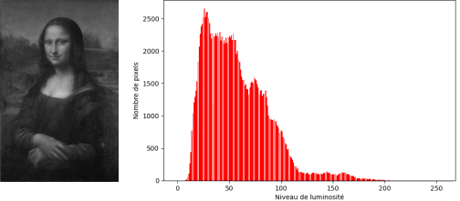
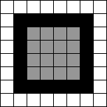
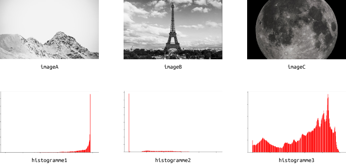
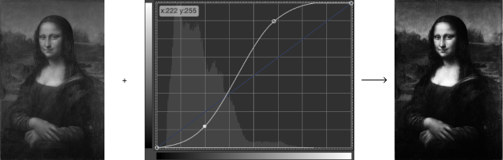
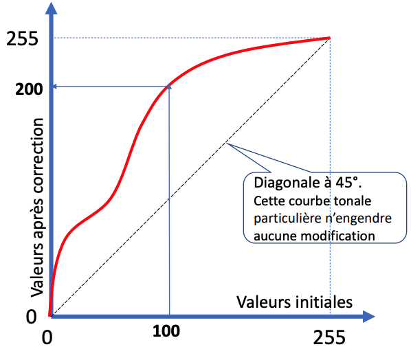
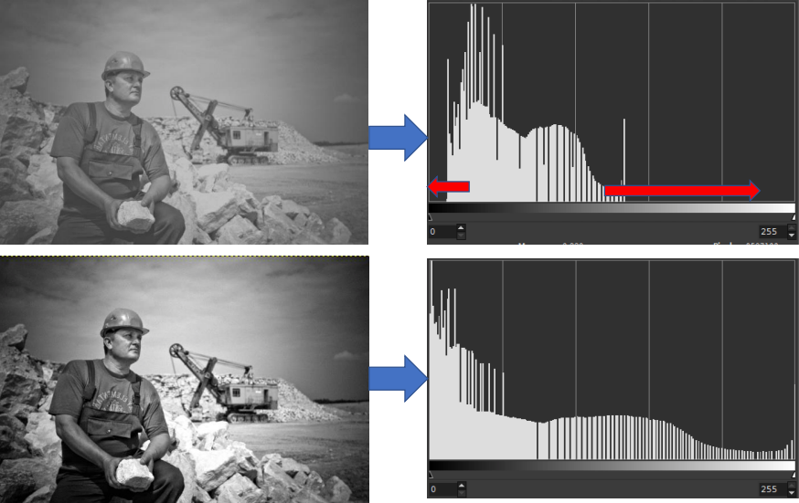

# Retouche d'une image

## Introduction

Ces travaux pratiques ont pour objectif de faire comprendre les concepts relatifs à la luminosité des pixels et
effectuer des retouches.

!!! danger "Travail à rendre"

    Un compte rendu sera à rédiger et à déposer sur Pronote en fin de séance.

## Préparation

### Espace de travail

Vous allez créer des dossiers afin de ne pas mélanger vos productions numériques entre vos différentes matières et
travaux pratiques.

!!! note "Organisation de l'espace travail"

    === ":material-laptop: Ordinateur portable"

        1. Lancez l'application <i class="icon file-explorer"></i> **Explorateur de fichiers**
        2. Dans le dossier `Document`, s'il n'y a pas de dossier `SNT`, créez-le
        3. Dans le dossier `SNT`, s'il n'y a pas de dossier `Photographie`, créez-le
        4. Dans le dossier `Photographie`, créez-le dossier `TP2 - Retouche`

    === ":material-desktop-tower: Ordinateur fixe"

        1. Depuis le bureau, double-cliquez sur l'icône intitulée **Zone personnelle**
        2. Dans la **zone personnelle**, s'il n'y a pas de dossier `SNT`, créez-le
        3. Dans le dossier `SNT`, s'il n'y a pas de dossier `Photographie`, créez-le
        4. Dans le dossier `Photographie`, créez-le dossier `TP2 - Retouche`

### Téléchargement

Pour réaliser ces travaux pratiques, il est nécessaire de disposer de certains fichiers.

!!! note "Récupération des fichiers"

    1. Téléchargez le fichier ZIP contenant les fichiers nécessaires : [:material-download: télécharger](assets/SNT05_TP2.zip){:download="SNT05_TP2.zip"}
    2. Ouvrez le fichier ZIP *(si le navigateur ne l'ouvre automatiquement, cliquez sur le fichier téléchargé)*
    3. Sélectionnez tous les fichiers et dossiers  ++ctrl+a++
    4. Copiez tous les fichiers et dossiers ++ctrl+c++
    5. Collez les fichiers dans le dossier `SNT\Photographie\TP2 - Retouche` ++ctrl+v++

    ??? help "Aide vidéo"

        
<iframe src="https://www.loom.com/embed/fb39b9fdd7184179a05bab2c9534c088?sid=9fa4d6f6-2dac-4f83-aa3b-7e1add8dcc90" frameborder="0" webkitallowfullscreen mozallowfullscreen allowfullscreen style="position: absolute; top: 0; left: 0; width: 100%; height: 100%;"></iframe>

### Compte rendu

Un compte rendu est à rédiger et à déposer sur Pronote au format PDF en fin de séance.

!!! note "Préparation du compte rendu"

    1. Créez un document texte en utilisant un logiciel de traitement de texte *(LibreOffice Writer, Microsoft Word, ...)*
    2. Ajoutez un titre, une date, votre classe, votre prénom et votre nom
    3. Enregistrez immédiatement le document dans le dossier `TP2 - Retouche`

## Caractéristiques d'une image

### Luminosité

Dans une image numérique, un niveau de gris représente la **luminosité d'un pixel**.
Un niveau de gris varie alors du noir *(la plus faible luminosité)* au blanc *(la plus forte luminosité)* avec un
certain nombre de nuances intermédiaires selon la **profondeur de couleurs** de l'image.

La profondeur de couleur est définie par le nombre de bits utilisés pour représenter chaque pixel.
Plus ce nombre est élevée, plus le nombre de nuances de gris sera grand.

|     Profondeur     |      Nombre de nuances      |             Aperçu              |
|:------------------:|:---------------------------:|:-------------------------------:|
|       3 bits       |  23 = 8 nuances  |  |
|       4 bits       | 24 = 16 nuances  |  |
|       5 bits       | 25 = 32 nuances  |  |
| 8 bits *(1 octet)* | 28 = 256 nuances |  |

!!! info "Information"

    Afin de simplifier les expérimentations de ces travaux pratiques, nous n'utiliserons que des images en noir et blanc.
    Celles-ci ont une profondeur de couleurs de 8 bits ce qui signifie qu'elles sont construites à partir de 256 nuances de gris.

### Histogramme

#### Principe

Un histogramme est un graphique qui indique le nombre de pixels dans l'image pour chaque valeur de luminosité.
Pour une profondeur de couleurs de 8 bits, les valeurs vont de 0 *(luminosité minimale)* à 255 *(luminosité maximale)*.
Chaque pic correspond au nombre de pixels pour une de luminosité donnée. Plus il est haut, plus sont nombreux les pixels pour cette luminosité. 

<figure markdown>
{:style="max-width:100%;"}

<em>Histogramme du portrait de Mona Lisa</em>

</figure>

!!! note "Activité 1"
    
    Observez l'histogramme de l'image de *La Joconde* et déduisez-en la luminosité globale de l'image *(claire, neutre ou sombre)*.
    Écrivez votre réponse dans le compte rendu **en justifiant**.

#### Construction d'un histogramme

Voici une image de 8x8 pixels de définition représentant un rectangle gris.
Celle-ci a une profondeur de couleurs de 8 bits, mais ses pixels n'ont finalement que 3 nuances de gris sur les 256 possibles :

    <table>
        <tr><th style="text-align:center;">Nuance</th><th style="text-align:center;">Luminosité</th></tr>
        <tr><td style="text-align:center;">

</td><td style="text-align:center;">0</td></tr>
        <tr><td style="text-align:center;">

</td><td style="text-align:center;">150</td></tr>
        <tr><td style="text-align:center;">

</td><td style="text-align:center;">255</td></tr>
    </table>

!!! note "Activité 2"

    Construire l'histogramme correspondant à l'image ci-dessus. Pour cela :

    1. Accédez au dossier `SNT\Photographie\TP2 - Retouche\histogramme_construction`
    2. Complétez le fichier `SNT05_histogramme.ods` en indiquant dans la colonne **Nombre de pixels**, le nombre de pixels que contient l'image pour chaque luminosité
    3. Faites une capture d'écran de l'histogramme obtenu  ++win+shift+s++
    4. Collez la capture dans votre compte rendu

    ??? help "Aide vidéo"
        
        Exemple pour une image contenant 60 pixels noirs (intensité de 0) et 4 pixels gris (intensité de 150) :

        
<iframe src="https://www.loom.com/embed/8fbaf0b9522648b89ddb657d3f511280?sid=962af908-8d4c-4a3d-9b24-6c54bc410691" frameborder="0" webkitallowfullscreen mozallowfullscreen allowfullscreen style="position: absolute; top: 0; left: 0; width: 100%; height: 100%;"></iframe>

#### Interprétation

Le dossier `histogramme_interpretation` comporte 3 images et 3 histogrammes :

<figure markdown>
{:style="max-width:100%;"}
</figure>

!!! note "Activité 3"
    - Visualisez les images et les histogrammes depuis le dossier `histogramme_interpretation`
    - Associez chaque histogramme à la bonne image. Vous répondrez en faisant des phrases : 
    *"L'histogramme numéro ... correspond à celui de l'image ... car ..."*

!!! note "Activité 4"

    Lancez une application de retouche d'image et vérifiez les histogrammes de chaque image. Vous pouvez utiliser au choix :

    - [:material-link: Pixlr](https://pixlr.com/fr/editor/){:target=_blank} *(application en ligne)* : Ajustement ▶ Niveaux...
    - Gimp *(uniquement sur les ordinateurs du lycée)* : Couleurs ▶ Niveaux...

## Traitement d'image

### La courbe tonale

La courbe tonale est un outil proposé par toute application de retouche d'image. Celui-ci permet d'ajuster la luminosité
des pixels.

#### Exemple

<figure markdown>
{:style="max-width:100%;"}

<em>Modification de la courbe tonale de La Joconde</em>

</figure>

#### Explication

L'axe des abscisses correspond à l'intensité lumineuse originale des pixels.
L'axe des ordonnées correspond à l'intensité lumineuse modifiée des pixels.
Sans modification, la courbe est une droite correspondant à *y = x*.
Il est possible de modifier manuellement cette courbe et ainsi faire varier *y* par rapport à *x*.

<figure markdown>
{:style="max-width:50%;margin-left:auto;margin-right:auto;"}

<em>Exemple : tous les pixels d'intensité 100 prendront la valeur 200 après modifications. Ils vont donc s'éclaircir.</em>

</figure>

### Exposition

#### Principe

L'exposition est la quantité de lumière qui atteint le capteur de votre appareil photo.
Une forte exposition se traduit par une image lumineuse et inversement, une faible exposition se traduit par une image
plus sombre.
L'exposition peut être ajustée après la prise de vue en modifiant la courbe tonale.

#### Mise en pratique

Soit les courbes tonales suivantes :

<em>Courbe 1</em>

<em>Courbe 2</em>

!!! note "Activité 5"

    Vous devez réussir à distinguer entre les deux courbes celle qui permet d'augmenter l'exposition et celle qui permet de la réduire.
    Pour cela, modifiez la courbe tonale d'une des images de ce TP et ajoutez une capture d'écran du résultat obtenu dans votre compte rendu et concluez.

    Pour modifier la courbe tonale, vous pouvez utiliser au choix :

    - [:material-link: Pixlr](https://pixlr.com/fr/editor/){:target=_blank} *(application en ligne)* : Ajustement ▶ Courbes...
    - Gimp *(uniquement sur les ordinateurs du lycée)* : Couleurs ▶ Courbes...

### Contraste

#### Principe

Le contraste correspond à la différence de luminosité entre les parties claires et les parties sombres d'une image.
Augmenter le contraste revient à égaliser l'histogramme : l'intensité est mieux répartie en "étalant" l'histogramme.

<figure markdown>
{:style="max-width:100%;margin-left:auto;margin-right:auto;"}
</figure>

#### Mise en pratique

Soit les courbes tonales suivantes :

<em>Courbe 1</em>

<em>Courbe 2</em>

!!! note "Activité 6"

    Vous devez réussir à distinguer entre les deux courbes celle qui permet d'augmenter le contraste et celle qui permet de le réduire.
    Testez vos modifications sur une des images de ce TP, ajoutez une capture d'écran des résultats obtenus dans votre compte rendu et concluez.

    Pour modifier les courbes, vous pouvez utiliser au choix :

    - [:material-link: Pixlr](https://pixlr.com/fr/editor/){:target=_blank} *(application en ligne)* : Ajustement ▶ Courbes...
    - Gimp *(uniquement sur les ordinateurs du lycée)* : Couleurs ▶ Courbes...

    ??? help "Aide vidéo"
        
        Exemple de reproduction de la courbe 1 sous Pixlr

        
<iframe src="https://www.loom.com/embed/5e1b6ab79b104423ad3fbd52f6986ec6?sid=80af98a8-d07c-4e6a-8342-698f1ffdc4b7" frameborder="0" webkitallowfullscreen mozallowfullscreen allowfullscreen style="position: absolute; top: 0; left: 0; width: 100%; height: 100%;"></iframe>

## Envoi du travail

!!! note "Dépot du travail sur Pronote"

    1. Enregistrez votre compte rendu et exportez-le au **format PDF**
    1. Connectez-vous à l'ENT : [:material-link: https://ent.iledefrance.fr](https://ent.iledefrance.fr){:target="_blank"}
    3. Accédez à l'application **Pronote**
    4. Depuis l'accueil, recherchez le devoir **SNT05 - TP - Retouche d'une image**
    5. Cliquez sur le bouton Déposer ma copie
    6. Cliquez sur le bouton **Un seul fichier (*.pdf, *.doc, ...)**
    7. Déposez votre fichier PDF