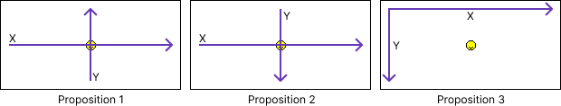

# Manipulation d'une image

## Introduction

Ces travaux pratiques ont pour objectif de vous faire manipuler les pixels et les couleurs d'une image à l'aide du
langage de programmation Python.

!!! danger "Travail à rendre"

    Un compte rendu sera à rédiger et à transmettre en fin de séance.

## Préparation

Vous allez créer des dossiers afin de ne pas mélanger vos productions numériques entre vos différentes matières et
travaux pratiques.

!!! note "Organisation de l'espace travail"

    === ":material-laptop: Ordinateur portable"

        1. Lancez l'application <i class="icon file-explorer"></i> **Explorateur de fichiers**
        2. Dans le dossier `Document`, s'il n'y a pas de dossier nommé `SNT`, créez-le
        3. Dans le dossier `SNT`, créez-le dossier `Photographie`
        4. Dans le dossier `Photographie`, créez-le dossier `TP1 - Manipulation`

    === ":material-desktop-tower: Ordinateur fixe"

        1. Depuis le bureau, double-cliquez sur l'icône intitulée **Zone personnelle**
        2. Dans la **zone personnelle**, s'il n'y a pas de dossier nommé `SNT`, créez-le
        3. Dans le dossier `SNT`, créez-le dossier `Photographie`
        4. Dans le dossier `Photographie`, créez-le dossier `TP1 - Manipulation`

!!! note "Préparation du document de compte rendu"

    1. Créez un document texte en utilisant un logiciel de traitement de texte *(LibreOffice Writer, Microsoft Word, ...)*
    2. Ajoutez un titre, une date, votre classe, votre prénom et votre nom
    3. Enregistrez immédiatement le document dans le dossier `TP1 - Manipulation`

## Exercices

### 1. Définition d'une image

Une image numérique est composée de pixels.
Le pixel est un point coloré qui constitue le plus petit élément d'une image.
Une des caractéristiques d'une image numérique est sa **définition**.

La définition correspond au nombre de pixels d'une image numérique en largeur et en hauteur.
Elle est exprimée sous la forme `LARGEUR`x`HAUTEUR`.

À titre d'exemple, une télévision Full HD est capable d'afficher une image de définition 1920x1080 comportant un peu
plus de deux millions de pixels.

!!! info "Instructions de préparation"

    === ":material-web: Basthon"

        1. Téléchargez le fichier [:material-download: smiley.png](assets/smiley.png){:download="smiley.png"} sans l'ouvrir
        2. Rendez-vous sur [:material-link: Basthon](https://console.basthon.fr/?script=eJw9jU0KgzAUhPeB3OERNwpV6AG67EJwUXqDEJ_6wPzwTMD2Rp7DizVWcDfDfDNTFAXUdQ3PFdmQQbgfVoqBvYVX2wHZ4DlCa_WIUkhRQIcmJkboEwxkJkLO0D8lO8LjRBsf0JVqsTTjpwluVNXZfu-bSWHfWEfyDjCCHo6Z3IEeYdbQ79tAjo5YilnziIlvMOkUs8j7-aVZ6Jv_ApOL5YWoVV1c9QPsmkd1){:target="_blank"}
           <br>*:material-comment-alert: cliquez sur le lien afin de disposer du code Python nécessaire à cet exercice*
        3. Dans Basthon, cliquez sur le bouton représentant un dossier et qui sert à importer un fichier
        4. Importez le fichier `smiley.png` téléchargé précédemment
           <br>**:material-alert: Attention**, le nom du fichier doit être impérativement `smiley.png` ou `smiley`

    === ":material-code-block-parentheses: Code Python"

        N'utilisez ce code que si vous souhaitez utiliser un autre interpréteur Python que Basthon.

        ```python
        ### --- Exercice 1 ---
        from PIL import Image
        
        # Lecture du fichier image
        img = Image.open("smiley.png")
        
        # Récupération et affichage de la définition
        largeur, hauteur = img.size
        print(largeur, "x", hauteur)
        ```

    <div style="position: relative; padding-bottom: 62.5%; height: 0;"><iframe src="https://www.loom.com/embed/0601dc53f37c428cbadd9e33b4ec30a8?sid=4942ffdc-71d6-4db9-8a06-aff3c2aade25" frameborder="0" webkitallowfullscreen mozallowfullscreen allowfullscreen style="position: absolute; top: 0; left: 0; width: 100%; height: 100%;"></iframe></div>


!!! note "Instructions de travail"

    1. Cliquez sur le bouton **Exécuter**
    2. Lisez les dimensions de l'image
    3. Reportez dans votre compte rendu les informations suivantes en ne faisant qu'une seule phrase :
        - Largeur en pixels
        - Hauteur en pixels
        - Nombre total de pixels que contient l'image *(à calculer)*
    4. Fermez l'onglet contenant Basthon

### 2. Manipuler les pixels

Vous allez maintenant placer des pixels sur l'image afin de reconstituer les yeux du smiley.
L'objectif est de **comprendre le système de coordonnées** de l'image.
Vous devez trouver où se trouve le point de coordonnées `(0, 0)` *(l'origine)* et comment sont orientés les axes X et Y.

!!! info "Instructions de préparation"

    === ":material-web: Basthon"

        1. Si vous l'avez perdu, téléchargez de nouveau le fichier [:material-download: smiley.png](assets/smiley.png){:download="smiley.png"} sans l'ouvrir
        2. Lancez **de nouveau** [:material-link: Basthon](https://console.basthon.fr/?script=eJxtkE1OwzAQhfeWfIdRs4gtJVaIYMGiC0RZVEKCGyCTTJIR_glOQtMjcQ4uRkyKhGg3M7Lf8zfPkyQJ5HkODzOGiiqEMh45a4K38Lx_BLK9DyPsrW4xW9su6ANnnCXwNH1gGKeAUCOYlKLKGdkWtqtV-R6d2AyWDB5V79qNXF_eex9q79zXJw4g5uwoI6Lq9PuE4JEMZ7G-tHqqOlxw4qooMygLeRLq4GmM9zdFBte3J-wOh4Ec1BP0NKM5Y9ZL9N9s8RsqFrEElqumek9uFH9GZ9CQMdv01ejqLb1g-wly5oph7pqGFkL4vxw1dP4g5DfCAXXI){:target="_blank"}
           <br>*:material-comment-alert: cliquez sur le lien afin de disposer du code Python nécessaire à cet exercice*
        3. Dans Basthon, cliquez sur le bouton représentant un dossier et qui sert à importer un fichier
        4. Importez le fichier `smiley.png` téléchargé précédemment
        5. Cliquez sur le bouton **Exécuter**
        6. Cliquez sur le bouton représentant une image

    === ":material-code-block-parentheses: Code Python"
        
        N'utilisez ce code que si vous souhaitez utiliser un autre interpréteur Python que Basthon.

        ```python
        ### --- Exercice 2 ---
        from PIL import Image, ImageDraw
        
        # Ouverture de l'image
        img = Image.open("smiley.png")
        
        # Coordonnées (x,y) de chaque oeil
        oeil_gauche = (102, 20)
        oeil_droit = (50, 49)
        
        # Dessin du pixel de chaque oeil
        draw = ImageDraw.Draw(img)
        draw.point(oeil_gauche, fill='black')
        draw.point(oeil_droit, fill='black')
        
        # Afficher de l'image
        img.show()
        ```
    
    <div style="position: relative; padding-bottom: 62.5%; height: 0;"><iframe src="https://www.loom.com/embed/84738957fc5f41559b05b6f5c4283bb3?sid=55815f37-d543-4364-aacb-15d3bfa879e9" frameborder="0" webkitallowfullscreen mozallowfullscreen allowfullscreen style="position: absolute; top: 0; left: 0; width: 100%; height: 100%;"></iframe></div>


!!! note "Instructions de travail"

    1. Repérez deux pixels noirs isolés sur l'image
       <br>*:material-comment-alert: ce sont les pixels représentant les yeux du smiley et ceux-ci sont mal placés*
    2. Modifiez les coordonnées des pixels afin de les placer correctement sur le smiley pour lui rendre ses yeux 
       <br>*:material-comment-alert: faites plusieurs essais afin de comprendre l'orientation des axes X et Y*
    4. Ajoutez les nouvelles coordonnées des pixels des yeux au compte rendu
    5. Par déduction des déplacements que vous avez appliqués aux pixels, ajoutez au compte rendu la proposition correspondant à la position de l'origine et l'orientation des axes du plan représenté par l'image :

    <figure markdown>
    {:style="max-width:100%;"}
    </figure>


### 3. Manipuler la couleur

En informatique, les couleurs peuvent être représentées en faisant varier l'intensité des trois composantes rouge, vert et bleu.
Chaque intensité est codée sous forme d'une valeur entière comprise entre 0 et 255.

!!! info "Instructions de préparation"

    === ":material-web: Basthon"
    
        1. Lancez de  nouveau [:material-link: Basthon](https://console.basthon.fr/?script=eJxNjksLgzAQhO-C_2HAgwoqYvHYQytSBA_FU6-hrg_w0Sax_v1u1EIhJMzk29lxEIYh8kdeZUWW42SkbTVyHnEvSvTja5YaxShasi3bclCSYuo584cSk2ZVu8tE7CwDLXJDBD7CCNTsd-K90N-AIUjpzZG9ItCkJSEGaSRpaltHEs7w4gDm-PvqS9P0HNeSyR3cfi-1PQxvHaOJVs-tblc3gJfEPMyXH_za-QceqW5ePf8Lzl9KIw){:target="_blank"}
           <br>*:material-comment-alert: cliquez sur le lien afin de disposer du code Python nécessaire à cet exercice*
        2. Cliquez sur le bouton **Exécuter**
        3. Cliquez sur le bouton représentant une image

    === ":material-code-block-parentheses: Code Python"

        N'utilisez ce code que si vous souhaitez utiliser un autre interpréteur Python que Basthon.

        ```python
        ### --- Exercice 3 ---
        from PIL import Image
        
        # Les 3 composantes d'une couleur
        # La valeur de chaque composante
        # est comprise entre 0 et 255
        couleur = (0, 0, 0)
        
        # Affichage de l'image
        image = Image.new('RGB', (200, 200), couleur)
        image.show()
        ```

!!! note "Instructions de travail"

    1. Modifiez la ligne `#!python couleur = (0, 0, 0)` afin de tester les couleurs :
        - `(255,0, 0)`
        - `(0, 255, 0)`
        - `(0, 0, 255)`
    2. Reportez les couleurs trouvées dans votre compte rendu
    3. Complétez votre compte rendu en effectuant les tâches suivantes :
        - Trouvez et reportez le code couleur du blanc, du jaune et du magenta *(rose/violet vif)*
        - Recherchez sur le web le nombre de couleurs visibles par l'œil humain
        - Calculez le nombre total de couleurs possibles sachant que chacune des 3 intensités peut prendre 256 valeurs. Notez le calcul et la valeur trouvée dans le compte rendu
        - Comparez sur le nombre de couleurs qu'il est possible de générer avec le nombre de couleurs visibles par l'œil humain et conclure. Que pouvez-vous conclure de la capacité du numérique à représenter les couleurs du monde.

### 4. Manipuler une image

Vous allez maintenant altérer la couleur de l'ensemble des pixels d'une image.
Vous commencerez par suivre quelques instructions d'expérimentation avant de laisser libre cours à votre imagination.

!!! info "Instructions de préparation"

    === ":material-web: Basthon"

        1. Téléchargez le fichier [:material-download: fraise.jpg](assets/fraise.jpg){:download="fraise.jpg"} sans l'ouvrir
        2. Lancez de nouveau [:material-link: Basthon](https://console.basthon.fr/?script=eJxtkU1qwzAQhfcG32GIF7VB9qqrQhaFdhFoaegNVHvsTJAlMbISpzfKOXKxyn-YptVmEG_eN0-aJEkgz3N47ZFLKhEeh2sc1Wxa2O_egFpruINdKxsUU3lheY6jOErgw5-QO88IFYJ6oEGNI2ob2E6thbGo003NkhwWR9tsssm5l1waz24wdsY7UOjAUo_K_WKVRhmt0QlQ1IQawAFfOPoOYm0YeiANLHWD6dKbPcURhDPIl1WeAIs4nAQ-b9fS29uVZUdGj5MlhGAKPUPlp0SrwRpHY-MW0l7AJVslFnAS8DXna7AbreniGJ-9zn2XmqxX_0xdu5YYYdYMv4eYimoqZ8ifsEMO6-9yiAU77-G5DoRD-Or7DRbuYM5p9gP2jKNd){:target="_blank"}
           <br>*:material-comment-alert: cliquez sur le lien afin de disposer du code Python nécessaire à cet exercice*
        3. Dans Basthon, cliquez sur le bouton représentant un dossier et qui sert à importer un fichier
        4. Importez le fichier `fraise.jpg`
        5. Cliquez sur le bouton **Exécuter**
        6. Cliquez sur le bouton représentant une image

    === ":material-code-block-parentheses: Code Python"

        N'utilisez ce code que si vous souhaitez utiliser un autre interpréteur Python que Basthon.

        ```python
        ### --- Exercice 4 ---
        from PIL import Image, ImageDraw
        
        # Ouverture de l'image
        img = Image.open("fraise.jpg")
        
        # Parcours de tous les pixels de l'image
        colonnes, lignes = img.size
        for x in range(colonnes):
            for y in range(lignes):
                # Récupération de la couleur du pixel
                position = (x, y)
                r, v, b = img.getpixel(position)
        
                # Manipulation de la couleur
                couleur = (r, v, b)
        
                # Modification du pixel
                img.putpixel(position, couleur)
        
        # Affichage de l'image
        img.show()
        ```

!!! warning "Point d'attention"

    L'ensemble des modifications à mettre en oeuvre sont à effectuer uniquement au niveau de la ligne :

    ```python
    # Manipulation de la couleur
    couleur = (r, v, b)
    ```

    **Attention**, veillez aussi à conserver l'indentation des lignes *(ne changez pas leur décalage vers la droite)*.

!!! note "Instructions d'expérimentation"

    Les éléments d'expérimentation ne sont pas à intégrer au compte rendu. Vous devez cependant tout essayer.

    1. Modifiez les couleurs telles que : `couleur = (b, r, v)`
    2. Modifiez les couleurs telles que : `couleur = (v, v, b)`
    3. Supprimez la composante rouge : `couleur = (0, v, b)`
    4. Supprimez la composante verte : `couleur = (r, 0, b)`
    5. Supprimez la composante bleue : `couleur = (r, v, 0)`
    6. Créez la version négative : `couleur = (255-r, 255-v, 255-b)`
    7. Créez une image en noir et blanc en affectant aux 3 composantes le calcul de l'intensité moyenne : 
       <br>`couleur = ((r+v+b)//3, (r+v+b)//3, (r+v+b)//3) `

!!! note "Instructions de travail"

    1. Inventez votre propre "filtre" de couleurs et copier/coller votre "formule" et l'image générée dans votre compte rendu
    2. Testez un nouveau filtre sur l'image de votre choix récupérée sur le Web (au format jpg ou png)
       <br>*:material-comment-alert: trouver une image de faible définition afin que les traitements ne provoquent pas d'anomalies*
    3. Copiez/collez l'image obtenue dans votre compte rendu

## Envoi du travail

!!! note "Dépot du travail sur Pronote"

    1. Enregistrez votre compte rendu et exportez-le au **format PDF**
    1. Connectez-vous à l'ENT : [:material-link: https://ent.iledefrance.fr](https://ent.iledefrance.fr){:target="_blank"}
    3. Accédez à l'application **Pronote**
    4. Depuis l'accueil, recherchez le devoir **SNT05 - TP - Manipulation d'une image**
    5. Cliquez sur le bouton <span class="pronote-button">Déposer ma copie</span>
    6. Cliquez sur le bouton **Un seul fichier (*.pdf, *.doc, ...)**
    7. Déposez votre fichier PDF