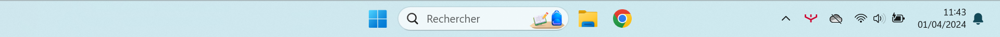

# L'ordinateur

## Introduction

Ce tutoriel a pour objectif d'appliquer quelques réglages utiles à votre ordinateur portable et à vous familiariser à
son utilisation.

## Préparation

### Prérequis

!!! warning "Attention"

    Pour mener à bien l'ensemble des opérations de ce tutoriel, vous devez disposer :    
    
    - de votre ordinateur portable ;
    - de votre identifiant et mot de passe du réseau pédagogique (*{nom}_{première lettre prénom}*) ;
    - de votre identifiant et mot de passe ENT (*identifiant qui sera utilisé suivi de @monlycee.net*).

### Espace de travail

Vous allez créer des dossiers afin de ne pas mélanger vos productions numériques entre vos différentes matières et
travaux pratiques.

!!! note "Organisation de l'espace travail"

    === ":material-laptop: Ordinateur portable"

        1. Lancez l'application <i class="icon file-explorer"></i> **Explorateur de fichiers**
        2. Dans le dossier `Documents`, s'il n'y a pas de dossier nommé `SNT`, créez-le
        3. Dans le dossier `SNT`, s'il n'y a pas de dossier nommé `Tutoriels`, créez-le

    === ":material-desktop-tower: Ordinateur fixe"

        - Si vous avez oublié votre ordinateur, faites le tutoriel consacré à [:material-link: Windows](windows.md){:target="_blank"}
        - Si votre ordinateur dysfonctionne, contactez le SAV

## Configuration

### Le navigateur Web

L'objectif est de faire le choix d'un navigateur web et d'ajouter en favoris quelques liens utiles.
Selon la configuration de votre ordinateur au moins deux des navigateurs web ci-dessous devraient être présents :

- :material-google-chrome: Google Chrome
- :material-microsoft-edge: Microsoft Edge
- :material-firefox: Mozilla Firefox
- :material-opera: Opéra

!!! note "Ajout d'un favori vers l'ENT"

    Afin d'accéder rapidement à l'ENT, il serait intéresant de disposer d'un lien dans votre barre de favoris :

    1. Lancez votre navigateur préféré *(qui est déjà lancé sans quoi vous ne pourriez pas lire cette page)*
    2. Accédez au site de l'ENT en cliquant sur le lien suivant : [:material-link: monlycee.net](https://www.monlycee.net){:target="_blank"}
    3. Ajoutez la page à vos favoris en cliquant sur l'icône étoile :material-star-outline: à droite de la barre d'adresse
    4. Vérifiez que la page soit bien présente dans vos favoris en ouvrant un nouvel onglet

!!! note "Ajout d'un favori vers `mulot-nsi.fr`"

    Afin de pouvoir démarrer rapidement les travaux pratiques de SNT, il serait judicieux d'avoir ce site dans vos favoris : 

    1. Accédez à la section SNT du site Mulot NSI en cliquant sur le lien suivant : [:material-link: mulot-nsi.fr](https://mulot-nsi.fr/snt/){:target="_blank"}
    2. Ajoutez la page à vos favoris
    3. Vérifiez qu'elle soit bien présente dans vos favoris

!!! note "Ajout d'un lien vers l'assistance"

    En cas de problème technique avec votre ordinateur, il vous faudra contacter l'assistance.
    Il s'agit d'une interface en ligne à partir de laquelle il vous sera possible d'échanger avec un technicien.
    Ce service est accessible du **lundi au vendredi de 9h-12h et de 13h30-18h**.

    Ajoutez la page suivante à vos favoris : [:material-link: Assistance](https://assistanceidf.zendesk.com/hc/fr/articles/360019182080-FAQ-Acc%C3%A8der-au-Chat){:target="_blank"}

### La suite bureautique

Votre ordinateur vous a été fourni avec la suite bureautique **Microsoft Office** préinstallée. Vous disposez donc de :

- :material-microsoft-word: Word *(traitement de texte)*
- :material-microsoft-excel: Excel *(tableur)*
- :material-microsoft-powerpoint: PowerPoint *(diaporama)*

Pour l'utiliser, il est nécessaire de l'activer en vous connectant aux services de Microsoft via votre identifiant et de
votre mot de passe ENT.

!!! note "Activation"

    1. Lancez l'application Word
    2. Si le choix des types de fichier par défaut vous est proposé, choisissez **Formats Office Open XML**
    2. Vérifiez votre état de connexion en haut à droite de la fenêtre
    3. Si vous n'êtes pas connecté, connectez-vous en utilisant votre adresse email de l'ENT 
       *:material-comment-alert: pour rappel, celle-ci est de la forme `prenom.nom@monlycee.net`*

!!! note "Vérification"

    Afin de nous assurer que tout fonctionne correctement, vous allez simplement créer un document Word et l'enregistrer.
    L'activation est réussie s'il vous est possible d'enregistrer le document.

    1. Créez un nouveau document Word
    2. Écrivez le texte de votre choix
    3. Enregistez votre document dans le dossier `Documents\SNT\Tutoriels` créé en début de TP
    4. Fermez l'application Word

### Le courrier électronique

Il vous est possible d'accéder à vos emails en vous connectant à l'ENT depuis un navigateur web.
Mais il pourrait être pratique de pouvoir consulter les emails directement depuis l'application **Outlook** fournie par
le système d'exploitation Windows.
Vous allez configurer celle-ci afin d'y ajouter votre boîte mail du **lycée**.

!!! note "Instructions"

    Vous allez maintenant configurer l'application afin qu'elle puisse récupérer vos emails du lycée.
    Vous pouvez suivre la vidéo ou les indications textuelles.

    
<iframe src="https://www.loom.com/embed/6242bd4970594292b8c913538de9f0cf?sid=42b1e979-c850-4c35-b3b1-63b1cc67035e" frameborder="0" webkitallowfullscreen mozallowfullscreen allowfullscreen style="position: absolute; top: 0; left: 0; width: 100%; height: 100%;"></iframe>

    1. Saisissez `Outlook` dans le champs de recherche de la **barre de tâches**
    2. Cliquez sur l'option **:material-pin-outline: Épingler à la barre des tâches**
    3. Lancez l'application **Outlook** depuis le raccourci de la barre des tâches
    4. Saisissez votre adresse `prenom.nom@monlycee.net` dans le champ de saisie des comptes suggérés
    5. Saisissez votre mot de passe de l'ENT
    6. Cliquez sur **Afficher plus** et renseignez correctement les paramètres ci-dessous :

        | Paramètre                   | Valeur                                  |
        |:----------------------------|-----------------------------------------|
        | Adresse de courrier         | votre adresse `prenom.nom@monlycee.net` |
        | Mot de passe                | votre mot de passe ENT                  |
        | Serveur entrant IMAP        | `imaps.monlycee.net`, port `993`        |
        | Type de connexion sécurisée | SSL/TLS (recommandé)                    |      
        | Nom d'utilisateur SMTP      | votre adresse `prenom.nom@monlycee.net` |
        | Serveur sortant SMTP        | `smtps.monlycee.net`, port `465`        |
        | Type de connexion sécurisée | SSL/TLS (recommandé)                    |   

    7. Cliquez sur **Continuer** et patientez le temps de la synchronisation

### La sauvegarde sur le Cloud

#### Présentation

Tout élève de la région Île-de-France dispose d'un accès et d'un espace de stockage de **1 To** sur le service de
stockage cloud **Microsoft OneDrive**.
L'état du service OneDrive est indiqué par un nuage situé à droite de la barre des tâches.

<figure markdown>
{:style="max-width:100%;"}
<figcaption>Barre des tâches sous Windows 11</figcaption>
</figure>

Selon l'état sur service, vous pouvez vous trouver dans l'une des situations décrites ci-après.
Identifiez celle qui correspond à l'état du service sur votre ordinateur et suivez ses instructions.

??? note "Situation 1 - Le nuage n'est pas visible dans la barre des tâches"

    L'absence de nuage signifie que l'application OneDrive n'a pas été lancée automatiquement au démarrage de votre ordinateur.

    1. Recherchez l'application OneDrive sur votre ordinateur
    2. Lancez l'application et attendez l'apparition du nuage
    3. Selon la couleur du nuage, rendez-vous à la situation 2 ou 3

??? note "Situation 2 - Le nuage est visible dans la barre des tâches, mais il est barré ou gris"

    Un nuage est gris et barré signifie que vous n'êtes pas connecté au service.

    1. Cliquez sur le nuage
    2. Cliquez sur **se connecter**
    3. Connectez-vous au service en utilisant votre adresse email de l'ENT 
       *:material-comment-alert: pour rappel, celle-ci est de la forme `prenom.nom@monlycee.net`*
    4. Activez la sauvegarde des dossiers `Documents` et `Images` lorsqu'on vous le demandera

    ??? help "Aide - Activer le service OneDrive"

        
<iframe src="https://www.loom.com/embed/772ad6b8261a42d097a83a52566e4c5c?sid=ee6f1959-49cb-4eae-a53b-b01d3b9f4f4a" frameborder="0" webkitallowfullscreen mozallowfullscreen allowfullscreen style="position: absolute; top: 0; left: 0; width: 100%; height: 100%;"></iframe>

??? note "Situation 3 - Le nuage est visible dans la barre des tâches et il est bleu"

    Un nuage est bleu signifie que vous êtes bien connecté au service. Vous pouvez donc passer à la suite.

#### Activation de la sauvegarde automatique

Le service OneDrive vous offre la possibilité de sauvegarder automatiquement sur le *cloud* le contenu des éléments
suivants :

- :material-folder: Documents
- :material-folder: Images
- :material-monitor: Bureau

Prenez l'habitude d'enregistrer vos travaux dans le dossier `Documents` et donc à ne pas travailler directement depuis
le dossier `Téléchargements`.
En procédant ainsi et en activant la sauvegarde automatique, vous avez l'assurance de ne rien perdre de vos travaux.

!!! note "Instructions"

    1. Cliquez sur le nuage depuis la barre des tâches
    2. Cliquez sur **:material-cog-outline: Paramètres**
    3. Dans la section **:material-sync: Synchronisation et sauvegarde**, cliquez sur **Gérer la sauvegarde**
    4. Activez la sauvegarde pour les dossiers `Documents` et `Images` 
       *:material-comment-alert: et éventuellement `Bureau` si vous avez l'habitude d'y mettre des fichiers*
    5. Cliquez sur **Enregistrer les modifications**

??? help "Aide - Configurer la sauvegarde"

    
<iframe src="https://www.loom.com/embed/6747e2b6939c4999874fa286a4336b72?sid=0c113062-d3c7-4dbf-8f1f-5d15dc1c0ae5" frameborder="0" webkitallowfullscreen mozallowfullscreen allowfullscreen style="position: absolute; top: 0; left: 0; width: 100%; height: 100%;"></iframe>

#### Accès depuis le Web

Imaginons que vous utilisiez un ordinateur sur lequel il vous est impossible d'installer le service OneDrive.
Pour contourner ce problème, les services de stockage sur le *cloud* fournissent un accès depuis une interface web.

!!! note "Instructions"

    1. Lancez un navigateur web
    2. Accédez au site du service OneDrive : [:material-link: https://www.onedrive.com](https://www.onedrive.com){:target="_blank"}
    3. Connectez-vous en utilisant votre adresse email de l'ENT 
       *:material-comment-alert: pour rappel, celle-ci est de la forme `prenom.nom@monlycee.net`*
    4. Une fois connecté, accédez à la section **Mes fichiers**
    5. Essayez de retrouver le dossier SNT crée en début de travaux pratiques

### Le dossier personnel

!!! danger "Important"

    L'accès à votre **dossier personnel** du lycée n'est possible que si vous êtes connecté au réseau WIFI du lycée.
    Si l'accès au réseau WIFI ne fonctionne pas et que vous êtes en partage de connexion, votre dossier personnel sera inaccessible.

Les instructions pour vous connecter à votre dossier personnel ainsi qu'à d'autres dossiers du lycée vous ont été
transmises par email
par **M. Salamat**.

!!! note "Instructions"

    1. Accédez à vous emails via l'application **Courrier** ou via [:material-link: monlycee.net](https://www.monlycee.net){:target="_blank"}
    2. Retrouvez l'email de **M. Salamat**
    3. Suivez les instructions de connexion au réseau du lycéee
    4. Lancez l'application <i class="icon file-explorer"></i> **Explorateur de fichiers**
    5. Vérifiez la présence de votre dossier personnel du lycée dans la séction **Réseaux**
    6. Copiez/collez vos travaux de SNT du début d'année dans le dossier `Documents\SNT` de votre ordinateur
