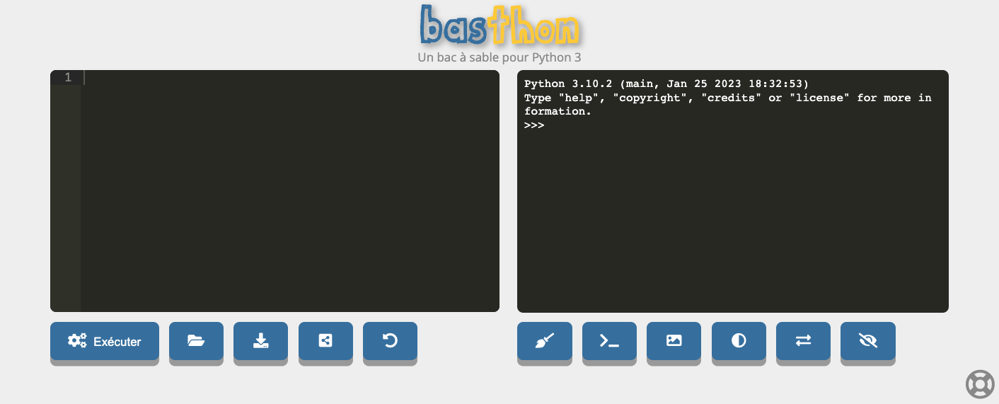
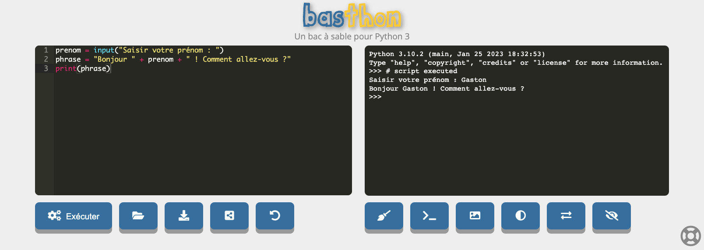

# Le langage Python

## Introduction

Ces travaux pratiques ont pour objectif de vous introduire le langage programmation Python.

Python est un langage **interprété**.
Cela signifie qu'un programme écrit en Python n'est pas autonome et ne fonctionnera qu'en utilisant un logiciel capable de le lire.
Ce logiciel, ou interpréteur, lira et exécutera chaque instruction de votre programme.

!!! info "Les interpréteurs Python"

    Il existe de nombreux interpréteurs Python.
    La calculatrice « TI-83 Premium CE Edition Python » recommandée par le lycée dispose par exemple d'un interpréteur Python. 
    Nous ne l'utiliserons pas dans le cadre de ces travaux pratiques et lui préfèrerons l'interpréteur en ligne [:material-link: Basthon](https://console.basthon.fr/){:target="_blank"}.

### Préparation

**Basthon** est une interface de développement Python accessible depuis le Web.
C'est le moyen le plus simple et rapide de disposer d'un interpréteur Python.
Vous devez cependant disposer d'une connexion Internet.

!!! note "Instruction"

    1. Rendez-vous sur la page [:material-link: https://console.basthon.fr](https://console.basthon.fr){:target="_blank"}
    <figure markdown>
    
    </figure>

    2. Lisez **attentivement** le principe de fonctionnement ci-après

!!! info "Principe de fonctionnement"

    - La zone de saisie de **gauche** correspond au **mode programme**.<br>
      Le principe est d'y saisir l'ensemble des instructions de votre programme et de lancer celui-ci en cliquant sur le bouton **Exécuter**
    - La zone de saisie de **droite** correspond au **mode interactif**. Elle est généralement appelée **console**.<br>
      Le principe est de saisir une instruction Python qui sera interprétée immédiatement après avoir appuyé sur entrée.
      C'est un peu comme un dialogue direct avec l'interpréteur.


## Premiers pas

### Le mode interactif

Vous allez commencer par utiliser l'interpréteur Python comme une calculatrice en saisissant vos calculs dans la **console** (la zone de saisie de **droite**).

!!! danger "Important"
    
    Les trois chevrons `>>>` sont appelés **invite de commandes**. Ils indiquent que l'interpréteur Python attend une instruction de votre part.
    
    Si vous veniez à faire des copier/coller depuis les exemples de ces travaux pratiques, vous ne devez **jamais** les recopier.
    Ils n'ont aucune signification dans le langage Python et ne servent qu'à indiquer où écrire votre instruction dans la console.

#### Premier calcul

!!! note "Instructions"

    - Retournez sur [:material-link: Basthon](https://console.basthon.fr){:target="_blank"} et préparez vous à saisir dans la **console** (zone de **droite**)
    - Saisissez la valeur `#!python 2` et appuyez sur la touche ++enter++
    - Saisissez l'expression `#!python 2 + 2` et appuyez sur sur la touche ++enter++
    - Saisissez l'expression `#!python 2.5 + 2.5` et appuyez sur sur la touche ++enter++.
    - Vous devez obtenir l'affichage suivant :

        ```
        >>> 2
        2
        >>> 2 + 2
        4
        >>> 2.5 + 2.5
        5.0
        ```

!!! info "Explication"

    - À la soumission d'une **expression** à l'interpréteur Python, celui-ci l'évalue et affiche sa **valeur**
    - L'interpréteur attend ensuite une nouvelle saisie de la part de l'utilisateur
    - Notez l'usage du point et non de la virgule comme séparateur décimal

#### Les opérateurs arithmétiques

!!! note "Instructions"

    Testez dans la console, une expression Python correspondant à chacune des descriptions ci-dessous.
    Vous êtes libre d'utiliser les nombres que vous voulez.

    - Une addition entre un nombre entier et un nombre décimal
    - Une soustraction (opérateur `-`)
    - Une multiplication (opérateur `*`)
    - Une division (opérateur `/`)
    - Une puissance (opérateur `**`)

#### Les variables

Une **variable** est un emplacement mémoire nommé dans lequel il est possible d'enregistrer toute valeur.
L'opération consistant à enregistrer une valeur dans une variable s'appelle une **affectation**.
Celle-ci s'effectue en utilisant l'opérateur `=`. 

!!! example "Exemple"

    ``` python
    >>> n = 9 # (1)!
    >>> n # (2)!
    9
    >>> n += 1 # (3)!
    >>> n
    10
    >>> carre = n ** 2 # (4)!
    >>> carre # (5)!
    100
    ```

    1. On enregistre la valeur `#!python 9` dans `n`.<br>En programmation, on dit qu'on **affecte** `#!python 9` **à la variable** `n`
    2. On récupère la valeur enregistrée dans une variable en écrivant simplement son nom
    3. On ajoute 1 à la variable `n` grâce à l'opérateur `+=`
    4. On peut affecter le résultat d'un calcul à une variable.<br>Ici on affecte `#!python n ** 2` à la variable `carre`<br><br>
       Ce que fait Python :
       <ul>
         <li>effectue le calcul `#!python n ** 2` → `#!python 10 ** 2` → `#!python 100`</li>
         <li>enregistre le résultat du calcul dans la variable `carre`</li>
       </ul>
    5. On accède à la valeur de la variable `carre`

    Cliquez sur les **+** pour avoir les explications de chacune des commandes saisies dans la console.

!!! note "Instructions"

    Nous souhaitons calculer la moyenne de notes sur 20. Pour cela, effectuez les opérations décrites ci-dessous dans la console Python :

    1. Vous disposez des notes 15, 12  et 18,5.
       Affectez le calcul `#!python 15 + 12 + 18.5` à la variable `total`
    2. Affichez le total
    3. Calculez la moyenne
    4. Vous obtenez la nouvelle note 16. Ajoutez cette note au total en utilisant l'opérateur `+=`
    5. Affichez le nouveau total
    6. Calculez la nouvelle moyenne

??? success "Solution"
    **Attention**, ne copiez/collez pas toute la solution dans la console, ça ne fonctionnera pas !
    
    ```
    >>> total = 15 + 12 + 18.5
    >>> total
    45.5
    >>> total / 3
    15.166666666666666
    >>> total += 16
    61.5
    >>> total / 4
    15.375
    ```


### Le mode programme

!!! danger "Attention"
    
    Vous allez maintenant utiliser l'interpréteur Python en **mode programme** (c'est-à-dire la zone de saisie de **gauche**).


#### Les chaînes de caractères

En programmation, tout texte est appelé **chaîne de caractères**. 
Celle-ci se définit en **délimitant le texte** par des guillemets doubles `"` ou simples `'`.

!!! example "Exemple"

    ```python
    "Ceci est une chaîne de caractères"
    'Ceci est aussi une chaîne de caractères'
    ```

!!! note "Instruction"

    1. Copiez/collez le code à ci-dessous dans l'éditeur *(pour rappel, la zone de gauche)* :
        ```python
        prenom = ...
        print("Bonjour", prenom, "! Comment vas-tu ?")
        ```
    2. Complétez le code en remplaçant **uniquement** les `...` par la **chaîne de caractères** de votre prénom
    3. Lancez le programme et observez le résultat dans la console *(la zone de droite)*

??? success "Une solution possible"

    
    ```python
    prenom = "Ginette"
    print("Bonjour", prenom, "! Comment vas-tu ?")
    ```

!!! info "Explication du programme"

    - La chaîne de caractères de votre prénom est stockée dans la variable `prenom`
    - La fonction `print` permet l'affichage d'un texte dans la console


### Demande d'une saisie utilisateur

#### Découverte de la fonction `input`

!!! note "Instructions"

    1. Effacez le code de l'exercice précédent
    2. Copiez l'intégralité du code ci-dessous dans l'éditeur **sans le modifier** :
        ```python
        texte_saisie = input("Votre prénom : ")
        
        print(" ")
        print("Bonjour", texte_saisie)
        print("Félicitations", texte_saisie, "!")
        print("Vous avez correctement lu l'énoncé 👏")
        ```
    2. Exécutez le programme
    3. Saisissez votre prénom dans la **console** et appuyez sur ++enter++

!!! info "Explication"

    - `input` est une instruction permettant d'afficher un message pour demander à l'utilisateur de saisir du texte
    - La saisie s'effectue dans la **console** et est transmise au programme en appuyant sur la tocuhe ++enter++
    - La valeur saisie est alors enregistrée dans la variable `texte_saisie` et est utilisable dans le programme
    
    <figure markdown>
    
    </figure>


#### Programmer un calculateur d'âge

!!! note "Instructions"

    1. Remplacez l'intégralité du code de l'éditeur par le code suivant :
        ```python
        # Demande de saisies à l'utilisateur
        prenom = input("Votre prénom : ")
        annee_naissance = int(input("Votre annee de naissance : "))
        
        # Calcul de l'age approximatif
        age = 2024 - ...
        
        # Affichage de l'age
        print("Bonjour", prenom, "! Vous avez entre", age-1, "et", age, "ans.")
        ```

    2. Remplacez **uniquement** les `...` par le **nom de la variable** qui permettrait le calcul de l'age
    3. Exécutez le programme
    4. Lorsque le programme vous le demande, fournissez votre prémom et votre année de naissance
    5. Exécutez une seconde fois le programme
    6. Lorsque le programme vous le demande, fournissez votre prémom et l'année de naissance **1950**

??? success "Solution"

    ```python
    prenom = input("Saisir votre prénom : ")
    annee_naissance = int(input("Votre annee de naissance : "))
    age = 2024 - annee_naissance
    
    print("Bonjour", prenom, "! Vous avez", age, "ans.")
    ```

!!! info "Explication du programme"

    - La fonction `input` renvoie toujours une chaîne de caractères
    - La fonction `int` permet la conversion de la valeur renvoyée par `input` en un nombre entier
    - Le programme demande donc des informations à l'utilisateur, effectue un calcul et affiche le résultat


### Les boucles

Les boucles sont des instructions Python permettant de répéter certaines portions de code.
Elles ouvrent la voie à l'automatisation des traitements.

!!! note "Instructions"

    1. Remplacez l'intégralité du code de l'éditeur par le code suivant :
        ```python
        for n in range(10):
            print('la variable n vaut', n, 'et son carré vaut', n**2)
        ```
    2. Exécutez le programme et observez l'affichage dans la console

!!! info "Explication du code"

    - L'instruction `#!python for n in range(10):` est une boucle. Elle permet la répétition d'un bloc de code
    - Le bloc de code appartenant à la boucle correspond aux instructions « décalées » vers la droite (on dit **indentées**) et situées juste en dessous de l'instruction de boucle
    - Toutes les instructions d'un même bloc doivent avoir la même indentation(utilisez la touche ++tab++ et non ++space++ pour indenter)


#### Affichage d'une table de multiplication

!!! note "Instructions"

    **En modifiant le code utilisé précédemment**, essayez d'obtenir l'affichage suivant :

    ```
    8 x 0 = 0
    8 x 1 = 8
    8 x 2 = 16
    8 x 3 = 24
    8 x 4 = 32
    8 x 5 = 40
    8 x 6 = 48
    8 x 7 = 56
    8 x 8 = 64
    8 x 9 = 72
    8 x 10 = 80
    ```

??? help "Aide"

    Remplacez uniquement les `...` par les expressions Python adéquates :

    ```python
    for n in range(...):
        print("8 x", ..., "=", 8*...)
    ```

??? success "Solution"

    ```python
    for n in range(11):
        print("8 x", n, "=", 8*n)
    ```

    Faites preuve de curiosité et ne recopiez pas simplement la solution.
    Essayez une autre table de multiplication, allez au delà de 10 ou essayez une autre opération !

### Jeu du nombre secret

!!! notes "Instructions"

    1. Remplacer le code de l'éditeur par le code suivant :

    ```python
    import random
    
    print("\n "*2)
    print("             *** Jeu du nombre secret ***")
    print(" ")
    print("La machine va mémoriser un nombre, à vous de le trouver !")
    print("       Attention, le nombre d'essais est limité")
    print("\n "*2)
     
    print("3 tentatives pour trouver un nombre entre 0 et 1000")
    
    nombre_secret = random.randint(0, 1000)
    tentatives = 0

    while tentatives < 3:
        choix = int(input("Votre nombre : "))
        tentatives = tentatives + 1
        
        if choix > nombre_secret :
            print("Trop grand !")
        elif choix < nombre_secret :
            print("Trop petit")
        else:
            break

    if choix == nombre_secret:
        print("Bravo vous avez gagné")
    else:
        print("Vous avez perdu, le nombre secret était", nombre_secret)
    ```

    2. Testez le programme
    3. Votre professeur de SNT a fait un jeu beaucoup trop difficile :expressionless:. Modifiez-le de façon à :
        - Chercher un nombre entre 0 et 100
        - Avoir 8 tentatives pour chercher le nombre

## Turtle

La tortue graphique (ou *Turtle*) est un module d'initiation à la programmation.
Son fonctionnement consiste à réaliser des dessins en déplaçant une tortue virtuelle dotée d'un stylo.

|   Fonction    | Description                                                                                    |
|:-------------:|:-----------------------------------------------------------------------------------------------|
| `forward(n)`  | Avancer la tortue de *n* pixel                                                                 |
| `backward(n)` | Reculer la tortue de *n* pixel                                                                 |
|   `left(n)`   | Effectuer une rotation de la tortue d'un angle de *n* degrés vers la gauche (sens antihoraire) |
|  `right(n)`   | Effectuer une rotation de la tortue d'un angle de *n* degrés vers la droite (sens horaire)     |
| `goto(x, y)`  | Déplacer la tortue aux coordonnées *(x, y)*                                                    |
|   `penup()`   | Lever le crayon                                                                                |
|  `pendown()`  | Baisser le crayon                                                                              |

Vous pouvez consulter la documentation de ces fonctions et en découvrir bien d'autres sur le site officiel de Python :
[:material-link: https://docs.python.org/fr/3/library/turtle.html](https://docs.python.org/fr/3/library/turtle.html){:target="_blank"}

### Expérimentation


!!! note "Instructions"

    1. Remplacez le code de l'éditeur par le code ci-dessous
        ```python
        import turtle
        
        # Tracé de démonstration
        turtle.forward(50)
        turtle.left(90)
        turtle.forward(50)
        turtle.right(90)
        turtle.forward(50)
        
        # Indique que le tracé est terminé
        turtle.done()
        ```
    2. Exécutez le code et observez le résultat
    3. Modifiez le code à votre guise pour expérimenter chacune des fonctions

### Tracé de figures géométriques

!!! note "Instructions"
    
    Écrire le code Python permettant de tracer les figures géométriques suivantes :

    - Un carré
    - Un carré *(en utilisant une boucle et éviter d'écrire 4 fois le même code : `#!python for n in range(4):`)*
    - Un pentagone *(en modifiant le nombre de répétitions de la boucle et l'angle)*
    - Un polygone à *n* sommets *(trouver une formule pour calculer l'angle en fonction du nombre de sommets)*

### Tracé de figures libres

!!! note "Instructions"
    
    Testez ces tracés et essayez d'en imaginer d'autres :

    <h4>Premier tracé</h4>
    ```python
    import turtle

    turtle.speed(0)

    for n in range(50):
        turtle.forward(2*n)
        turtle.right(90)

    turtle.done()
    ```

    <h4>Second tracé</h4>
    ```python
    import turtle
    
    turtle.speed(0)
    
    for n in range(255):
        couleur = "#33cc" + hex(n)[2:].zfill(2)
        turtle.pencolor(couleur)        
        turtle.forward(n)
        turtle.right(70)
    
    turtle.done()
    ```
